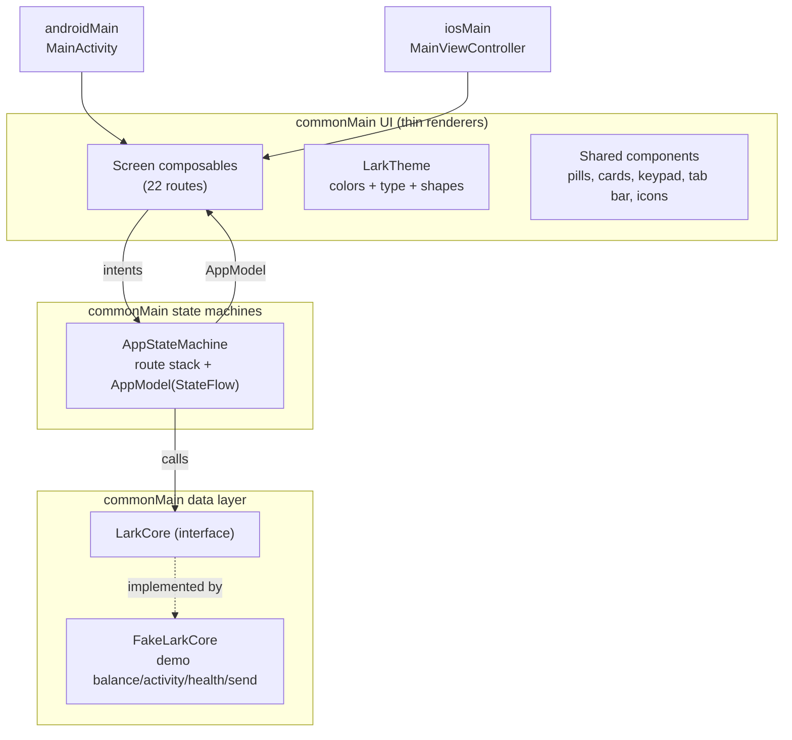
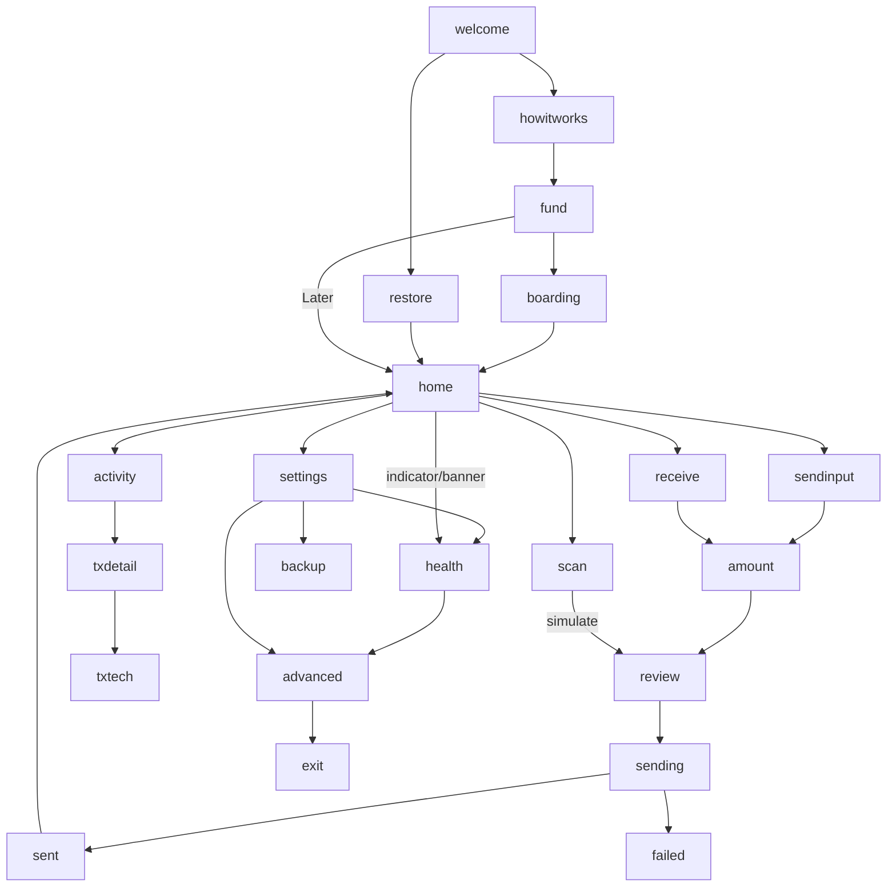

# LARK Wallet App UI - Plan

## Goal Capsule

- **Objective:** Implement every screen and behavior of the approved "LARK Wallet" design prototype as shared Compose Multiplatform UI in this repo, driven by KMP state machines against a fake `LarkCore` data layer, building and passing tests on Android and iOS.
- **Authority hierarchy:** The design prototype (vendored under `docs/design/lark-wallet/` by U1) is authoritative for visuals and interaction behavior; this plan is authoritative for architecture and sequencing; existing repo conventions (detekt, version catalog, package `xyz.lark.app`) govern code style.
- **Execution profile:** Implement units in dependency order; verify each with the Verification Contract commands before moving on.
- **Stop conditions:** Stop and surface a blocker if a settled decision (KTD-1..3) proves infeasible, if fonts cannot be obtained and no acceptable fallback exists, or if the iOS framework link breaks in a way that requires toolchain changes beyond this repo.
- **Tail ownership:** The invoking pipeline owns review, commit, PR, and CI.

---

## Product Contract

### Summary

Turn the interactive LARK Wallet design prototype into the working app: 22 screens covering onboarding, home/balance, pay, receive, activity, transaction detail, settings, backup, wallet status, Advanced, and move-on-chain — rendered by one Compose Multiplatform codebase on Android and iOS. All wallet behavior comes from a `FakeLarkCore` demo implementation behind the `LarkCore` interface, designed so the M1 gateway client or M2 Rust core can replace it with at most interface-level extension (auth/session state, real fees and settlement timing) while UI and state machines stay untouched.

### Problem Frame

The repo is an M0 scaffold with a single placeholder screen. The product design is complete and approved as an interactive prototype, but nothing of it exists in the app. M1's real backend is blocked on a separate auth write-up, so the app cannot yet talk to barkd — yet the entire UI surface, navigation, formatting rules, and health-state behavior are fully specified and buildable today against a fake core.

### Requirements

**Architecture**

- R1. All screens are shared Compose Multiplatform UI in `composeApp/src/commonMain`, rendering on both Android and iOS targets.
- R2. Screen state and navigation logic live in KMP state machines in `commonMain` that emit immutable UI models; composables stay thin renderers.
- R3. All wallet data and actions flow through a `LarkCore` interface; the only implementation in this milestone is `FakeLarkCore`, reproducing the prototype's demo behavior.

**Onboarding**

- R4. First launch lands on the welcome screen ("Money that moves now."), with paths: Set up a wallet → three promises → add money → first-deposit settling → home; "I have 12 words" → restore → home; "Later" on add-money skips to home.
- R5. The settling screen offers "Skip ahead (demo)" to jump to home, matching the prototype's demo affordance.

**Home and money display**

- R6. Home shows one balance (no spendable/pending split) as ₿412,350 primary with $412.35 secondary, BIP 177 format: `₿` prefix, thousands separators, no "sats" suffix; tapping the secondary line (or the Settings row) toggles denomination app-wide, with the demo rate 1 sat = $0.001.
- R7. Home offers balance Hide/Show (`••••` when hidden), a gold Pay tile, an outlined Get paid tile, the health indicator (dot + word, top-right), and the shared tab bar (Scan / WALLET / ACTIVITY / Settings).
- R8. Health has four states — ready, tidying, stale, offline — driving the home indicator word and dot color (ready/tidying `#6FE3A8` "Ready"; stale "Needs a moment", offline "Offline", both `#FF7A4D`), an attention banner on home for stale/offline only, the wallet-status screen copy and action button plus its always-present "See the details" link to Advanced, the Advanced network rows, and send failure when offline.

**Pay flow**

- R9. Pay: recipient screen (paste resolves to a contact, gold PASTE affordance, recents list, scan shortcut) → amount keypad → review (Arrives Instantly / Fee None) → sending spinner (~1.5s) → "Sent." verdict, or "Didn't go through." when health is offline, with Try again / Cancel.
- R10. The keypad accepts integer digits only (max 8, leading zero suppressed): sats in bitcoin mode, cents in fiat mode; the primary action is disabled while no digits are entered, and over-balance amounts turn the display and availability line `#FF7A4D` and disable it too; secondary line shows the other denomination.
- R11. Scan (reached from the tab bar or the recipient screen) shows the camera-frame treatment with an animated gold scan line and a "Simulate a scan" button that resolves Ferry Building Coffee at 520 sats and jumps to review; no real camera integration in this milestone.

**Receive**

- R12. Get paid shows one QR code with the `ark1qf7…lark.money` code line, "One code, any wallet" copy, a Copy button (label flips to "Copied" for ~1.6s), and Set amount which reuses the keypad in request mode ("Make the code", "Any amount" availability) and returns to the QR screen.

**Activity and transaction detail**

- R13. Activity lists the five demo transactions (initial avatar, name, relative time, signed amount — incoming `+` in `#6FE3A8`); tapping opens transaction detail (verb, amount, counterparty, when, fee) with a "Technical details" screen one level deeper carrying the protocol facts (route, VTXOs spent, change expiry, preimage, server).

**Settings, backup, status, Advanced, exit**

- R14. Settings groups: Back up your wallet (subtitle "Not done yet" in `#FF7A4D` until backup completes, then "Done"), Show amounts in (denomination toggle), Wallet status (dot + word), Advanced, and the version footer reading `LARK 0.4.1 · Ark + Lightning · mutinynet` (see KTD-11 — the prototype's "signet" label is superseded).
- R15. Backup hides the 12 demo words (blurred where the platform supports it, otherwise under an opaque scrim) until "Tap to reveal", auto-hides after a 60-second countdown, and "I've written them down" marks backup done.
- R16. Advanced shows the FUNDS rows (VTXOs 4 · ₿412,350; soonest expiry and last refresh varying with the stale state; on-chain reserve ₿6,200; deposit address with the "use Get paid instead" note), NETWORK rows (Ark server status; next round — countdown text, em dash when offline; Lightning bridge; chain tip), "Refresh funds now" (spinner → health ready), and "Move everything on-chain" in warning orange.
- R17. Move on-chain shows the confirmation framing ("You don't need permission from anyone…"), amount/miner-fee/ready-in rows, and an orange "Start moving funds" action returning home; it is reachable only via Advanced.
- R18. A DEMO section at the bottom of Advanced lets the user force each of the four health states (replacing the prototype's canvas-side state rail); it renders only when the active core exposes demo controls, which only `FakeLarkCore` does.

**Visual language**

- R19. The app uses the design's visual system: background `#0B0C0E`, surface `#14161A` with `rgba(255,255,255,.07)` borders, text `#F4F1EA` with alpha-tiered secondary text, gold `#E8C15C` (pressed/hover `#F3D68C`, on-gold `#14100A`), warning `#FF7A4D`, success `#6FE3A8`; pill-shaped CTAs, 16dp card radius; Manrope for UI text, Bricolage Grotesque for display numerals and headlines, JetBrains Mono for codes; tabular numerals for money; at most one gold action per screen.

### Key Flows

- F1. Pay someone
  - **Trigger:** Home → Pay (or tab-bar Scan).
  - **Steps:** Recipient (paste or pick recent) → amount keypad → review → sending → Sent/Failed → Done returns home.
  - **Covered by:** R9, R10, R11.
- F2. Health degradation
  - **Trigger:** Health state becomes stale or offline (forced via Advanced DEMO in this milestone).
  - **Steps:** Home indicator changes; banner appears; wallet status explains and offers the action; offline sends fail; "Get it done"/"Try again now"/"Refresh funds now" runs the spinner and restores ready.
  - **Covered by:** R8, R16, R18.
- F3. First run
  - **Trigger:** App launch with no wallet.
  - **Steps:** Welcome → promises → add money → settling (skippable) → home; or restore → home.
  - **Covered by:** R4, R5.

### Acceptance Examples

- AE1. **Given** health is offline, **when** a send is confirmed on review, **then** the sending spinner shows ~1.5s and resolves to "Didn't go through." with balance unchanged.
- AE2. **Given** bitcoin denomination and balance 412,350 sats, **when** the keypad holds digits `500000`, **then** the amount shows `₿500,000` in `#FF7A4D`, the availability line reads "More than you have", and Review is disabled.
- AE3. **Given** fiat denomination, **when** the keypad holds digits `520`, **then** the primary display is `$5.20` and the secondary is `₿5,200`.
- AE4. **Given** the backup words are revealed, **when** 60 seconds elapse without action, **then** the words re-blur automatically.
- AE5. **Given** the health indicator is stale or offline, **when** home renders, **then** the indicator omits the word next to the dot and the attention banner is visible (the banner carries the message).

### Scope Boundaries

- **In scope:** every prototype screen and behavior listed above, fake data layer, shared theme/design system, state-machine tests.
- **Deferred to follow-up work:** real barkd gateway client (M1, blocked on the auth write-up), Rust `lark-ffi` core (M2), real camera scanning, real QR encoding of a live address, wallet persistence across launches (fresh launch restarts at onboarding in this milestone), push/background refresh, fiat rate feed, localization, accessibility audit.
- **Outside this product's identity:** exposing protocol mechanics (rounds, VTXOs, expiry) anywhere except Technical details and Advanced — the translation-layer rule from the design.

### Sources

- Design project: [LARK Bitcoin wallet design](https://claude.ai/design/p/5a78d049-5f0b-4f24-a645-d06672831882?file=LARK+Wallet.dc.html) — canonical upstream, exported 2026-07-28. The export (`LARK Wallet.dc.html`, `LARK Tab Bar.dc.html`, `support.js` runtime, condensed spec `README.md`) already sits in the working tree at `docs/design/lark-wallet/`; U1 commits it, and the committed copy is the immutable spec the implementation and review are checked against.
- Milestone context: `PLANS/LARK_CLIENT_KMP_CMP.md` in the team workspace (M0 done; M1 gateway blocked on auth write-up; locked decisions on CMP/KMP/Rust core).
- Repo baseline: `composeApp/src/commonMain/kotlin/xyz/lark/app/App.kt` (placeholder screen to replace), `gradle/libs.versions.toml` (Kotlin 2.2.0, CMP 1.8.2), `scripts/ci.sh` (reference check set).

---

## Planning Contract

### Key Technical Decisions

- KTD-1. **UI is Compose Multiplatform — one shared UI codebase for Android and iOS.** (session-settled: user-directed — chosen over native SwiftUI/Jetpack Compose per platform: one codebase; state machines emit UI models so screens can go native later without re-architecting.)
- KTD-2. **Screen logic lives in KMP `commonMain` state machines emitting immutable UI models, Bitkey-style.** (session-settled: user-directed — chosen over per-platform view-model logic: single tested core, thin UI.) Concretely: one `AppStateMachine` class owning route stack + app state, exposing `StateFlow<AppModel>`; composables render models and forward intents. No androidx `ViewModel` — plain class + coroutines keeps it multiplatform-testable.
- KTD-3. **All wallet data/actions sit behind a `LarkCore` interface; `FakeLarkCore` is the only implementation this milestone.** (session-settled: user-directed — chosen over wiring UI directly to a backend client: the hosted-gateway thin client (M1) and in-process Rust core (M2) must be swappable without touching UI or state machines.) The state-machine test suite doubles as the behavioral contract a future implementation must satisfy; demo-only controls (force-health) live on a separate demo-controls capability of `FakeLarkCore`, not on `LarkCore` itself.
- KTD-4. **Hand-rolled navigation stack, no navigation library.** The prototype's semantics are a plain stack — `push(route)`, `back()` (pop; an empty stack lands on the resting route: home with a wallet, welcome without), `go(route)` (reset stack) — held inside `AppStateMachine`. On Android the system back gesture forwards to `AppStateMachine.back()` via activity-compose's `BackHandler`. A navigation dependency (compose-navigation/voyager) would put navigation state outside the state machine, violating KTD-2, for no gain at 22 static routes.
- KTD-5. **Bundle OFL webfonts as Compose resources.** Manrope (400/500/600/700), Bricolage Grotesque (500/600/700), JetBrains Mono (400/500) committed under `composeApp/src/commonMain/composeResources/font/` and loaded via the Compose resources `Font()` API. Fallback if any face cannot be obtained: system default for that role plus a surfaced blocker note — do not silently ship mismatched type.
- KTD-6. **Money is integer sats end-to-end; formatting is a pure function.** `MoneyFormat` renders BIP 177 bitcoin (`₿412,350`) and demo fiat (`$412.35`); the fiat rate (demo: 1 sat = $0.001) is exposed on `LarkCore` and passed into `MoneyFormat`, never hardcoded in UI, and keypad validation and send use the same cents↔sats conversion. Keypad state stores raw digit strings exactly like the prototype (sats in btc mode, cents in fiat mode).
- KTD-7. **Fake QR, drawn in Compose.** Reproduce the prototype's deterministic 21×21 LCG pattern with finder squares on a Canvas. A real QR encoder is deferred until there is a real address to encode.
- KTD-8. **Icons are hand-ported `ImageVector`s.** The design's ~15 stroke icons (back chevron, scan frame, arrows, check, close, bolt, shield, refresh, backspace, card, menu, info) become `ImageVector` builders in one `LarkIcons` file; no icon-font or material-icons dependency (the design's icons are custom strokes).
- KTD-9. **Time and randomness are injected.** Spinner delays (1.5s), the copy-flip (1.6s), and the backup countdown (60s) run on an injected `CoroutineScope`/clock abstraction so `commonTest` can drive them with `kotlinx-coroutines-test` virtual time.
- KTD-10. **New dependencies limited to `kotlinx-coroutines-core` (and `kotlinx-coroutines-test` for tests).** Everything else ships with the existing catalog.
- KTD-11. **Target network is mutinynet.** (session-settled: user-directed — chosen over the design footer's "signet" label: the repo and M1 milestone target mutinynet.) Every user-visible network label (settings footer, `FakeLarkCore` network metadata) says mutinynet; this is label/metadata only in this milestone since the data layer is fake.

### High-Level Technical Design

Route model (matches the prototype exactly):

### Assumptions

- No persistence this milestone: each cold launch starts at onboarding welcome (`FakeLarkCore` starts without a wallet); "restore"/"set up" flip an in-memory flag. This is the faithful full-flow demo; persisting wallet-exists is follow-up work.
- Design variation props resolve to their prototype defaults: health indicator style `dot`, home balance layout `left`.
- The prototype's canvas-side tooling (state rail, jump chips) is not product UI; its only in-app replacements are the Advanced DEMO section (R18) and the in-frame demo buttons the prototype already has (R5, R11).
- Bricolage Grotesque is a variable-optical-size font; static instances at the used weights are acceptable.

---

## Implementation Units

### U1. Vendor design reference and build the design system

- **Goal:** The repo carries the design spec, and `LarkTheme` + shared components render the design language.
- **Requirements:** R19; supports all screen units.
- **Dependencies:** none.
- **Files:** `docs/design/lark-wallet/{README.md, LARK Wallet.dc.html, LARK Tab Bar.dc.html, support.js}` (already in the working tree — commit as-is); `composeApp/src/commonMain/composeResources/font/*.ttf`; `composeApp/src/commonMain/kotlin/xyz/lark/app/ui/theme/{LarkColors.kt, LarkType.kt, LarkTheme.kt}`; `composeApp/src/commonMain/kotlin/xyz/lark/app/ui/components/{Buttons.kt, Cards.kt, RowGroups.kt, LarkIcons.kt, Spinner.kt}`.
- **Approach:** Commit the vendored design files in `docs/design/lark-wallet/`. Define color constants and text styles from the vendored spec (KTD-5 fonts via Compose resources; note Compose resource file names forbid hyphens — rename Google Fonts downloads accordingly). Build the reusable pieces every screen shares: gold pill button, outline pill button, surface card, grouped stat rows, back button, section eyebrow label, gold spinner, icon set (KTD-8). Replace `MaterialTheme` usage with `LarkTheme` (Material3 stays as the substrate with overridden color scheme/typography).
- **Patterns to follow:** existing `App.kt` composable structure; version-catalog dependency declarations in `gradle/libs.versions.toml`.
- **Test scenarios:** Test expectation: none — pure theme/visual scaffolding; behavior is covered by later units' state tests.
- **Execution note:** Obtain the three font families from Google Fonts (OFL) and commit the `.ttf` files; if network access blocks this, apply KTD-5's fallback and surface it.
- **Verification:** `assembleDebug` and iOS framework link succeed; a temporary preview of the theme is not required.

### U2. Domain model, LarkCore interface, FakeLarkCore, money formatting

- **Goal:** The complete data layer the app runs on, faithful to the prototype's demo behavior.
- **Requirements:** R3, R6, R8 (state definitions), R13 (data), R16 (data).
- **Dependencies:** none.
- **Files:** `composeApp/src/commonMain/kotlin/xyz/lark/app/core/{LarkCore.kt, FakeLarkCore.kt}`; `.../core/model/{Money.kt, HealthState.kt, Transaction.kt, Contact.kt, AdvancedStats.kt, WalletState.kt}`; `.../core/format/MoneyFormat.kt`; `gradle/libs.versions.toml` and `composeApp/build.gradle.kts` (coroutines deps); tests `composeApp/src/commonTest/kotlin/xyz/lark/app/core/{MoneyFormatTest.kt, FakeLarkCoreTest.kt}`.
- **Approach:** `LarkCore` exposes: wallet-exists flag + create/restore, balance, fiat rate, activity list, recents, receive code, backup words + backed-up flag, health `StateFlow` + refresh, `send(recipient, sats)` returning success/failure after an injected delay owned by the core, advanced stats (varying with health per R16). Force-health is a demo-controls capability on `FakeLarkCore` only, not part of `LarkCore` (KTD-3). `FakeLarkCore` carries the prototype's constants (412,350 sats balance, five transactions, three recents, 12 words, ark/bc1 codes, VTXO/network numbers). `MoneyFormat` is a pure object with `btc(sats)` and rate-parameterized fiat conversion per KTD-6 — no platform `NumberFormat`, hand-rolled grouping so both targets render identically. Inject a coroutine dispatcher/clock (KTD-9).
- **Patterns to follow:** `Platform.kt` expect/actual style for anything platform-specific (none expected); kotlin-test in `commonTest` like `PlatformTest.kt`.
- **Test scenarios:**
  - Covers AE3. `MoneyFormat.btc(412350)` → `₿412,350`; `fiat(412350)` → `$412.35`; `btc(0)` → `₿0`; grouping at 1,000/1,000,000 boundaries; `fiat(1)` → `$0.00` rounding behavior pinned.
  - Covers AE1. `send` with health offline → failure result; with health ready → success; balance unchanged on failure.
  - Health transitions: `forceHealth(stale)` then `refresh()` → health ready; advanced stats reflect stale (last refresh "38 days ago") vs ready ("4 hours ago").
  - Backup: words list has 12 entries; `markBackedUp()` flips the flag.
- **Verification:** `:composeApp:testDebugUnitTest` green.

### U3. AppStateMachine, navigation, and app shell

- **Goal:** The state machine drives routes and app-wide state; `App()` renders the current route's screen model.
- **Requirements:** R1, R2, R4 (routing), R6 (denomination toggle), R7 (hide/show).
- **Dependencies:** U2.
- **Files:** `composeApp/src/commonMain/kotlin/xyz/lark/app/state/{AppStateMachine.kt, Route.kt, AppModel.kt}`; `composeApp/src/commonMain/kotlin/xyz/lark/app/App.kt` (rewrite); `composeApp/src/androidMain/kotlin/xyz/lark/app/MainActivity.kt` (back-gesture wiring); tests `composeApp/src/commonTest/kotlin/xyz/lark/app/state/AppStateMachineTest.kt`.
- **Approach:** `Route` is a sealed hierarchy of the 22 prototype routes. `AppStateMachine(core, scope)` holds `route`, `stack`, `denomination`, `balanceVisible`, keypad digits, send context, and exposes `StateFlow<AppModel>` plus intent functions mirroring the prototype (`push/back/go`, toggles). `back()` on an empty stack lands on the resting route — home with a wallet, welcome without — so back can never skip onboarding. On Android, wire the system back gesture to `AppStateMachine.back()` with activity-compose's `BackHandler`, enabled while there is anything to pop. `App()` collects the model inside `LarkTheme` and switches on route to render screens (screens arrive in U4–U8; until then a placeholder per route keeps it compiling). Start route: `welcome` when no wallet, else `home`.
- **Patterns to follow:** prototype `Component` class methods (vendored dc.html script block) as the behavioral reference.
- **Test scenarios:**
  - `push` then `back` returns to origin; `back` on empty stack lands home with a wallet and welcome without; `go` resets the stack (home → settings → advanced, then `go(activity)`, then `back` → home).
  - Denomination toggle flips every money field in the model; balance hide produces the hidden marker state.
  - Start route is welcome with no wallet, home after `createWallet()`.
- **Verification:** unit tests green; app builds with placeholder screens.

### U4. Onboarding screens

- **Goal:** Welcome, three promises, add money, settling, and restore render and flow per the design.
- **Requirements:** R4, R5.
- **Dependencies:** U1, U3.
- **Files:** `composeApp/src/commonMain/kotlin/xyz/lark/app/ui/screens/onboarding/{WelcomeScreen.kt, HowItWorksScreen.kt, FundScreen.kt, BoardingScreen.kt, RestoreScreen.kt}`; state additions in `AppStateMachine.kt`; tests extend `AppStateMachineTest.kt`.
- **Approach:** Static layouts from the vendored design (hero type in Bricolage Grotesque, gold primary/outline secondary CTAs, promise rows with tinted icon circles, fund option cards, settling spinner with skip). Restore shows the static placeholder input treatment (`tide margin ocean …`) — real seed entry is meaningless against a fake core; "Restore wallet" calls `core.restoreWallet()` and lands home.
- **Test scenarios:**
  - Covers F3. Welcome → howitworks → fund → boarding → (skip) home transitions in the state machine; fund "Later" → home; restore → home and wallet exists afterward.
- **Verification:** flows drive correctly in tests; screens render on both targets.

### U5. Home, tab bar, activity, transaction detail

- **Goal:** The wallet's resting surface: balance, health indicator + banner, Pay/Get paid, tab bar, activity list, transaction detail and technical details.
- **Requirements:** R6, R7, R8 (indicator/banner rendering), R13.
- **Dependencies:** U1, U3.
- **Files:** `.../ui/screens/home/HomeScreen.kt`; `.../ui/components/LarkTabBar.kt`; `.../ui/screens/activity/{ActivityScreen.kt, TxDetailScreen.kt, TxTechScreen.kt}`; state additions; tests extend `AppStateMachineTest.kt`.
- **Approach:** Home per the design: LARK wordmark, health dot+word (word hidden when a banner shows, AE5), centered balance block with secondary-line denomination toggle and Hide/Show, attention banner (stale gold / offline orange tints) sliding in above the action tiles, gold Pay + outlined Get paid tiles, tab bar (vendored `LARK Tab Bar.dc.html`: selected pill `#F4F1EA` on `#0B0C0E`). Activity rows and detail screens bind `LarkCore` data; amounts colored per direction.
- **Test scenarios:**
  - Covers AE5. Model for stale/offline includes banner content and suppresses the indicator word; ready/tidying shows "Ready" and no banner.
  - Tab bar `go` semantics: scan/settings/activity/home from tab bar reset the stack.
  - Tx detail model: sent tx → verb "Sent", label "To"; received → "Received"/"From"; amounts formatted per denomination.
- **Verification:** unit tests green; visual spot-check against the vendored design.

### U6. Pay flow

- **Goal:** The complete send experience: recipient, scan, keypad, review, sending, sent, failed.
- **Requirements:** R8 (send failure when offline), R9, R10, R11.
- **Dependencies:** U1, U3, U5 (home Pay tile and tab bar are the flow's entry points).
- **Files:** `.../ui/screens/pay/{SendInputScreen.kt, ScanScreen.kt, AmountScreen.kt, ReviewScreen.kt, SendingScreen.kt, SentScreen.kt, FailedScreen.kt}`; keypad component `.../ui/components/Keypad.kt`; state additions (keypad/send logic); tests extend `AppStateMachineTest.kt`.
- **Approach:** Recipient screen: input card whose PASTE affordance injects `jack@lark.money` (fake clipboard is out of scope), gold-bordered when resolved, Continue rises in; recents from `LarkCore`. Scan: radial-dark treatment, pulsing gold scan line, "Simulate a scan" → Ferry Building Coffee 520 sats → review. Keypad per KTD-6/R10 in a `#14161A` bottom sheet area; primary label "Review" (send) / "Make the code" (receive mode, U7). On confirm, the state machine emits the sending route first, then awaits `core.send()` (the ~1.5s delay lives inside the fake core, with no second UI-side delay) → sent verdict or failed screen with Try again (re-sends) / Cancel.
- **Test scenarios:**
  - Covers AE2. Over-balance digits disable next and flag the model; exact boundary (digits == balance) stays enabled.
  - Keypad: leading `0` on empty is ignored; 9th digit is ignored; backspace on empty is a no-op; digits reset when entering the keypad; the primary action is disabled while digits are empty.
  - Covers AE1/F1. Ready send → sending → sent (virtual time 1.5s); offline send → failed; Try again re-runs send; recents pick pre-fills recipient and jumps to keypad.
  - Scan simulate sets recipient+amount and lands on review.
- **Verification:** unit tests green with `kotlinx-coroutines-test` virtual time.

### U7. Receive screen

- **Goal:** Get paid: QR, code line, copy, set-amount request mode.
- **Requirements:** R12.
- **Dependencies:** U1, U3, U6 (keypad reuse).
- **Files:** `.../ui/screens/receive/ReceiveScreen.kt`; QR component `.../ui/components/FakeQr.kt`; state additions; tests extend `AppStateMachineTest.kt`.
- **Approach:** White rounded QR card drawing the deterministic LCG pattern (KTD-7), headline/sub copy, mono code line, Copy (flips to "Copied" 1.6s on virtual-time-testable clock), Set amount → keypad in receive mode → back to receive.
- **Test scenarios:**
  - Receive-mode keypad: header "Request", availability "Any amount", over-balance rule not applied, primary action disabled while digits are empty, confirm returns to receive.
  - Copy flag set on copy and cleared after 1.6s virtual time.
- **Verification:** unit tests green.

### U8. Settings, backup, wallet status, Advanced, move on-chain

- **Goal:** The management surface: settings groups, 12-word backup with reveal/countdown, health status screen, Advanced panel with DEMO controls, exit flow.
- **Requirements:** R14, R15, R16, R17, R18.
- **Dependencies:** U1, U3.
- **Files:** `.../ui/screens/settings/{SettingsScreen.kt, BackupScreen.kt, HealthScreen.kt, AdvancedScreen.kt, ExitScreen.kt}`; state additions (backup countdown, refresh action); tests extend `AppStateMachineTest.kt`.
- **Approach:** Settings/Advanced use U1's grouped-row components. Backup hides the word grid behind an opaque scrim, adding `Modifier.blur` only where supported (blur is a RenderEffect and is ignored on Android API < 31; minSdk is 26), lifts it on reveal, 60s auto-rehide (KTD-9), finish marks backed up. Health screen binds the active health state's title/body/action and always shows the "See the details" link pushing to Advanced; the action and Advanced "Refresh funds now" run the refresh spinner then land home ready. Advanced DEMO section (fake-core-only, R18) lists the four states as selectable rows. Exit screen orange CTA returns home.
- **Test scenarios:**
  - Covers AE4. Reveal → 60s virtual time → hidden again; finish backup → settings subtitle model flips to "Done".
  - Refresh from stale → health ready and lands home; health screen model carries action label only for stale/offline.
  - DEMO force-state rows update health everywhere (home indicator model changes).
- **Verification:** unit tests green; full screen sweep renders on both targets.

---

## Verification Contract

| Check | Command | Applies to |
|---|---|---|
| Static analysis | `./gradlew detekt` | all units |
| Shared/unit tests | `./gradlew :composeApp:testDebugUnitTest` | U2–U8 |
| Android build | `./gradlew :composeApp:assembleDebug` | all units |
| iOS framework link | `./gradlew :composeApp:linkDebugFrameworkIosSimulatorArm64` | U1, U3, final sweep |
| Full reference CI | `scripts/ci.sh` (needs `xcodegen`; `SKIP_IOS=1` fallback) | final sweep |

Environment: `JAVA_HOME=/opt/homebrew/opt/openjdk@21`, `ANDROID_HOME=$HOME/Library/Android/sdk` (per repo README and team toolchain notes).

---

## Definition of Done

- All 22 prototype routes render as shared Compose screens on Android (`assembleDebug`) and iOS (framework link + `scripts/ci.sh` iOS leg where the toolchain allows).
- All R-IDs implemented or explicitly listed as deferred in Scope Boundaries; AE1–AE5 hold in state-machine tests.
- `LarkCore` is the only seam the UI/state machines touch; `FakeLarkCore` is instantiated in exactly one composition-root place.
- `./gradlew detekt :composeApp:testDebugUnitTest :composeApp:assembleDebug` passes clean.
- Design reference vendored under `docs/design/lark-wallet/`; no dead placeholder code (the M0 placeholder screen content is gone).
- No abandoned experimental code remains in the diff.
