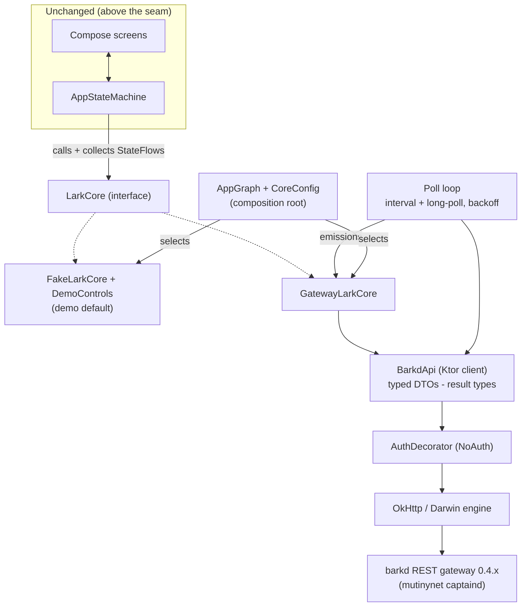

# GatewayLarkCore barkd Thin Client - Plan

## Goal Capsule

- **Objective:** Implement `GatewayLarkCore` — a real `LarkCore` backed by the barkd REST gateway on mutinynet — selectable at the composition root, verified end-to-end against a mock engine, with real QR encoding for receive codes.
- **Authority hierarchy:** The barkd v0.4.x REST API (OpenAPI-specced at the ark-bitcoin project; vendored summary in U2) is authoritative for wire shapes; the existing `LarkCore` interface and state-machine test suite are authoritative for seam behavior; this plan for architecture and sequencing.
- **Execution profile:** Units in dependency order; proof-first for all mapping/behavior units; every unit gated by the Verification Contract before moving on.
- **Stop conditions:** Stop and surface a blocker if a settled decision (KTD-1..4) proves unworkable, if the barkd API surface turns out to be fundamentally incompatible with the `LarkCore` seam (not merely differently shaped), or if the Ktor/Kotlin-Native combination cannot link the iOS framework.
- **Tail ownership:** The invoking pipeline owns review, commit, PR, and CI.

---

## Product Contract

### Summary

The app gains its first real core: `GatewayLarkCore` speaks to a barkd REST gateway over HTTPS/JSON, so a device pointed at a reachable gateway shows a real mutinynet wallet — real balance, history, receive codes (rendered as scannable QR), mock-verified send behavior (live sends additionally need real destination entry, deferred — today's paste/scan are prototype simulations), refresh, and health that reflects actual gateway reachability. Demo mode remains the default and fully intact; the core is chosen once at the composition root. Auth ships as a pluggable no-op seam awaiting the pending REST security write-up.

### Problem Frame

Everything above the `LarkCore` seam is built and tested, but the only implementation is a fake. M1's goal is a thin client against the hosted barkd gateway. The gateway's deployment status is not verifiable from this machine, but barkd's REST surface is publicly documented (OpenAPI, v0.4.0, July 2026) — so the client can be built and fully verified against a mock engine now, and reconciled against a live gateway when one is reachable (the deferred reconciliation checklist is the artifact that discharges that promise). Topology assumption: barkd is a single-wallet daemon, so `GatewayLarkCore` targets a dedicated barkd instance per app installation; a shared gateway would expose one wallet to every device, which R5's wallet-exists probe surfaces rather than hides.

### Requirements

**Gateway client**

- R1. A `BarkdApi` HTTP client in commonMain (Ktor) exposes the endpoint surface `GatewayLarkCore` consumes — wallet-exists probe, balance, VTXO list, payment history, BIP-321 receive-request creation, send, refresh, connected/tip/ark-info status, mnemonic, create — as typed suspend functions with kotlinx-serialization DTOs. Exit/offboard endpoints are excluded this milestone (no seam member consumes them; see Deferred).
- R2. The gateway base URL is configurable and carries no hardcoded production default; non-loopback URLs must be `https://` (plain `http://` only for loopback dev targets via explicitly scoped debug platform config — Android network-security-config, iOS ATS exception). The client pins the vendored 0.4.0 spec as a documented constant; the API has no runtime version-negotiation mechanism, so unrecognized or missing response shapes surface as typed contract errors (R4) rather than a claimed version check.
- R3. Every request passes through a single `AuthDecorator` seam (default no-op) so the pending auth model drops in without restructuring call sites.
- R4. Transport and gateway errors map to typed results — never exceptions across the `LarkCore` seam; 401/403 map to a distinct auth-required result so an auth-enabled gateway is diagnosable at first contact rather than indistinguishable from unreachability.
- R15. Mnemonic responses are never logged, cached, or retained beyond the backup-words display path; HTTP-level logging (if any) excludes bodies for the mnemonic endpoint and the `Authorization` header.
- R16. At first successful contact, `GatewayLarkCore` verifies the gateway-reported network (`ark-info`/create response) equals the configured expected network (mutinynet) and treats a mismatch as a hard, non-recoverable error state — no send/receive/mnemonic calls proceed.

**Core semantics**

- R5. `GatewayLarkCore` implements `LarkCore` exactly: the collected StateFlows emit on data changes, `send` returns `SendResult` after the gateway confirms or fails, and `walletExists` derives from the wallet-exists probe. Create checks the probe first and maps the gateway's wallet-already-exists failure to a typed error, never a crash; the seam's parameterless `restoreWallet()` maps to create-without-mnemonic this milestone (behaviorally create-equivalent — restore with real words needs a word-entry affordance, deferred). Backup words map to the mnemonic endpoint; a 404 (`--expose-mnemonic` off, the hosted default) yields the words-unavailable state: empty `backupWords`, rendered by the backup screen as an explanatory "words unavailable on this gateway" message (a named, deliberate above-seam touch) — never fake words.
- R6. Health maps from observable gateway state: connect failure/timeout on state-fetch requests or the `/ping` probe, a persistent HTTP-error streak on data endpoints, or `connected: false` from `GET /wallet/connected` → OFFLINE; reachable with VTXOs nearing expiry (minimum `expiry_height` within a threshold of `bitcoin/tip`, threshold derived from `ark-info.vtxo_expiry_delta`) → STALE; refresh round pending → TIDYING presented as Ready; otherwise READY. The long-poll notifications call never drives OFFLINE — its timeout just re-issues the wait (its client timeout must exceed the server's long-poll window). Recovery from OFFLINE is automatic on the next successful poll.
- R7. Data freshness comes from a polling loop (interval-based `GET` of balance/VTXOs/history, upgraded with the long-poll notification endpoint) feeding the StateFlows; polling stops when the core is closed and backs off while OFFLINE. History-only changes that move no collected StateFlow surface on the next flow emission or user interaction — accepted, documented M1 staleness.
- R8. Fiat rate: barkd exposes no fiat/price endpoint (verified against the 0.4.0 spec — all amounts are sat-denominated), so the gateway core retains the existing demo rate constant, clearly marked as demo until a rate source exists.
- R9. Advanced stats map from real gateway data where available (VTXO count/total, expiry, last refresh, server status, chain tip); fields the gateway does not expose render as em-dash placeholders rather than fake numbers.

**Selection and UI**

- R10. Core selection happens only at the composition root: demo (default) or gateway, with the gateway URL supplied by configuration; the Advanced DEMO rail continues to appear only when the active core provides `DemoControls` (fake only).
- R11. The receive screen renders the active core's receive code as a real, scannable QR (qrose painter) in shared code; the decorative `FakeQr` is removed.
- R12. The settings footer and network metadata read from the active core (`mutinynet` for both cores today).

**Verification**

- R13. A shared `LarkCore` contract test suite runs against both `FakeLarkCore` and `GatewayLarkCore` (mock engine), pinning seam behavior: send validation (non-positive/over-balance rejected), wallet lifecycle transitions, StateFlow emission on data change.
- R14. All `GatewayLarkCore` behavior is testable without network: Ktor `MockEngine` fixtures for happy paths, gateway errors (incl. 401/403 and wallet-already-exists), timeouts, and malformed responses; fixture payloads are schema-validated against the vendored `docs/gateway/barkd-openapi-0.4.0.json` at test time so a fixture that drifts from the contract fails the build (breaks the DTO/fixture same-author circularity); the existing 105-test suite stays green.

### Acceptance Examples

- AE1. **Given** a mock gateway that times out, **when** the polling loop ticks, **then** health becomes OFFLINE, `send` returns failure, and a subsequent successful poll returns health to READY.
- AE2. **Given** a mock gateway reporting balance 250,000 sats and two history entries, **when** `GatewayLarkCore` polls, **then** `balanceSats` emits 250,000 and `activity` reflects both entries mapped to `Transaction`.
- AE3. **Given** the gateway core is active, **when** the receive screen renders, **then** the identical string instance feeds both the QR painter and the code box (pinned by test at the wiring level), and a one-time manual check scans the rendered QR of a representative long BIP-321 string with a phone camera to confirm the decoded payload matches.
- AE4. **Given** demo mode (default), **when** the app runs, **then** the existing 105-test suite passes unchanged, all demo flows behave as before, and the Advanced DEMO rail appears — with one known delta: the receive QR is now a real encoding of the same demo string (R11).

### Scope Boundaries

- **In scope:** everything above; the vendored API contract summary; dependency additions (Ktor, kotlinx-serialization, qrose).
- **Deferred to follow-up work:** real auth incl. bearer-token storage/rotation (blocked on the REST security write-up — the `AuthDecorator` seam is the drop-in point); WebSocket streaming (long-poll/interval polling suffices for M1); an in-app settings UI for gateway URL/core switching (config-level only this milestone); wallet persistence across launches; real destination entry (clipboard paste / manual input) and camera scanning — prerequisites for live sends; restore with real backup words (needs a word-entry affordance; the seam's `restoreWallet()` is parameterless); exit/offboard wiring (the exit screen is display-only today — needs a seam member; the spec shapes are documented in Sources for that follow-up); a documented manual live-gateway reconciliation checklist (smoke script over the R1 surface: probe, create, receive-QR scan, send, refresh, health transitions) as the artifact for first live contact; live-gateway integration tests in CI; issue #2's background force-hide hook.
- **Outside this product's identity:** exposing protocol mechanics outside Technical details/Advanced (design translation-layer rule); the M2 in-process Rust core (`bark-ffi`/uniffi — noting Second's docs recommend FFI for native apps, which is precisely the existing M2 plan; REST-first remains the settled M1 approach).

### Sources

- barkd REST API **0.4.0 spec fetched and vendored** at `docs/gateway/barkd-openapi-0.4.0.json` (66 paths; source `bark-rest/openapi.json` in the bark repo, retrieved 2026-07-28). Verified shapes used by this plan: `GET /api/v1/wallet/balance` (`spendable_sat` + pending fields), `GET /api/v1/history` (`Movement[]`; `/wallet/movements` and `/wallet/history` are deprecated aliases — avoid), `POST /api/v1/wallet/bip321` (→ `bip321` string + optional `ark`/`bolt11`), `POST /api/v1/wallet/send` (`destination` accepts ark address/BOLT11/BOLT12/LNURL/lightning-address; **no unified bip321-pay endpoint** — the client parses the URI and routes), `POST /api/v1/wallet/refresh/all` (→ `PendingRoundInfo`), `GET /api/v1/wallet/vtxos` (per-VTXO `expiry_height`, `amount_sat` — the STALE predicate input), `GET /api/v1/wallet/connected` (Ark-server connectivity), `POST /api/v1/wallet/create` (`network`, optional `mnemonic` for restore → `fingerprint`), `GET /api/v1/wallet` (`fingerprint\|null` = wallet-exists probe), `GET /api/v1/wallet/mnemonic` (**404 unless barkd runs `--expose-mnemonic`**), `GET /api/v1/notifications/wait?since=` (tagged-union events: movement-created/updated, channel-lagging), `GET /ping` (explicitly unauthenticated — the reachability probe), `GET /api/v1/bitcoin/tip`, `GET /api/v1/wallet/ark-info` (network, round interval, vtxo expiry delta — Advanced-stat + R16 inputs). Exit/offboard shapes (`POST /api/v1/exits/start/all`, `POST /api/v1/exits/progress`, `GET /api/v1/exits/status/all`) are documented here for the deferred exit-wiring follow-up only — not part of this milestone's client surface. Auth: `Authorization: Bearer <token>`; `--no-auth` disables auth entirely (verified from `bark-rest/src/auth.rs`). bark/barkd 0.4.0 pairs with captaind 0.4.0, **no cross-version upgrade guarantee** — pin versions. Networks incl. mutinynet.
- Ktor 3.5.1 (stable, 2026-06-26), compatible with Kotlin 2.2.0; artifacts: `ktor-client-core`, `ktor-client-content-negotiation`, `ktor-serialization-kotlinx-json`, engines `ktor-client-okhttp` (Android) / `ktor-client-darwin` (iOS), `ktor-client-mock` (tests). kotlinx-serialization **1.9.0** is the Kotlin 2.2.0 match. Pitfall: Darwin engine session-invalidation crash in older 3.x — pin latest; use `Darwin`, not `DarwinLegacy`.
- QR: **qrose** `io.github.alexzhirkevich:qrose` v1.1.2 (2026-02-09, MIT, iosArm64+iosSimulatorArm64, `rememberQrCodePainter` → Compose `Painter` in commonMain). Fallback: `network.chaintech:qr-kit` 3.1.3 (heavier — bundles scanning).
- Seam contract: `composeApp/src/commonMain/kotlin/xyz/lark/app/core/LarkCore.kt`; behavioral contract = state-machine suite per prior plan KTD-3 (`docs/plans/2026-07-28-001-feat-lark-wallet-ui-plan.md`).
- Milestone: `~/.buzz/PLANS/LARK_CLIENT_KMP_CMP.md` M1 (team workspace).

---

## Planning Contract

### Key Technical Decisions

- KTD-1. **The LarkCore seam, commonMain state machine, and single Compose codebase are fixed.** (session-settled: user-directed — chosen over wiring UI to the gateway client directly or per-platform logic: the seam exists so cores swap without touching UI/state machines.) `GatewayLarkCore` changes nothing above the seam except the composition root and the QR rendering source.
- KTD-2. **Target network is mutinynet.** (session-settled: user-directed — chosen over the design's signet label: repo and milestone target mutinynet.) Both cores report `mutinynet`; the gateway config documents that the URL must point at a mutinynet-paired captaind.
- KTD-3. **Auth is a pluggable decorator seam, out of scope.** (session-settled: user-approved — chosen over blocking gateway work until the REST security write-up lands: unblocks everything but the auth layer.) `AuthDecorator` decorates each request (headers/tokens); ships with `NoAuth`. barkd's documented token auth + `--no-auth` local mode confirms the seam fits the real surface.
- KTD-4. **Demo mode stays the default; core selection at the composition root only.** (session-settled: user-approved — chosen over replacing FakeLarkCore: demo is the only runnable mode until a gateway is reachable, and tests/UI work depend on it.) `AppGraph` builds the core from `CoreConfig`; the DEMO rail keeps keying off `DemoControls`.
- KTD-5. **Ktor 3.5.1 + kotlinx-serialization 1.9.0.** Research-validated for Kotlin 2.2.0; OkHttp engine on Android, Darwin on iOS, MockEngine in commonTest. Chosen over ktorfit/hand-rolled expect-actual HTTP: Ktor is the KMP-native standard with first-class mock testing, and the pinned versions dodge the known Darwin session-invalidation crash in older 3.x.
- KTD-6. **Target the verified barkd 0.4.0 REST surface; the vendored spec is the contract.** The 0.4.0 OpenAPI spec is already fetched and vendored at `docs/gateway/barkd-openapi-0.4.0.json`; `docs/gateway/barkd-api.md` summarizes the subset this client uses and records the pinned version pair (bark/captaind 0.4.x) so a gateway upgrade is a deliberate, visible diff. DTOs mirror spec field names exactly; avoid the deprecated alias endpoints.
- KTD-7. **Polling (long-poll where available) feeds the StateFlows; no WebSocket this milestone.** A single poll loop per core instance — interval GET of wallet state + history, upgraded to `GET /api/v1/notifications/wait` long-polling when the endpoint reconciles — with exponential backoff while OFFLINE. Chosen over WebSocket streaming: materially simpler, the seam only needs eventual StateFlow emissions, and the notification long-poll gives near-push latency.
- KTD-8. **Errors are typed at the transport boundary.** `BarkdApi` returns a result type (success/http-error/unreachable) — `GatewayLarkCore` maps those to `SendResult`/health, and nothing above the seam sees a Ktor exception type.
- KTD-9. **qrose renders real QR codes in commonMain.** `rememberQrCodePainter` on the active core's receive string; `FakeQr` and its LCG test are deleted (the decorative pattern was a prototype artifact; the design intent is "one scannable code"). Chosen over qr-kit (bundles unneeded camera/scanning surface) and a hand-rolled encoder (error-correction complexity detekt would hate).
- KTD-10. **`CoreConfig` is a plain commonMain value resolved in `AppGraph`** — mode (DEMO default | GATEWAY) plus gateway base URL, compile-time constants for now (no BuildConfig plumbing, no runtime switching UI). Chosen over gradle BuildConfig/expect-actual per platform: smallest honest mechanism until a settings UI is planned.

### High-Level Technical Design

Health mapping (gateway observations → existing `HealthState`):

| Gateway observation | HealthState |
|---|---|
| State-fetch/`/ping` timeout or connect failure; persistent 5xx streak; `connected: false`; 401/403 (auth-required, distinguishable reason) | OFFLINE (backoff polling; auto-recover on success) |
| Reachable; minimum VTXO `expiry_height` within threshold of chain tip (threshold from `ark-info.vtxo_expiry_delta`) | STALE |
| Refresh round pending (`/wallet/refresh/all` in flight) | TIDYING |
| Reachable, no action needed | READY |

The long-poll notifications request is excluded from OFFLINE classification — its timeout re-issues the wait.

### Assumptions

- The hosted gateway is not reachable from CI or this machine; all verification is mock-engine based, and first live reconciliation happens when a URL exists (KTD-6's contract doc is the reconciliation checklist).
- Wire shapes are verified from the vendored 0.4.0 spec; the residual unknown is the hosted deployment (URL, auth on/off, version drift), reconciled at first live contact against the contract doc.
- Long-poll notification support is optional: the poll loop must be correct with plain interval polling alone; a `channel-lagging` event triggers a full resync.
- The app's "one balance" is `spendable_sat`; pending fields surface only in Advanced (design translation-layer rule).
- Backup words with the gateway core require `--expose-mnemonic` on barkd; a 404 maps to an explicit words-unavailable state (never fake words).
- `GatewayLarkCore` needs no `DemoControls`; forcing health states remains a fake-core capability.

---

## Implementation Units

### U1. Dependencies and configuration plumbing

- **Goal:** The build carries Ktor/serialization/qrose, and the composition root can express core selection.
- **Requirements:** R2, R10; KTD-4, KTD-5, KTD-10.
- **Dependencies:** none.
- **Files:** `gradle/libs.versions.toml`, `composeApp/build.gradle.kts` (serialization plugin + commonMain/androidMain/iosMain deps, `ktor-client-mock` in commonTest); `composeApp/src/commonMain/kotlin/xyz/lark/app/core/CoreConfig.kt` (mode enum + gateway URL, demo default); `composeApp/src/commonMain/kotlin/xyz/lark/app/App.kt` (AppGraph builds core from CoreConfig — gateway branch lands in U6).
- **Approach:** Version-catalog entries: ktor 3.5.1 (core, content-negotiation, serialization-kotlinx-json, okhttp, darwin, mock), kotlinx-serialization-json 1.9.0 + `org.jetbrains.kotlin.plugin.serialization` 2.2.0, qrose 1.1.2. Verify the iOS static framework still links (the known Darwin-engine risk surface).
- **Test scenarios:** Test expectation: none — dependency/config scaffolding; replacement verification is the full build + iOS framework link.
- **Verification:** Gradle sweep green including `linkDebugFrameworkIosSimulatorArm64`.

### U2. barkd API contract and typed client

- **Goal:** `BarkdApi` — typed, mock-testable access to the endpoint surface the core needs, with the contract vendored for reconciliation.
- **Requirements:** R1, R2, R3, R4; KTD-3, KTD-5, KTD-6, KTD-8.
- **Dependencies:** U1.
- **Files:** `docs/gateway/barkd-api.md` (used-subset summary + pinned version pair; the vendored spec `docs/gateway/barkd-openapi-0.4.0.json` is already in the tree); `composeApp/src/commonMain/kotlin/xyz/lark/app/core/gateway/{BarkdApi.kt, BarkdDtos.kt, BarkdResult.kt, AuthDecorator.kt}`; tests `composeApp/src/commonTest/kotlin/xyz/lark/app/core/gateway/BarkdApiTest.kt`.
- **Approach:** DTOs and paths come straight from the vendored spec (Sources lists the exact endpoint set; mirror field names like `spendable_sat`, `bip321`, `fingerprint`; skip deprecated aliases). Client: Ktor `HttpClient(engine)` with ContentNegotiation/json (ignore unknown keys), base-URL from config, `AuthDecorator.decorate(requestBuilder)` applied in one place (`NoAuth` no-op; real impl will add `Authorization: Bearer <token>`), timeouts tuned for mobile, `GET /ping` as the unauthenticated reachability probe. Every call returns `BarkdResult<T>` (Ok / HttpError(status, body) / Unreachable(cause)) — no exceptions escape.
- **Execution note:** Start each endpoint with a failing MockEngine test asserting request line + serialization round-trip.
- **Test scenarios:** happy-path decode per endpoint (fixtures schema-validated against the vendored spec per R14); auth decorator applied to every request (assert a marker header from a test decorator); HttpError carries status + body for 4xx/5xx and 401/403 surfaces as auth-required; Unreachable on connect failure/timeout; malformed JSON → HttpError-not-crash; unknown JSON fields ignored; mnemonic endpoint excluded from logging output.
- **Verification:** `BarkdApiTest` green via MockEngine; detekt clean.

### U3. GatewayLarkCore

- **Goal:** The real core: polling, mapping, health, send/create/restore — a drop-in `LarkCore`.
- **Requirements:** R5, R6, R7, R8, R9, R12; KTD-1, KTD-2, KTD-7, KTD-8.
- **Dependencies:** U2.
- **Files:** `composeApp/src/commonMain/kotlin/xyz/lark/app/core/gateway/GatewayLarkCore.kt` (+ small mappers file if it keeps the class readable); tests `composeApp/src/commonTest/kotlin/xyz/lark/app/core/gateway/GatewayLarkCoreTest.kt`.
- **Approach:** Constructor takes `BarkdApi`, scope, poll intervals (injectable for virtual-time tests). One poll loop: `GET /wallet/balance` + `GET /wallet/vtxos` + `GET /history` diffed into the StateFlows (balance = `spendable_sat` — the design's one-balance rule; pending fields feed Advanced only; VTXO `expiry_height` vs `bitcoin/tip` drives STALE per R6), upgraded with `GET /notifications/wait?since=` long-polling (`movement-created/updated` → refresh, `channel-lagging` → full resync; long-poll timeouts never drive OFFLINE), exponential backoff while OFFLINE with `GET /ping` + `GET /wallet/connected` as the recovery/health probes. First successful contact runs the R16 network check (`ark-info` network == mutinynet, hard error on mismatch). `send`: parse `bitcoin:` BIP-321 URIs first (prefer the `ark` component, else BOLT11; bare onchain-only URIs are a typed unsupported error this milestone), then route the destination string to `POST /wallet/send`; map to `SendResult`. Create: probe `GET /wallet` first; `POST /wallet/create` with `network = mutinynet` (required field) → `fingerprint`; wallet-already-exists → typed error. `restoreWallet()` = create-without-mnemonic (R5). Backup words via `GET /wallet/mnemonic`, 404 → words-unavailable per R5, response never logged/cached (R15). Refresh: `POST /wallet/refresh/all` (TIDYING while the round is pending). Receive code: `POST /wallet/bip321` → the `bip321` string; `depositAddress` from `POST /wallet/bip321` with `onchain=true` (response `onchain` field, fetched on the first poll cycle); `recents` derives from recent history `sent_to` entries (empty when none). Advanced stats from `ark-info`, `bitcoin/tip`, VTXO list, balance pendings; em-dash placeholders for anything unexposed. Fiat rate per R8 (demo constant).
- **Execution note:** Proof-first with virtual-time MockEngine tests; AE1's offline→recover cycle is the anchor test.
- **Test scenarios:** Covers AE1 (timeout → OFFLINE → backoff → `/ping` recovery → READY); Covers AE2 (balance/history mapping from spec-shaped fixtures); reachable-but-erroring (5xx streak) and `connected: false` → OFFLINE while `/ping` still answers; long-poll timeout does NOT flip OFFLINE and re-issues the wait; send success returns Success and next poll reflects the debit; send HTTP failure → Failure, no balance change; 401/403 → typed auth-required result; BIP-321 URI parsed (ark component preferred, BOLT11 fallback, onchain-only → typed unsupported) before routing to `/wallet/send`; create sends `network=mutinynet` and flips `walletExists` via `fingerprint`; create against an existing wallet → typed already-exists error (probe-first path pinned); `restoreWallet()` issues create-without-mnemonic; R16 network-mismatch fixture → hard error state, no further calls; mnemonic 404 → words-unavailable state (never fake words) and mnemonic 200 body excluded from any log output; STALE from an expiring-VTXO fixture (`expiry_height` near tip); refresh() posts `/wallet/refresh/all` + TIDYING→READY; `channel-lagging` triggers full resync; history-only update renders on the next flow emission (documented staleness pinned); poll loop stops on close/scope cancel; backoff schedule pinned with virtual time; `depositAddress` and `recents` mappings; advanced-stats mapping incl. placeholder fields.
- **Verification:** `GatewayLarkCoreTest` green; no test touches real network.

### U4. Shared LarkCore contract test suite

- **Goal:** One abstract suite pins seam behavior for every present and future core.
- **Requirements:** R13; KTD-1.
- **Dependencies:** U3.
- **Files:** `composeApp/src/commonTest/kotlin/xyz/lark/app/core/LarkCoreContractTest.kt` (abstract) + thin `FakeLarkCoreContractTest.kt` / `GatewayLarkCoreContractTest.kt` runners; refactor overlapping assertions out of `FakeLarkCoreTest.kt` rather than duplicating them.
- **Approach:** Abstract class with a factory per implementation (gateway variant backed by a happy-path MockEngine). Pins: send rejects non-positive and over-balance; success debits; walletExists lifecycle; StateFlow emission on data change; backup words → backedUp flow.
- **Test scenarios:** the contract set above executed twice (fake + gateway); a deliberate-divergence note where behavior legitimately differs (e.g., fake's fixed data vs gateway's fixtures) kept out of the shared suite.
- **Verification:** both runners green; `FakeLarkCoreTest` keeps only fake-specific cases.

### U5. Real QR rendering

- **Goal:** The receive screen shows a scannable QR of the active core's receive string; the decorative pattern is gone.
- **Requirements:** R11; KTD-9.
- **Dependencies:** U1.
- **Files:** `composeApp/src/commonMain/kotlin/xyz/lark/app/ui/screens/receive/ReceiveScreen.kt` (qrose painter in the white card, sized/padded as today); delete `.../receive/FakeQr.kt` and `composeApp/src/commonTest/kotlin/xyz/lark/app/ui/screens/receive/FakeQrCellsTest.kt`.
- **Approach:** `rememberQrCodePainter(receive.code)` — encode exactly the string displayed in the code box (AE3). Keep the white rounded card container; let qrose own the modules. Visual spot-check on the simulator.
- **Test scenarios:** Test expectation: none — rendering swap onto a third-party painter; behavior (which string renders) is pinned by AE3's state-machine-level assertion that `receive.code` is the single source, and by the U4 contract suite. Replacement verification: build + simulator screenshot.
- **Verification:** build green; screenshot shows a dense real QR in the existing card.

### U6. Composition-root selection and network metadata

- **Goal:** `AppGraph` builds the configured core; everything downstream keeps working in both modes.
- **Requirements:** R10, R12; KTD-4, KTD-10.
- **Dependencies:** U1, U3.
- **Files:** `composeApp/src/commonMain/kotlin/xyz/lark/app/App.kt` (AppGraph: `CoreConfig.mode` → FakeLarkCore or GatewayLarkCore(BarkdApi(engine per platform...))); engine provisioning may need a tiny expect/actual (`httpClientEngine()`) in `composeApp/src/{commonMain,androidMain,iosMain}/kotlin/xyz/lark/app/core/gateway/`; tests extend `AppStateMachineTest` only if a gap appears (state machine is core-agnostic already).
- **Approach:** Demo default unchanged (AE4). Gateway mode passes `demo = null` so the DEMO rail disappears (existing null-gating). Settings footer already reads `networkLabel` from the core.
- **Test scenarios:** Covers AE4. A test exercising the AppGraph factory path with `CoreConfig.GATEWAY` (MockEngine-backed) asserts the model carries `demoHealth == null` and gateway-fed balance; demo-mode construction unchanged (existing suite); backup screen renders the words-unavailable message on empty `backupWords` (R5's above-seam touch).
- **Verification:** full suite green in both wiring paths; app boots in demo mode on the simulator exactly as today.

---

## Verification Contract

| Check | Command | Applies to |
|---|---|---|
| Static analysis | `./gradlew detekt` | all units |
| Shared/unit tests (incl. MockEngine + contract suites) | `./gradlew :composeApp:testDebugUnitTest` | U2-U4, U6 |
| Android build | `./gradlew :composeApp:assembleDebug` | all units |
| iOS framework link (Ktor/Native risk gate) | `./gradlew :composeApp:linkDebugFrameworkIosSimulatorArm64` | U1 onward |
| Full reference CI (also runs in GitHub Actions on the PR) | `scripts/ci.sh` | final sweep |

Environment: `JAVA_HOME=/opt/homebrew/opt/openjdk@21`; no check may require a live gateway.

---

## Risks & Dependencies

- **barkd version churn, no upgrade path** (0.4.x pairs with captaind 0.4.x): mitigated by the vendored spec + contract doc — upgrades become an explicit diff of `docs/gateway/`.
- **Hosted deployment unknowns** (URL, auth on/off, version drift from 0.4.0): wire shapes are spec-verified, but first live contact may still surface drift; the contract doc is the reconciliation checklist and DTOs ignore unknown fields.
- **Ktor Darwin engine crash on invalidated sessions (older 3.x)**: pinned 3.5.1; iOS framework link is a per-unit gate and `scripts/ci.sh` builds the real app in CI.
- **Auth unknown**: KTD-3 seam; barkd's documented token auth confirms a request-decorator fits. The first live gateway may require `--no-auth` mode until the write-up lands. **Operating posture until then:** anyone who can reach a `--no-auth` gateway controls its wallet — mutinynet test funds only, never a non-loopback gateway without TLS (R2), and never a real-funds network (R16's runtime check enforces mutinynet).
- **Polling vs battery/network**: intervals injectable and conservative by default; long-poll upgrade reduces chatter; follow-up work if M1 field-testing shows drain.

---

## Definition of Done

- `GatewayLarkCore` + `BarkdApi` and the composition-root/QR work implemented per all Requirements (R1-R16) with the vendored contract doc; all mock-engine and contract tests green; the pre-existing 105-test suite still green.
- Demo mode unchanged per AE4's criteria; gateway mode boots against a MockEngine-backed core in tests.
- Receive screen renders a real QR (AE3); `FakeQr` and its test removed; no dead code from the swap.
- `./gradlew detekt :composeApp:testDebugUnitTest :composeApp:assembleDebug :composeApp:linkDebugFrameworkIosSimulatorArm64` and `scripts/ci.sh` pass; CI green on the PR.
- No abandoned experimental code in the diff.
