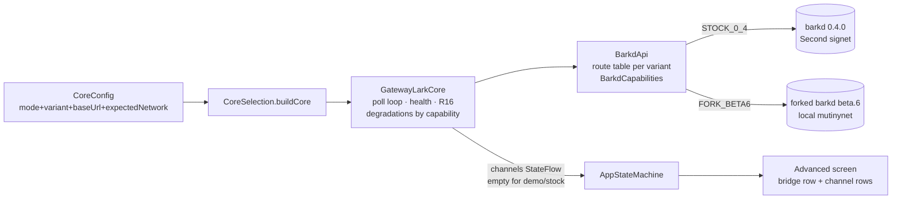

# LARK Channels on Local Mutinynet - Plan

## Goal Capsule

Make the app's gateway mode run against Greg's forked barkd (`0.1.0-beta.6`, the LARK channel bridge) on the local mutinynet stack, and surface Lightning channel state read-only in the Advanced screen. The stock barkd 0.4.0 path (Second's signet) must keep working unchanged. Authority: this plan > repo conventions > implementer judgment on open details. Stop and surface rather than guess when: the fork's live wire shape contradicts the vendored spec, the LarkCore seam would need a breaking change, or channel work would touch the main money flows (send/receive/home) beyond what U5 scopes.

---

## Product Contract

### Summary

The wallet currently speaks only the stock barkd 0.4.0 REST surface, which has no channel concept. LARK's differentiator — LDK Lightning channels funded by Ark VTXOs — exists only on the forked barkd/captaind stack running locally on mutinynet. This work makes the app speak both surfaces via a compile-time API variant, degrades gracefully where the fork lacks endpoints, polls channel state, and renders it in Advanced ("Everything LARK handles for you, in the protocol's own words").

### Problem Frame

The channel stack was proven live on 2026-07-29 (bob's 1M-sat VTXO-funded channel `ready=true, usable=true`), but the app cannot connect to it: four endpoints it depends on don't exist on the fork, wallet-create takes a different request shape, and channel state has no home in the seam or the UI. Second's public server can't serve channel work at all — the fork can no longer parse current production ArkInfo (protobuf field drift), and channels require the forked captaind server-side.

### Requirements

Compatibility:
- R1. In gateway mode with the fork variant selected, the app completes onboarding, shows READY health, real balance, receive address, and activity against forked barkd `0.1.0-beta.6` (local barkd, e.g. `http://localhost:3001`).
- R2. The stock 0.4.0 variant continues to pass the existing gateway test suite unchanged; variant selection is compile-time in `CoreConfig` (no runtime probing).
- R3. Fork-missing capabilities degrade honestly: no `/wallet/mnemonic` → Backup shows the existing words-unavailable notice (never fake words); no `/notifications/wait` → the core runs poll-only (no notification loop, no error spam); no `/wallet/bip321` → the receive code is a client-built `bitcoin:?ark=<address>` URI from `POST /wallet/addresses/next`.
- R4. Wallet create/adopt works with the fork's `CreateWalletRequest` shape (`ark_server`, `chain_source`, `network`), preserving the probe-first adopt-on-existing behavior. The fork variant adds `arkServerUrl` (the forked captaind, a different host:port from barkd) and `chainSource` as compile-time `CoreConfig` constants beside `gatewayBaseUrl` — no production defaults; concrete local-stack values live in the U7 recipe; U1's vendored spec settles the required fields and the accepted `network` enum value for create.
- R5. The R16 network hard-fail still guards the fork path: the fork reports network id `signet` (observed live 2026-07-29 in barkd-alice's ark-info), so expectedNetwork for the fork variant is `signet`; in the fork variant the identity check additionally requires ark-info `supports_channels == true`, hard-failing OFFLINE on mismatch, since within signet space the network id alone no longer discriminates fork from stock servers. Mutinynet identity is carried by which server the build points at — and by a user-facing network label decoupled from the id: `CoreConfig` gains `networkLabel` ("mutinynet" for the fork variant) so the Settings footer never regresses to the signet copy KTD-2 rejected (`networkLabel` is currently derived from expectedNetwork in `GatewayLarkCore`).

Channels:
- R6. When the fork variant is active, the core polls `GET /lightning/channels` and `GET /lightning/channels/balance` on the existing poll cadence and exposes a channels snapshot through the seam; the demo core exposes an empty snapshot.
- R7. Advanced shows channel state: the Lightning bridge row becomes real (channel count and total local balance from `LightningBalanceInfo`), and each channel renders a row with short channel id, local balance as the primary figure with capacity secondary (`₿<local> of ₿<capacity>` — per-channel figures sum to the bridge total), usable/ready state, and backing-VTXO expiry (`expiry_height` against tip, same countdown voice as Soonest expiry; absent `expiry_height` renders the em-dash, never a fabricated height). Not-yet-fetched (pre-first-poll) is distinct from fetched-and-empty: the snapshot flow starts null → bridge row shows the em-dash; a successful poll with zero channels shows "0 channels". Stock variant and demo stay null forever (em-dash, unchanged).
- R8. Channel data is display-only this milestone: no open, close, force-close, ldk-pay, or ldk-invoice actions from the app.

Verification:
- R9. All channel and degradation logic is proven against the scriptable GatewayTestHarness with fixtures validated schema-scoped against the vendored fork spec; the live mutinynet stack is a manual smoke pass only.

### Scope Boundaries

Deferred to Follow-Up Work:
- Channel-preferring send (`ldk-pay`) and channel invoicing (`ldk-invoice`) — the payment-routing decision deserves its own plan once channel visibility ships; interacts with #14/#15.
- Boards (`/boards/board-amount`) as a real "add money" flow — a design change, not a protocol change.
- `GET /wallet/rounds` for round visibility — belongs with the #16 balance-during-rounds fix.
- Explicit `POST /wallet/sync` nudges from the app — today's live finding (barkd sync loop can die silently); a workaround for a fork bug, not app behavior. The U7 smoke procedure still checks sync-loop health operator-side (see U7) so a dead loop can't masquerade as an app regression.
- Force-close / exit-progress display: `force_close_spend_delay` is a static CSV parameter, not a close-in-progress signal, and force-closed channels leave the channels list to become exits — that display belongs with a future exits surface.
- Channel open/close operations from the app.

Outside this milestone's identity:
- Any change to main-flow screens (home, pay, get-paid) for channels.
- Rebasing Greg's fork onto current upstream (team/bark work, not app work).
- Fixing the fork's crash-recovery and startup-race bugs observed live.

### Sources

- Vendored fork spec (U1): `docs/gateway/barkd-fork-openapi-0.1.0-beta.6.json` — served by the fork itself at `GET /api-docs/openapi.json` (captured live from barkd alice 2026-07-29), not hand-authored, so fixture validation checks against the fork's own contract; stock spec: `docs/gateway/barkd-openapi-0.4.0.json`.
- Live survey 2026-07-29: endpoint diff (9/13 shared; `history` moved to `/wallet/history`; `bip321`, `mnemonic`, `notifications/wait` absent), `Movement` schema unchanged, `LightningChannelInfo{channel_id, counterparty, capacity_sat, local_balance_msat, is_usable, is_channel_ready, expiry_height?, force_close_spend_delay?}`, `LightningBalanceInfo{balance_sat}`, fork `ArkInfo` adds required `supports_channels` and drops `fees`; observed fork ark-info: `network: Signet`, `supports_channels: true`, `round_interval: 30s`, `required_board_confirmations: 3`, `vtxo_expiry_delta: 8640` (barkd-alice log).
- Team setup guide: `~/.buzz/GUIDES/LARK_LOCAL_SETUP.md` (stack pins, ports, smoke stages).

---

## Planning Contract

### Key Technical Decisions

- KTD-1. Target server for channel work is the local mutinynet channel stack (forked barkd + forked captaind). (session-settled: user-directed — chosen over Second's public signet server: the fork cannot parse current production ArkInfo (protobuf field drift) and Second does not run the channel bridge; the local forked captaind is the only channel-capable Ark server.)
- KTD-2. LARK's target network remains mutinynet. (session-settled: user-directed — chosen over the design's signet footer copy: product decision from the UI milestone, carried forward.) Reconciliation: mutinynet is a signet variant and the fork's ark-info reports `network: "signet"`, so the R16 check expects `signet` in the fork variant; pointing the build at the mutinynet gateway is what makes it mutinynet.
- KTD-3. Dual-surface strategy is a compile-time `BarkdApiVariant` (`STOCK_0_4`, `FORK_BETA6`) in `CoreConfig`, driving a route table and a `BarkdCapabilities` value (hasMnemonic, hasNotifications, hasBip321, hasChannels, create-request shape) inside the single `BarkdApi`/`GatewayLarkCore` — chosen over a runtime capability probe (more failure modes on a stack that is fragile at startup, and magic where KTD-10 of the gateway plan established compile-time constants) and over a second core class (would duplicate ~470 lines of poll/health/backoff logic for a handful of path and capability differences).
- KTD-4. The LarkCore seam gains one additive member: a channels snapshot flow (list of channel display models + total local balance) with a default empty implementation, so FakeLarkCore and the stock variant are untouched behaviorally — chosen over a fork-only side channel (UI reading GatewayLarkCore directly would break the seam that keeps screens core-agnostic).
- KTD-5. Channel rows live in Advanced only, display-only — chosen over new channel screens: the canonical design has no channel surface, and Advanced's charter ("everything LARK handles for you") is exactly this. Money-moving channel actions are deferred until the design owns them.
- KTD-6. Receive addresses in the fork variant: mint one address via `POST /wallet/addresses/next` inside the poll cycle when the receive-code cache is null, build the `bitcoin:?ark=<addr>` URI client-side, and cache it per session — mirroring the stock path's `fetchReceiveTargetsIfNeeded` (bip321 fetched once per session, "stable per wallet"). Minting per Get-paid visit was rejected: `addresses/next` mutates the address index, and `LarkCore.receiveCode` is a synchronous property, so per-visit minting would either rotate the QR every poll cycle or force an async seam change.
- KTD-7. Test strategy: fixtures derived from the vendored fork spec, validated by the same schema-scoped validator pattern as `BarkdFixtureSpecTest`, driving the existing GatewayTestHarness; the live stack is a manual smoke pass — chosen over live-stack integration tests: the stack demonstrated startup races, silent sync death, and crash-window state loss on 2026-07-29; CI must not depend on it.
- KTD-8. Branch stacks on `feat/gateway-lark-core` (PR #13, open and mergeable); the PR for this work targets that branch — chosen over branching from main: this work extends files PR #13 introduces.

### High-Level Technical Design

Capability-driven degradation inside the core, not scattered conditionals: `BarkdCapabilities` is consulted at three seams — loop startup (skip notification loop), backup words (return unavailable), receive-code minting (bip321 endpoint vs addresses/next + client URI). Channel polling joins the existing poll cycle; no new loop.

### Assumptions

- The fork's `/wallet/history` returns the same `Movement` array the 0.4.0 `/history` does (schema-verified; live shape spot-checked 2026-07-29) — activity mappers reuse unchanged.
- `Balance.pendingExitSat` is already nullable in the existing DTO (`Long? = null`), which covers the fork's nullable `pending_exit_sat` — U2 verifies rather than changes this.
- `ping` returns the same `pong` body on both surfaces.
- The local stack is reachable at plain HTTP loopback (`http://localhost:3001`); the R2 https rule for non-loopback hosts is unaffected.

---

## Implementation Units

### U1. Vendor the fork wire contract

**Goal:** The fork's OpenAPI spec and a contract summary live in the repo as the authoritative reference.
**Requirements:** R9 (fixture validation source); Sources.
**Dependencies:** none.
**Files:** `docs/gateway/barkd-fork-openapi-0.1.0-beta.6.json` (copy from the captured spec), `docs/gateway/barkd-fork-api.md` (endpoint diff vs 0.4.0, capabilities table, channel schemas), `docs/gateway/barkd-api.md` (add a pointer to the fork doc).
**Approach:** Mirror the structure of `barkd-api.md`. The diff table (9 shared / moved / absent / fork-only) from the 2026-07-29 survey is the core content.
**Test scenarios:** Test expectation: none — documentation; the spec file is exercised by U6's validator.
**Verification:** Fork doc names every endpoint U2–U4 consume; spec file is valid JSON.

### U2. BarkdApiVariant, route table, and capabilities

**Goal:** One `BarkdApi` speaks both surfaces, selected compile-time.
**Requirements:** R2, R4; KTD-3.
**Dependencies:** U1.
**Files:** `composeApp/src/commonMain/kotlin/xyz/lark/app/core/gateway/BarkdApi.kt`, `BarkdDtos.kt`, `core/CoreConfig.kt`, `xyz/lark/app/CoreSelection.kt` (composition root — package `xyz.lark.app`, not `core/gateway`); tests `composeApp/src/commonTest/kotlin/xyz/lark/app/core/gateway/BarkdApiTest.kt`.
**Approach:** Add `enum BarkdApiVariant { STOCK_0_4, FORK_BETA6 }` + `BarkdCapabilities` derived from it. Route table maps logical calls to paths (`history` → `/api/v1/history` vs `/api/v1/wallet/history`). Fork DTOs: `LightningChannelInfo`, `LightningBalanceInfo`, `Address`, fork-shape `CreateWalletRequest` (`ark_server`, `chain_source`, `network`, optional `mnemonic`); verify the existing nullable `Balance.pendingExitSat` (`Long? = null`) covers the fork. `CoreConfig` gains `apiVariant` (default `STOCK_0_4`), the fork create constants `arkServerUrl` + `chainSource` (consumed only when `apiVariant == FORK_BETA6`, no production defaults, R4), and a user-facing `networkLabel` per variant ("mutinynet" for `FORK_BETA6`) decoupled from `expectedNetwork` and passed into `GatewayLarkCore` separately (R5).
**Patterns to follow:** existing `BarkdApi` call/`BarkdResult` shape; `CoreConfig` KTD-10 compile-time constants.
**Execution note:** Start with failing route-table tests asserting each logical endpoint's path per variant.
**Test scenarios:** history path per variant; create-wallet body shape per variant (fork body has `ark_server`/`chain_source`, stock body has `esplora`); channels endpoints only reachable in fork variant; fork balance JSON with `pending_exit_sat: null` decodes to 0; unknown ark-info fields (e.g. `supports_channels` on fork, `fees` on stock) don't break either variant's decode.
**Verification:** New and existing `BarkdApiTest` suites green.

### U3. Capability-driven degradations in GatewayLarkCore

**Goal:** The core runs correctly on the fork surface with honest degradation, and unchanged on stock.
**Requirements:** R1, R3, R4, R5; KTD-3, KTD-6.
**Dependencies:** U2.
**Files:** `core/gateway/GatewayLarkCore.kt`, `core/gateway/GatewayMappers.kt`; tests `commonTest/.../gateway/GatewayLarkCoreTest.kt` (+ harness scripts).
**Approach:** Consult capabilities at the three seams: loop startup (no notification loop when `!hasNotifications` — poll cadence alone), backup words (immediate unavailable when `!hasMnemonic`), receive code (when `!hasBip321`: mint via `addresses/next` once per session when the cache is null, mirroring `fetchReceiveTargetsIfNeeded`; validate the returned address against the bech32 charset before embedding — reject to a no-receive-code state on mismatch; build `bitcoin:?ark=<addr>` client-side, KTD-6). Create/adopt uses the variant's request DTO; R16 compares against the variant's expectedNetwork, and in the fork variant additionally requires ark-info `supports_channels == true` (R5).
**Execution note:** Red-first per degradation: a harness script proving the stock behavior, its fork twin proving the degraded path.
**Test scenarios:** fork variant never calls `/notifications/wait` (harness asserts no request); backup words on fork → words-unavailable state, BackupScreen notice renders (existing state test extended); receive on fork calls `addresses/next` exactly once per session and returns a URI containing that address; an address with a URI-breaking character never reaches the receive code (no-receive-code state); create-on-fresh + adopt-on-existing against fork create shape; network mismatch (fork reports `signet`, config expects `mutinynet`) still hard-fails OFFLINE; fork variant against stock-shaped ark-info (no `supports_channels`) hard-fails OFFLINE; full stock contract suite unchanged.
**Verification:** `LarkCoreContractTest` passes against a fork-configured harness core; stock suite untouched and green.

### U4. Channels snapshot in the seam

**Goal:** Channel state flows from the fork API to the UI layer through LarkCore.
**Requirements:** R6; KTD-4.
**Dependencies:** U2.
**Files:** `core/LarkCore.kt` (additive member with empty default), `core/FakeLarkCore.kt` (inherits default), `core/gateway/GatewayLarkCore.kt`, `core/gateway/GatewayMappers.kt` (wire → display mapping), `core/model/` (channel display model); tests in `GatewayLarkCoreTest.kt` + `GatewayMappersTest.kt`.
**Approach:** `data class ChannelsSnapshot(channels: List<ChannelInfo>, totalLocalSat: Long)` exposed as `StateFlow<ChannelsSnapshot?>` — null means never-fetched (pre-first-poll, and forever on stock/demo), non-null-empty means polled-and-zero-channels; poll `lightning/channels` + `channels/balance` inside the existing cycle when `hasChannels`. Channel fetch failures must not route through the `CycleOutcome.note()` health classification — channel data is auxiliary, not liveness. Mapping: short channel id (head…tail, reuse abbreviation helper), local + capacity sats, usable/ready to a tri-state (usable / opening / unusable), `expiry_height` → the existing block-countdown voice (`force_close_spend_delay` is a static CSV parameter — not mapped; see Scope Boundaries).
**Test scenarios:** fork cycle with two channels updates the flow (counts, sats, states); channel with `is_channel_ready=false` maps to opening; null `expiry_height` renders placeholder; snapshot is null before the first successful poll and non-null-empty after a zero-channel poll; stock variant and demo core keep the flow null and never call channel endpoints; poll failure on channels endpoints degrades that cycle without flipping health.
**Verification:** Harness-driven core tests green; mapper tests cover every display field.

### U5. Advanced screen channel rows

**Goal:** Advanced shows the LARK machinery: bridge summary + per-channel rows.
**Requirements:** R7, R8; KTD-5.
**Dependencies:** U4.
**Files:** `composeApp/src/commonMain/kotlin/xyz/lark/app/ui/screens/settings/AdvancedScreen.kt`, `state/AppStateMachine.kt` + `state/AppModel.kt` (channels in the rendered model); tests `commonTest/.../state/AppStateMachineTest.kt`.
**Approach:** Lightning bridge row: `<n> channel[s] · ₿<total>` when the snapshot is non-null and non-empty, `0 channels` when non-null-empty, em-dash when null (stock/demo unchanged, R7). Below it, one row per channel in the existing Advanced row idiom: `<shortId>` / `₿<local> of ₿<capacity> · <state>` / expiry line in the Soonest-expiry voice (em-dash when `expiry_height` absent). No tap actions (R8).
**Test scenarios:** model render with two channels produces bridge summary and two rows with correct formatting (local-primary figures summing to the bridge total); null snapshot renders the em-dash placeholder exactly as today; non-null-empty snapshot renders "0 channels"; absent `expiry_height` renders the em-dash expiry cell; fork-variant footer label pins to "mutinynet" (R5 networkLabel decoupling); hidden-balance mode (R7 of the UI plan) masks channel sat amounts consistently with the rest of Advanced.
**Verification:** State-machine render tests green; manual visual check on simulator against demo core (empty) — live fork check happens in U7's smoke.

### U6. Fork fixture pack and schema-scoped validation

**Goal:** Every fork wire shape the app consumes is pinned by fixtures validated against the vendored spec.
**Requirements:** R9; KTD-7.
**Dependencies:** U1, U2.
**Files:** `commonTest/.../gateway/ForkFixtures.kt` (or extend `HealthyFixtures` with a fork set), `composeApp/src/androidUnitTest/kotlin/xyz/lark/app/core/gateway/BarkdForkFixtureSpecTest.kt` (beside the existing validator — androidUnitTest because the JSON-schema validation library is JVM-only, the established pattern from `BarkdFixtureSpecTest`).
**Approach:** Mirror `BarkdFixtureSpecTest`: each fork fixture validates schema-scoped against `barkd-fork-openapi-0.1.0-beta.6.json` (this caught 14 missing ArkInfo fields last time — it earns its keep). Fixtures: fork ark-info (with `supports_channels`), balance (null `pending_exit_sat`), channels list (from the live 2026-07-29 shape), channels balance, address, movements page.
**Test scenarios:** every fork fixture passes its spec schema; a deliberately broken fixture fails (validator sanity); the fixture set covers every endpoint U2–U4 consume from the fork.
**Verification:** Validator suite green in CI.

### U7. Local mutinynet runbook

**Goal:** Anyone can bring up the channel stack and point the app at it without re-learning today's landmines.
**Requirements:** R1 (manual smoke path); KTD-7.
**Dependencies:** U3, U5 (documents the smoke they enable).
**Files:** `docs/gateway/local-mutinynet.md`.
**Approach:** Condense the working knowledge: stack bring-up order (bitcoind at tip → postgres → captaind fully up and LDK at tip **before** any barkd, or the barkd worker panics and its sync loop dies silently), explicit `POST /onchain/sync` nudge gotcha, faucet CLI, smoke stages 1–6 (7–8 destructive/~3h), CoreConfig recipe (GATEWAY + FORK_BETA6 + `gatewayBaseUrl http://localhost:3001` + `arkServerUrl http://localhost:3535` + chainSource per stack pins + expectedNetwork `signet` + networkLabel `mutinynet`), and what the app should show (READY, balance, channels in Advanced). The smoke procedure includes a barkd sync-loop health check before recording pass/fail (nudge `POST /onchain/sync`, confirm the synced height advances; restart barkd per the bring-up order if not) so a dead fork sync loop can't masquerade as an app regression. Platform note: the live smoke targets the iOS simulator (shares host loopback); on the Android emulator use `adb reverse tcp:3001 tcp:3001` (and `tcp:3535`) so the app still dials localhost — never relax the R2 https rule for `10.0.2.2` or LAN hosts.
**Test scenarios:** Test expectation: none — documentation.
**Verification:** A cold read of the doc reproduces the smoke pass; one live smoke against the local stack recorded in the PR body.

---

## Verification Contract

- Unit/contract tests: `JAVA_HOME=/opt/homebrew/opt/openjdk@21 ./gradlew :composeApp:testDebugUnitTest` (harness, mappers, route table, fixture validators, state machine).
- Full gate: `scripts/ci.sh` (what CI runs on the PR) must pass.
- Live smoke (manual, not CI): local stack per U7 runbook; app onboards, shows READY + balance + channel rows in Advanced against barkd alice; screenshot in PR.
- Quality gates: no new detekt suppressions beyond the file-level patterns already established; stock-path test counts do not decrease.

## Definition of Done

- R1–R9 demonstrably hold: fork variant works end-to-end on the harness, stock suite is untouched and green, channels render in Advanced, degradations are honest.
- All new logic harness-tested; fork fixtures schema-validated; CI green on the stacked PR (base `feat/gateway-lark-core`).
- U7 runbook committed; one live smoke performed and evidenced in the PR body.
- No dead experiments left in the diff; no channel actions (open/close/pay) shipped.
