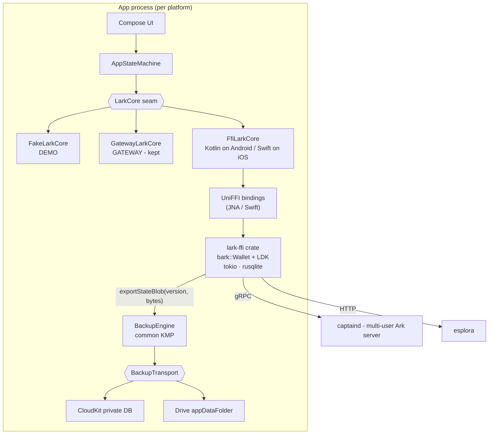
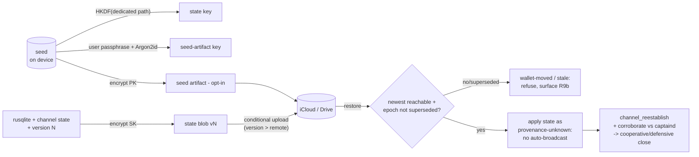

# M2 — In-Process Rust Core (Keys on Device) + Encrypted Cloud Backups - Plan

## Goal Capsule

Move the wallet into the app: a `lark-ffi` UniFFI crate compiles the bark+LDK forks into the app process, an `FfiLarkCore` implements the existing LarkCore seam on both platforms, and loss-of-phone becomes survivable through automatic client-side-encrypted backups to the user's own iCloud / Google Drive. Authority: this plan > repo conventions > implementer judgment. Stop and surface rather than guess when: the bark library API cannot express a seam operation, the LarkCore interface would need a breaking change, any backup design choice would place seed material under a seed-derived key, or fork compilation fails for a mobile target in a way the bark-ffi precedent doesn't cover.

---

## Product Contract

### Summary

Today the app is a thin client: a barkd daemon holds the seed and the app remote-controls it — one daemon serves exactly one user, and custody is server-side. M2 compiles the same wallet logic (Greg's bark+LDK forks) into the app via UniFFI, making the phone the wallet: keys on device, no per-user server anything (captaind is already multi-user). Because a lost phone then means lost funds, M2 also ships automatic encrypted backups: wallet/channel state auto-backed to the user's own cloud under a seed-derived key, and an opt-in passphrase-protected seed backup — so recovery is "sign into your cloud + passphrase (or your 12 words)".

### Problem Frame

The gateway model cannot serve external testers (single-tenant daemon, server-side seed) and contradicts the product's own promise ("bitcoin you hold yourself"). Its auth model is blocked on an external write-up; keys-on-device has no such dependency. Separately, the app currently has no persistence at all (re-onboards every launch) — an in-process wallet forces that gap closed. Lightning-specific danger shapes the backup design: seed-only recovery cannot restore off-chain balances, and restoring *stale* channel state risks the counterparty sweeping the channel via the penalty mechanism, so channel-state backup must be versioned and never-regressing.

### Requirements

Core swap:
- R1. An `FfiLarkCore` implements the full LarkCore seam against the in-process Rust wallet. Verification is asymmetric by platform (review): **Android** runs the existing `LarkCoreContractTest` suite unchanged against real Rust (JNA); **iOS** verifies the same Swift `FfiLarkCore` by simulator smoke (the contract suite is JVM-only — UniFFI has no Kotlin/Native target — so iOS parity is proven by behavior, not by re-running the suite).
- R2. Keys are generated, stored, and used exclusively on device: the seed never leaves the app sandbox except inside the R7 opt-in encrypted artifact. Two exfiltration channels are explicitly closed (review, P0): (a) the seed-bearing datadir is excluded from OS device backups — `NSURLIsExcludedFromBackupKey` on iOS, `android:allowBackup="false"` / dataExtractionRules excluding the datadir on Android — since iCloud device backup and Android Auto Backup would otherwise upload the seed to non-E2E storage; (b) the seed at rest is wrapped under a hardware-backed platform key per KTD-11. The mnemonic backs the existing BackupScreen words flow (no more words-unavailable on the primary path).
- R3. Wallet state is durable: rusqlite datadir in the app's documents/files directory (backup-excluded per R2); `walletExists`, balance, and history survive app restarts (first launch after onboarding lands on Home, not Welcome).
- R4. The in-process core speaks to captaind (gRPC) + esplora directly, configured via `CoreConfig` (`CoreMode.FFI`; the team mutinynet stack is the default dev target); the gRPC/HTTP endpoints use TLS and carry whatever captaind auth the stack requires — no plaintext transport to a non-loopback host (review). DEMO and GATEWAY modes keep working unchanged.
- R5. Unilateral **exit** is reachable through the seam and its progress survives app restarts (the fund-recovery path a keys-on-device user must have). Channel **management** ops proven in P0 (open-with-push, pay-over-channel, refresh, force-close) are built into the Rust crate this milestone but their seam exposure is deferred to when channel-management UI exists (review — scoping R5 to what M2 actually calls, so the Definition of Done doesn't claim seam operations no screen invokes).

Backups:
- R6. Automatic state backup: on state-changing events (movement, channel update, address derivation), a client-side-encrypted, monotonically versioned blob (rusqlite snapshot with seed-bearing rows excluded per U1/U5 + LDK channel state + descriptors — no seed material) uploads to the user's own cloud — CloudKit private database on iOS, Google Drive appDataFolder on Android. Encryption key is HKDF-derived from the seed on a dedicated path. Zero extra user secrets. Because uploads are debounced/async, the cloud copy always **lags** the true channel state — R9 treats that as a first-class fact, not an edge case.
- R7. Opt-in seed backup: a separate artifact containing the encrypted seed, protected by a user-chosen passphrase (Argon2id KDF), uploadable to the same cloud surfaces. Never encrypted with a seed-derived key (circularity). The manual 12-words flow remains the always-available fallback; declining the cloud seed backup is a first-class choice, not an error. (Review notes R7 is a convenience over the R2-words + R6-blob total-loss floor, not required to prevent total loss — kept per KTD-2, which the user directed toward automatic cloud recovery precisely so recovery doesn't depend on the user having written words down.)
- R8. Restore: onboarding detects existing backups in the signed-in cloud account and offers restore — state blob restores via seed-derived key after the user proves the seed (words or passphrase-decrypted seed artifact); freshness handling per R9. Restore must handle a wrong/absent signed-in cloud account (offer account switch, never silently fall to words-only). "I have 12 words" alone still restores on-chain + server-known funds without the blob.
- R9. Stale-state safety (review — reframed): the cloud's monotonic version proves *newest-in-cloud*, which is **not** the same as *matches-true-channel-state* (R6 lag) and is defeatable by a cloud-account attacker deleting newer blobs. Therefore restore's **default posture is provenance-unknown**: never auto-broadcast restored channel state; on reconnect use `channel_reestablish` / `option_data_loss_protect` and prefer cooperative/force-close recovery at the counterparty's last-known state, and where possible corroborate the version against captaind before trusting it. Upload still enforces monotonic version (conflict-checked) so the store never *regresses*; that guard is necessary, not sufficient, and R9's copy must not imply cloud-verifiable freshness.
- R9b. Old-device fencing (review): restoring to a new device does not silently make it safe for the old device to keep running — two live instances broadcasting divergent channel state is a penalty-sweep vector. M2 targets one active device per wallet; restore is migration, not concurrency. Surface this to the user at restore and, where the protocol allows, invalidate/fence the prior instance; full multi-device remains deferred.
- R10. Backup health is visible: the Settings backup row reflects real state (last backup time, opt-in seed backup status, and a manual "back up now"). Cloud-account display is platform-asymmetric and must not imply parity: Android can show the signed-in account email (Credential Manager); iOS shows "iCloud" only (CloudKit does not expose account identity to apps). Backup failures degrade honestly (visible staleness, never silent).

Operational:
- R11. CI builds and tests the Rust core: the crate compiles for the host target in CI so the Android contract tests exercise real Rust; mobile-target packaging (AAR/XCFramework) is reproducible via scripts. The `SKIP_RUST` escape hatch must NOT be settable on the required/main CI lane (review — an escape hatch on the gating lane silently invalidates Rust verification); a run with Rust skipped is marked non-verifying, and a required lane (or nightly) always builds it. CI obtains the forks at machine-readable pinned SHAs per KTD-3.
- R12. The liveness envelope is documented with a **measurable** bound (review): M2 states the concrete maximum offline window before channel-monitoring / VTXO-expiry risk begins (derived from the fork's timelock parameters and the ~2h45m P0 exit measurement), not just prose; the team captaind adopts offline-tolerant timelock parameters sized against that number; background-execution engineering is explicitly M3.

### Scope Boundaries

Deferred to Follow-Up Work (M3+):
- Background execution / notification-triggered wakeups / watchtower service (the liveness engineering R12 documents).
- Retiring GATEWAY mode and the barkd variant layer (kept as a dev/debug rail this milestone).
- A VSS server deployment; M2 mirrors the VSS pattern client-side against consumer clouds (KTD-8) — adopting `vss-server` proper is a follow-up.
- Multi-device active use (one active device per wallet this milestone; restore implies migration, not concurrency).
- The wasm32/PWA target the same crate could back.
- **Production distribution hardening** (own follow-up milestone, review): Google OAuth app verification for the Drive scope (unverified apps cap test users — the distribution-gating risk below), CloudKit production-container promotion, Rust-toolchain reproducible/signed release builds, and binary-size budgeting. M2 targets the team + small tester cohort.
- **Hosted/managed captaind** for testers who are not on the team stack (review): M2 assumes the team-run captaind + esplora; a public-facing hosted Ark server with its own auth/rate-limiting is its own milestone, not folded here.

Outside this milestone's identity:
- Changing the send/receive/home UX (#14, #16/#19/#20, #17 remain tracked separately).
- Mainnet. Everything here targets the team mutinynet stack.

### Sources

- Team feasibility research: `~/.buzz/RESEARCH/KMP_RUST_CLIENT_FEASIBILITY.md` (Bitkey architecture; bark-ffi proves tokio+rusqlite+tonic in-process on both platforms with async bindings; UniFFI has no Kotlin/Native target — hence the Bitkey binding pattern; Gobley exists but is young).
- Milestone plan: `~/.buzz/PLANS/LARK_CLIENT_KMP_CMP.md` (M2 definition; bark-ffi as packaging template).
- bark library survey (this session): `bark::Wallet` maps ~1:1 onto the seam — `create`/`open`, `balance`, `movements`/`history`, `new_address`, `ark_info`, `refresh_server`, arkoor send, bolt11 ops in `lightning/`, exit progress machinery in `exit/`; workspace has no FFI crate (lark-ffi is new work); `lightning` feature pulls `bark-lightning`.
- Backup research (2026-07-30, external): Phoenix backs channel state to its LSP + seed via CloudKit CKRecord; Breez backs full state to Drive/iCloud/WebDAV with optional passphrase layer; Bitkey stores a hardware-encrypted key blob in iCloud/Drive; LDK VSS documents the seed-derived-key + versioned-store pattern and ships in ldk-node; LDK requires ChannelMonitors persisted synchronously and treats stale monitors as the dangerous direction; iCloud KVS caps at 1MB total (too small/weak-conflict for state); Apple's at-rest encryption is not E2E without opt-in ADP → always client-side encrypt; GoogleSignIn is deprecated → Credential Manager + AuthorizationClient for the Drive scope; Drive appDataFolder is the standard hidden per-app store.

---

## Planning Contract

### Key Technical Decisions

- KTD-1. M2 (lark-ffi, keys on device) now. (session-settled: user-directed — chosen over a per-tester-barkd provisioner: throwaway infrastructure testing a custody model being abandoned; the REST-auth blocker gates only the gateway path.)
- KTD-2. Automatic encrypted backups to the user's own iCloud / Google Drive. (session-settled: user-directed — chosen over manual-only 12-word backup as the sole recovery path: with keys on device, unbacked-up phone loss is total loss.) Research-shaped instantiation in KTD-6/7/8.
- KTD-3. `lark-ffi` lives in this repo at `rust/lark-ffi`, path-depending on the sibling checkouts — chosen over a sibling repo: the crate's surface exists to serve this app's seam and must version atomically with it. Verified dependency facts (review, conf 100 against the bark checkout): the crate is `bark-wallet` (lib name `bark`), so the dep is `bark-wallet = { path = "../../../bark/bark", features = ["lightning", "onchain_bdk"] }` (a bare `bark = {path=...}` errors; `onchain_bdk` is REQUIRED — without it `Wallet::create` restricts boarding and unilateral exit, which R5 needs); lark-ffi also depends on `rusqlite = { features = ["bundled"] }` so feature-unification links bundled SQLite (the Android NDK has no system libsqlite3). Fork provenance is machine-readable, not runbook prose (review): a checked-in `rust/fork-pins.toml` (repo URL + branch + exact SHA per fork) is the single source consumed by `scripts/build-rust.sh` AND CI, so a fork bump is a one-line reviewable diff the contract suite gates — not whatever sibling checkout happens to exist.
- KTD-4. Bitkey binding pattern with a callback-delegate bridge on iOS (review, conf 100 — the naive version does not compile): Kotlin/Native does not allow Swift to *implement/override* a Kotlin `suspend` member (KT-38974), and LarkCore has `suspend fun refresh()`/`send()` plus StateFlow vals — so Swift cannot directly implement the exported seam. Instead: commonMain defines a non-suspend, completion-handler-style **platform-delegate** interface (`LarkCoreDelegate`, and a sibling `BackupCryptoDelegate` per KTD-6); Swift implements THAT over the UniFFI Swift bindings; a Kotlin `iosMain` adapter implements the real `LarkCore` (suspend + StateFlows, via `suspendCancellableCoroutine`) over the delegate and is what the composition root injects. On Android the Kotlin `FfiLarkCore` calls the UniFFI Kotlin (JNA) bindings directly — no delegate needed. Chosen over Gobley (Kotlin/Native bindings in commonMain): Gobley is young; this is Bitkey's actual production shape (the callback layer is why theirs compiles), and the seam keeps a later Gobley migration cheap.
- KTD-5. The FFI surface is coarse-grained and mirrors the seam, not bark's API: one `LarkWallet` UniFFI object with async operations named for seam semantics (balanceSnapshot, send, mintAddress, channelsSnapshot, startExit(progress callback), exportStateBlob, …). Keeps the binding surface small (feasibility doc's explicit guidance) and makes the contract suite the natural acceptance gate.
- KTD-6. Two-artifact backup design (the circularity resolution): the **state blob** (rusqlite snapshot + channel state + descriptors, no seed) auto-backs under an HKDF key derived from the seed on a dedicated derivation path — Phoenix/VSS precedent, zero user friction, safe precisely because the seed is not in the payload; the **seed artifact** is opt-in, encrypted under an Argon2id-derived key from a user passphrase, never a seed-derived key — chosen over (a) seed-in-blob under seed-derived key (cryptographically circular, worthless), (b) passphrase-encrypting everything (adds friction to the high-frequency artifact), (c) no cloud seed backup at all (fails KTD-2's intent). Crypto specifics pinned (review): both artifacts use an AEAD (XChaCha20-Poly1305) with `{version, walletFingerprint, artifact-type, format-version}` as authenticated associated data, so a cloud attacker cannot relabel a blob's version to defeat the R9 check; random per-encryption nonce and per-artifact salt in the header; Argon2id params pinned to at least m=64 MiB, t=3, p=4 (16-byte salt) and versioned for future hardening (header-version bump re-encrypts on next passphrase entry). The FFI surface exposes only sealed operations — `encryptStateBlob`/`decryptStateBlob`, `sealSeedArtifact(passphrase)`/`openSeedArtifact(passphrase)` — so derived key material never crosses the FFI boundary into GC-managed memory; there is no `deriveBackupKey` export.
- KTD-6b. Both artifacts may live in the same cloud account: account compromise yields ciphertexts only (state blob needs the seed; seed artifact needs the passphrase) — chosen over forcing separate storage locations for the two artifacts: the added recovery complexity buys nothing against this threat model, and the real residual (metadata + deletion/denial) is unchanged either way.
- KTD-7. Transports: **CloudKit private database** on iOS (Phoenix's choice; record-level conflict semantics; not KVS — 1MB total cap and weak conflicts; not raw iCloud Drive files — no atomic versioning) and **Google Drive `appDataFolder` via the Drive REST API** with Credential Manager sign-in + AuthorizationClient for the Drive scope on Android (GoogleSignIn is deprecated; Auto Backup gives no control over triggers/atomicity). Both behind one KMP `BackupTransport` interface so the engine is platform-blind and mock-testable.
- KTD-8. Version + device-epoch, with honest limits (review): every blob carries a monotonic version AND a device-epoch/installation id. Upload is conditional on version > remote (CloudKit change tags / Drive ETag CAS) so the store never *regresses* — necessary but NOT a freshness proof: the newest-in-cloud blob still lags the true channel state (R6 debounce) and a cloud attacker can delete newer blobs. So restore's default posture is provenance-unknown (R9): no auto-broadcast; corroborate against captaind where possible. Restore bumps the epoch; an engine whose remote epoch is newer than its own refuses to upload and surfaces "this wallet moved to another device" — the old-device fencing R9b needs, which a pure version counter cannot detect (both live devices advance from the same lineage). Adopting `vss-server` itself is deferred — consumer clouds are the storage backend this milestone.
- KTD-9. CI strategy: `ci.yml` gains steps to clone both forks at their `fork-pins.toml` SHAs into `../bark` and `../rust-lightning` (with a GitLab token if the repos are private — an open question to confirm before U2), install/cache the Rust toolchain, build `lark-ffi` for the **host** target, and run the Android contract tests against the real dylib via JNA — real-Rust coverage on every PR without device builds. AAR/XCFramework packaging runs via checked-in scripts (manual/nightly lane). Discipline (review): `SKIP_RUST` is NOT settable on the required/gating lane (an escape hatch there silently invalidates the Rust gate) — a skipped run is marked non-verifying and a required lane always builds Rust; and detekt excludes the generated-bindings path so `./gradlew detekt` still passes. Chosen over prebuilt committed binaries (opaque, drift-prone) and stub-only tests (untested real seam).
- KTD-10. Liveness is documented and parameterized, not engineered: M2 ships a liveness-envelope doc and sets generous VTXO expiry / channel timelock parameters on the team captaind (it's ours to configure), sized against the P0 exit measurement; background wakeups/watchtower are M3. (Instantiates the team plan's M3 gate.)
- KTD-11. Seed at rest under a hardware-backed platform key (review — bark does not persist the mnemonic; `Wallet::open` requires the caller to supply it every launch, so where it lives is ours to decide and the plan must decide it): store the mnemonic in iOS Keychain (a non-iCloud-synced accessibility class, e.g. `WhenUnlockedThisDeviceOnly`) / Android Keystore-encrypted storage, kept OUTSIDE the datadir the state blob snapshots — chosen over a plaintext file in the datadir (bark-cli's default): the datadir is both OS-backup-swept (R2) and snapshotted into the cloud blob, so a seed there would defeat both the R2 exclusion and the "no seed in blob" guarantee. Sandbox-only protection is explicitly rejected for a keys-on-device wallet's primary secret.

### High-Level Technical Design

Backup/restore data flow (the two artifacts never mix keys):

### Assumptions

- The forks compile for `aarch64-apple-ios`(+sim) and Android NDK targets with the `lightning` feature; bark-ffi's shipping of upstream bark on both platforms is the precedent. First compile is U1's first task and the plan's biggest early falsifier.
- `bark::Wallet` (or a thin wrapper) can expose a consistent state snapshot + version for the blob (rusqlite file snapshot at minimum); exact mechanism is implementation-time.
- CloudKit requires the iCloud entitlement + container (Apple dev account already in use for simulator builds; device provisioning is a known TestFlight prerequisite, not new).
- Drive REST + Credential Manager works on API 24+ with Play Services; testers without Play Services are out of scope.
- Kotlin stays 2.2.0; no new KMP library needs a 2.3-ABI klib (JNA is a JVM jar; no Kotlin/Native dependency is added).

### Risks & Dependencies

- **Fork churn (high).** lark-ffi tracks two fast-moving pre-1.0 forks pinned by side-by-side checkout, not versions. Mitigation: pin exact SHAs in the runbook, treat a fork bump as its own PR with the contract suite as the gate. A fork API break surfaces in U1's cargo build, the cheapest possible place.
- **UniFFI pre-1.0 (medium).** Occasional breaking changes between releases. Mitigation: pin the UniFFI version in Cargo.toml; regenerate bindings only deliberately (U2's checked-in-vs-generated decision records the reproducibility story).
- **Mobile-target compilation (front-loaded falsifier).** The forks have never been compiled for iOS/Android targets by this team. bark-ffi proves upstream bark does; the forks add bark-lightning + LDK. If a target fails in a way the precedent doesn't cover, U1 stops and surfaces per the Goal Capsule.
- **CloudKit prerequisites (external).** iCloud container + entitlement require the Apple developer account; CloudKit behavior is only fully testable on a signed-in simulator/device. Restore latency is eventually-consistent — U8's UX must tolerate "backup not visible yet" without scaring the user.
- **Drive OAuth consent (external, distribution-gating).** The Drive scope on a production/externally-distributed Android build requires Google OAuth app verification; unverified apps cap test users. Fine for the team + small tester cohort; flag before any wide external distribution.
- **Passphrase loss (product risk, accepted).** The opt-in seed artifact is unrecoverable without the passphrase by design (that is its security property). The 12 words remain the recovery of last resort; U8's copy must say both things plainly. No escrow, no hints, no server-side reset — deliberately.
- **Cloud-account compromise (threat model).** An attacker with the user's cloud account obtains ciphertexts only: the state blob needs the seed (not present in the cloud unless the user opted in), and the seed artifact needs the passphrase (Argon2id-hardened). The residual exposure is backup *metadata* (existence of a wallet, timing) and deletion/denial — document in the liveness/threat notes (U9 doc or U5 KDoc).
- **Binary size (~9MB+ accepted).** Rust core + CMP overhead per the feasibility research; acceptable for a wallet, monitored not gated.
- **Dependency: team captaind stability.** The in-process core inherits the local stack's known fragility (documented landmines in the runbook); FfiLarkCore's OFFLINE health mapping is the honest surface, and the stack's bring-up order remains a runbook prerequisite for all live smokes.

---

## Implementation Units

Unit index (dependency order):

| U-ID | Title | Key files | Depends on |
|---|---|---|---|
| U1 | lark-ffi crate + host build | `rust/lark-ffi/` | — |
| U2 | Kotlin bindings + FfiLarkCore (JVM/Android) + CI | `composeApp/src/androidMain/…`, `scripts/` | U1 |
| U3 | Swift bindings + iOS wiring | `iosApp/`, `rust/lark-ffi/` | U1 |
| U4 | Persistence + lifecycle + CoreMode.FFI | `core/`, `state/` | U2 |
| U5 | Backup engine + crypto (two artifacts) | `rust/lark-ffi/`, `core/backup/` | U1, U4 |
| U6 | iOS transport (CloudKit) | `iosApp/`, `core/backup/` | U5, U3 |
| U7 | Android transport (Drive appDataFolder) | `composeApp/src/androidMain/…` | U5 |
| U8 | Restore flow + backup status UI | `ui/`, `state/` | U5–U7 |
| U9 | Liveness envelope + captaind params + runbook | `docs/`, team stack | U4 |

### U1. lark-ffi crate + host build

**Goal:** A UniFFI crate wraps `bark::Wallet` (lightning feature) with a coarse async surface mirroring the seam, building for the host target with Rust unit tests green.
**Requirements:** R1, R2, R5, R7; KTD-3, KTD-5, KTD-6, KTD-11.
**Dependencies:** none.
**Files:** `rust/lark-ffi/{Cargo.toml,src/lib.rs,src/wallet.rs,src/exit.rs,src/backup.rs,uniffi.toml}`, `rust/lark-ffi/tests/`, `rust/fork-pins.toml`, workspace docs note in `docs/architecture` (or README).
**Approach:** Path-deps (review, conf-100 corrections — the naive lines do not build): `bark-wallet = { path = "../../../bark/bark", features = ["lightning", "onchain_bdk"] }` (the crate is `bark-wallet`, lib name `bark`, so imports stay `use bark::…`; `onchain_bdk` is required for boarding + unilateral exit) and `rusqlite = { version = "0.31", features = ["bundled"] }` (feature-unification links bundled SQLite for bark's rusqlite so the Android NDK build links). The exact fork repos+SHAs live in `rust/fork-pins.toml`, consumed by both build script and CI. UniFFI proc-macro style, async ops on one `LarkWallet` object: `createOrOpen` (generates a mnemonic on first run via bark's `Mnemonic::generate`, opens with `create_with_onchain`/`force:true` so create is server-free, and persists the mnemonic through the platform secure-storage port per KTD-11 — NOT into the datadir), balance, movements, newAddress, arkInfo, refresh, sendArkoor/sendBolt11, channel ops (open-with-push, pay, refresh, forceClose), startUnilateralExit + `ExitProgress` callback interface, mnemonicWords, `restoreWithWords(words)`, exportStateBlob()/applyStateBlob(bytes, version) for U5, and the KTD-6 **sealed** crypto ops `encryptStateBlob`/`decryptStateBlob`/`sealSeedArtifact(passphrase)`/`openSeedArtifact(passphrase)` — no `deriveBackupKey` export (derived keys never cross the FFI boundary). `exportStateBlob` uses SQLite's backup API (or `VACUUM INTO`) for a consistent snapshot and excludes any seed-bearing rows. Own tokio runtime per bark-ffi precedent.
**Execution note:** First falsifier first — get `cargo build` green against the forks before shaping the surface; a fork API gap discovered here reshapes U1 cheaply and U2+ not at all.
**Test scenarios:** Rust integration test drives create→address→balance for the server-free ops (create with `force:true`, mnemonic generation, address derivation, state export round-trip); exportStateBlob→applyStateBlob round-trips a wallet's rusqlite state; `encryptStateBlob`→`decryptStateBlob` round-trips and a tampered AAD (version/fingerprint) fails the AEAD open; `sealSeedArtifact`/`openSeedArtifact` round-trips under the right passphrase and fails cleanly under the wrong one; the state-blob key never opens the seed artifact and vice versa; a known-seed fixture proves no seed bytes appear in the exported blob across encodings.
**Verification:** `cargo test` green in `rust/lark-ffi`; `cargo build` produces a host cdylib; `uniffi-bindgen` generates Kotlin + Swift without errors.

### U2. Kotlin bindings + FfiLarkCore (JVM/Android) + CI

**Goal:** The generated Kotlin bindings drive a Kotlin `FfiLarkCore` implementing LarkCore; the existing contract suite passes against real Rust in JVM unit tests; CI builds it all.
**Requirements:** R1, R11; KTD-4, KTD-9.
**Dependencies:** U1.
**Files:** `composeApp/src/androidMain/kotlin/xyz/lark/app/core/ffi/FfiLarkCore.kt` (+ a JVM-shared source-set home so unit tests reach it), generated bindings under `composeApp/src/androidMain/kotlin/uniffi/…` (implementer decides checked-in vs generated with a one-line rationale; either way add the path to detekt excludes so `./gradlew detekt` stays green), `scripts/build-rust.sh` (host + android via cargo-ndk), `.github/workflows/ci.yml` (clone both forks at `fork-pins.toml` SHAs into `../bark` + `../rust-lightning`, rustup install/cache), `scripts/ci.sh` (rust steps; SKIP_RUST NOT honored on the required lane per KTD-9), Gradle wiring, tests `composeApp/src/…/FfiLarkCoreContractTest.kt` extending `LarkCoreContractTest`.
**Approach:** FfiLarkCore adapts the async UniFFI object to the seam's StateFlows with an internal poll/refresh scheduler reusing GatewayLarkCore's cadence patterns (poll loop, health mapping where meaningful — in-process "OFFLINE" means captaind/esplora unreachable). JNA + host dylib on the unit-test classpath makes the contract suite run real Rust on the macOS runner.
**Execution note:** Contract-suite-first: wire `FfiLarkCoreContractTest` before implementing each seam member; the suite's failures are the work queue.
**Test scenarios (revised per review — a fixture-response stub cannot satisfy bark's musig cosigning, so the money-bearing members need real signing):** split the suite by server dependency. **Pure-local lane (every PR):** create, mnemonic, address derivation, persistence, walletExists, health-maps-captaind-unreachable→OFFLINE, and the guard/lifecycle members run against the bare crate with real Rust. **Money-bearing members** (positive spendable balance, send-success, ark-info) require a server that produces valid musig partial signatures + signed VTXOs — a canned gRPC stub cannot; resolve by either (a) a real-signing test harness built from the fork's server crates / `ark-lib`'s `test-util` feature, or (b) scoping those members to the recorded live-captaind smoke and running them on a manual/nightly live lane, not on every PR. The plan chooses (b) as the default (cheapest, and the live smoke already exists), with (a) as an upgrade — and `log()`s that the money-members are covered by the live lane, not the PR lane, so the split is not silent. **Async note:** the contract suite's `settle()` uses `runTest` virtual time, but real-Rust work completes on tokio/JNA threads outside the test scheduler — FfiLarkCore's fixture needs a real-await `settle()` variant (poll-until-condition with a timeout), watched for CI flakiness.
**Verification:** `scripts/ci.sh` green locally including the rust leg; contract suite runs in `testDebugUnitTest`.

### U3. Swift bindings + iOS wiring

**Goal:** The iOS app runs the same Rust core: XCFramework packaging, a Swift `FfiLarkCore` implementing the framework-exported seam, injected at the composition root.
**Requirements:** R1; KTD-4.
**Dependencies:** U1.
**Files:** `scripts/build-xcframework.sh` (aarch64-apple-ios + sim targets, lipo/xcframework assembly), `iosApp/project.yml` (link the XCFramework), `composeApp/src/commonMain/kotlin/.../core/ffi/LarkCoreDelegate.kt` (non-suspend platform-delegate interface), `composeApp/src/iosMain/kotlin/.../core/ffi/DelegateBackedLarkCore.kt` (Kotlin adapter → real LarkCore), `iosApp/iosApp/FfiLarkCoreDelegate.swift`, `iosApp/iosApp/iOSApp.swift` (injection), a seam-injection hook in `CoreSelection` so a platform-provided LarkCore wins for `CoreMode.FFI` on iOS.
**Approach (revised per review — the naive "Swift implements the exported LarkCore" does NOT compile: Kotlin/Native forbids Swift from implementing a Kotlin `suspend` member, KT-38974):** commonMain declares a non-suspend, completion-handler-style `LarkCoreDelegate` (callbacks like `send(recipient, sats, completion:)`, plus state-change emit callbacks); **Swift** implements `LarkCoreDelegate` over the UniFFI Swift bindings; a Kotlin **`iosMain` adapter** (`DelegateBackedLarkCore`) implements the real `LarkCore` — lifting the delegate's callbacks into `suspend` via `suspendCancellableCoroutine` and feeding the emit callbacks into the seam's StateFlows — and is what `buildCore` injects. On Android U2's `FfiLarkCore` calls the UniFFI Kotlin bindings directly with no delegate.
**Execution note:** Packaging is the risk, not logic — prove app-launches-and-creates-wallet on the simulator before polishing; simulator smoke is the verification bar.
**Test scenarios:** Test expectation: unit-level none beyond U1's Rust tests and U2's contract suite (this unit is packaging + a thin adapter) — verification is a scripted simulator smoke: fresh install → onboard → wallet created by in-process Rust (datadir file exists in the app sandbox) → balance renders.
**Verification:** `scripts/ci.sh` iOS leg still green; documented `build-xcframework.sh` produces a linkable artifact; simulator smoke recorded.

### U4. Persistence + lifecycle + CoreMode.FFI

**Goal:** The wallet survives restarts: durable datadir, persisted onboarding state, FFI mode selectable in CoreConfig, exit jobs resumable.
**Requirements:** R3, R4, R5 (exit resumability), R8 (restore entry point); KTD-3, KTD-11.
**Dependencies:** U2.
**Files:** `core/CoreConfig.kt` (CoreMode.FFI + TLS captaind/esplora endpoints), `core/LarkCore.kt` (additive seam member `suspend fun restoreWallet(words: List<String>)` — the existing no-arg `restoreWallet()` stays for the DEMO/contract semantics; FFI's no-arg path means "re-open the on-device wallet if one exists"), platform datadir + secure-storage providers (`androidMain`/`iosMain` expect/actual — datadir in documents/files, mnemonic in Keychain/Keystore per KTD-11), `state/AppStateMachine.kt` (resting route honors persisted walletExists), `FfiLarkCore` (open-if-exists on launch; resume pending exit progress), tests in state machine + FfiLarkCore suites.
**Approach:** bark's rusqlite IS the persistence — this unit wires datadir location (app documents dir), open-vs-create on launch, and removes the re-onboard-every-launch behavior for FFI mode (DEMO keeps its ephemeral behavior; GATEWAY unchanged this milestone). Exit resumability leans on bark's exit module owning its state in the same DB.
**Test scenarios:** relaunch simulation (new core over same datadir) lands walletExists=true with prior balance/history; fresh datadir lands onboarding; a started exit is visible after core re-open (exit status query reflects pending exit); DEMO/GATEWAY behavior unchanged (existing suites).
**Verification:** contract + state suites green; manual: kill and relaunch the sim app → Home, not Welcome.

### U5. Backup engine + crypto (two artifacts)

**Goal:** The KMP `BackupEngine` produces/consumes both artifacts with the exact KTD-6 key separation, versioning per KTD-8, transport-blind.
**Requirements:** R6, R7, R9, R9b; KTD-6, KTD-8.
**Dependencies:** U1 (sealed crypto ops, exportStateBlob), U4.
**Files:** `composeApp/src/commonMain/kotlin/xyz/lark/app/core/backup/{BackupEngine.kt,BackupTransport.kt,BackupCrypto.kt,BackupModels.kt}`, crypto implemented in Rust (`rust/lark-ffi/src/backup.rs`), tests `commonTest/…/backup/BackupEngineTest.kt` (mock transport + mock crypto), Rust tests for crypto round-trips.
**Approach (revised per review — commonMain cannot call the Rust crate on iOS, same UniFFI-no-Kotlin/Native wall as U3):** the engine is transport-blind AND crypto-blind — it depends on a `BackupCrypto` port (the KTD-6 sealed ops) that on Android forwards to the UniFFI Kotlin bindings and on iOS is implemented in Swift over the UniFFI Swift bindings (injected like `BackupTransport`); the engine never calls Rust directly. Engine triggers on core events (movement/channel/address hook from FfiLarkCore), debounced; blob = `encryptStateBlob(exportStateBlob())` + metadata {version, walletFingerprint, deviceEpoch, createdAt, format-version}, with {version, walletFingerprint, artifact-type, format-version} bound as AEAD AAD (XChaCha20-Poly1305) so a relabelled blob fails to open; upload is conditional (transport enforces version + deviceEpoch precondition per KTD-8/R9b); seed artifact created only through the opt-in flow via `sealSeedArtifact(passphrase)` (Argon2id m≥64MiB/t≥3/p≥4, params + header-version in the artifact). Restore validates version monotonicity, refuses regressions, and returns a typed outcome (applied / stale-refused / provenance-unknown-defensive / wallet-moved-to-another-device).
**Execution note:** Red-first on the crypto properties: tests asserting seed-artifact decrypt fails with wrong passphrase, state-blob key never decrypts the seed artifact (and vice versa), and version-regression uploads/restores are refused — before wiring triggers.
**Test scenarios:** happy round-trip both artifacts; wrong passphrase fails cleanly; cross-key decrypt attempts fail; tampered AAD (relabelled version/fingerprint) fails the open; version N+1 uploads, version N-1 refused (upload and restore); a newer remote deviceEpoch refuses upload and surfaces wallet-moved (R9b); older format-version reads (compat), newer format-version refuses with a clear message; debounce coalesces bursts; transport failure → engine reports stale, retries next trigger; blob never contains mnemonic/seed bytes (plaintext scan across encodings on a known-seed fixture).
**Verification:** BackupEngineTest + Rust crypto tests green; a grep-proof "no seed in blob" test exists and passes.

### U6. iOS transport (CloudKit)

**Goal:** `BackupTransport` implemented over the CloudKit private database with atomic version preconditions.
**Requirements:** R6, R7; KTD-7, KTD-8.
**Dependencies:** U5, U3.
**Files:** `iosApp/iosApp/CloudKitBackupTransport.swift` (implements the exported KMP interface), `iosApp/project.yml` (iCloud/CloudKit entitlement + container), injection wiring beside U3's core injection.
**Approach:** One record type per artifact keyed by wallet fingerprint; CloudKit record change tags provide the compare-and-set for version preconditions; signed-out iCloud → transport reports unavailable (engine shows honest staleness, R10). Restore lists records for fingerprint at onboarding.
**Test scenarios:** Test expectation: unit-level via the KMP mock-transport suite (U5) — this unit's verification is a scripted simulator smoke with a signed-in iCloud account: backup uploads, version bump replaces, stale upload refused, restore fetches; signed-out behaves as unavailable-not-error.
**Verification:** simulator smoke recorded; entitlements build in CI's iOS leg.

### U7. Android transport (Drive appDataFolder)

**Goal:** `BackupTransport` implemented over Drive REST `appDataFolder`, Credential Manager sign-in + AuthorizationClient Drive scope.
**Requirements:** R6, R7; KTD-7, KTD-8.
**Dependencies:** U5.
**Files:** `composeApp/src/androidMain/kotlin/xyz/lark/app/core/backup/DriveBackupTransport.kt`, Gradle deps (credentials, play-services-auth authorization, Drive REST), manifest bits, tests: transport-level fake HTTP where practical.
**Approach:** appDataFolder file per artifact keyed by fingerprint; ETag `If-Match` preconditions give compare-and-set; no signed-in Google account → unavailable-not-error; token refresh via AuthorizationClient. Sign-in UX triggered from the backup settings flow (U8), not forced at onboarding.
**Test scenarios:** precondition-mismatch upload is refused and reported (fake server); token-expiry path refreshes and retries once; unavailable account → engine staleness state (mock).
**Verification:** transport tests green; manual smoke on an emulator with a Google account documented in the runbook.

### U8. Restore flow + backup status UI

**Goal:** Users can see backup health and recover a wallet end-to-end from a new install.
**Requirements:** R8, R10; KTD-6.
**Dependencies:** U5, U6, U7.
**Files:** `ui/screens/settings/BackupScreen.kt` (+ status row source in Settings), `ui/screens/onboarding/RestoreScreen.kt` + a cloud-restore branch, `state/AppStateMachine.kt` + `AppModel.kt` (backup status + restore routes), tests in the state-machine suite.
**Approach:** Settings backup row becomes real: last-backup time / "Backed up automatically" / staleness warning / a manual "back up now" / opt-in seed backup entry (passphrase set flow — confirm-twice, strength floor, explicit "we cannot recover this passphrase" copy). Cloud-account display is platform-asymmetric (R10): Android shows the signed-in Google account email; iOS shows "iCloud" only. Onboarding restore: "I have 12 words" (existing → new `restoreWallet(words)` seam member) and "Restore from iCloud/Google Drive" (fetch artifacts → words or passphrase → apply with R9 outcomes rendered honestly, including the provenance-unknown defensive path and the wallet-moved/old-device fence R9b). A wrong/absent cloud account offers account switch, never a silent words-only fallback. Keep screens thin; all logic in the machine/engine.
**Test scenarios:** render states: healthy/stale/unavailable/seed-opt-in-set + platform-asymmetric account label; restore state-machine paths: blob applied, stale-refused (message names the risk), provenance-unknown-defensive, wallet-moved (R9b), no-backup-found falls back to words-only, wrong-account offers switch; passphrase mismatch on seed artifact; opt-in flow requires passphrase confirmation; manual back-up-now triggers an upload.
**Verification:** state-machine suite green; scripted end-to-end on simulator/emulator: install A onboard+fund(test) → install B restore → same fingerprint + history.

### U9. Liveness envelope + captaind params + runbook

**Goal:** The keys-on-device operating envelope is written down and the team stack is configured to tolerate it.
**Requirements:** R12; KTD-10.
**Dependencies:** U4.
**Files:** `docs/liveness-envelope.md`, `docs/gateway/local-mutinynet.md` (FFI-mode recipe + captaind param note), captaind.toml change on the team stack (documented, not in this repo).
**Approach:** Document a **measurable** safe-offline bound (R12) — a concrete "safe to be closed for up to N days" figure derived from the fork's chosen vtxo_expiry_delta / channel CSV minus the P0 ~2h45m worst-case exit time and a safety margin — not just prose about what degrades; record the generous captaind parameters that back that number; note the combined threat (a stale cloud restore on a device already past its liveness bound); state the M3 boundary explicitly (wakeups/watchtower). Resolve the open question of whether bark-lightning persists LDK ChannelMonitors into the same rusqlite the state blob snapshots or into separate files `exportStateBlob` must also capture.
**Test scenarios:** Test expectation: none — documentation + server config; verification is review against the fork's actual parameter names/values.
**Verification:** doc committed; captaind params applied on the team stack and echoed in the runbook.

---

## Verification Contract

- Rust: `cargo test` + `cargo clippy` in `rust/lark-ffi` (added to `scripts/ci.sh` behind the KTD-9 gating).
- Kotlin/KMP: `JAVA_HOME=/opt/homebrew/opt/openjdk@21 ./gradlew detekt :composeApp:testDebugUnitTest` — including `FfiLarkCoreContractTest` against the real host dylib and the BackupEngine suite.
- Full gate: `scripts/ci.sh` (now with the rust leg; `SKIP_RUST=1` documented escape hatch).
- Manual smokes (recorded in the PR): iOS simulator onboard-with-in-process-wallet (U3), backup upload/restore round trip per platform (U6/U7), install-A→install-B recovery (U8), all against the team mutinynet stack per the runbook.
- Quality gates: no seed material in any state blob (the U5 plaintext-scan test is mandatory); OS-backup exclusion asserted (datadir carries the exclusion flag / allowBackup=false, R2); AEAD AAD-tamper rejection tested (U5); the mnemonic lives in secure storage outside the datadir (KTD-11); money-bearing contract members explicitly recorded as live-lane-covered, not PR-covered (U2); stock DEMO/GATEWAY suites untouched and green.

## Definition of Done

- R1–R12 (+ R9b) hold: contract suite green on FfiLarkCore (Android real-Rust pure-local lane every PR; money-bearing members on the live lane; iOS via recorded simulator smoke — the asymmetry R1 states), persistence survives relaunch, exit reachable through the seam (channel-management seam exposure deferred per R5), both backup artifacts round-trip on both platforms with KTD-6 key separation + AEAD-AAD binding and KTD-8 version+epoch safety, the seed is backup-excluded and secure-stored (R2/KTD-11), restore works end-to-end with honest provenance/old-device posture (R9/R9b), backup health + platform-asymmetric account state is visible, CI clones the forks and builds the crate, and the measurable liveness envelope + captaind params are committed.
- No dead experiments in the diff; generated bindings handled per U2's documented choice; abandoned approaches removed.
- The two settled KTDs shipped as settled; any implementation-time conflict with them was surfaced, not worked around.
