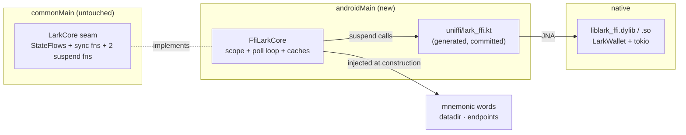
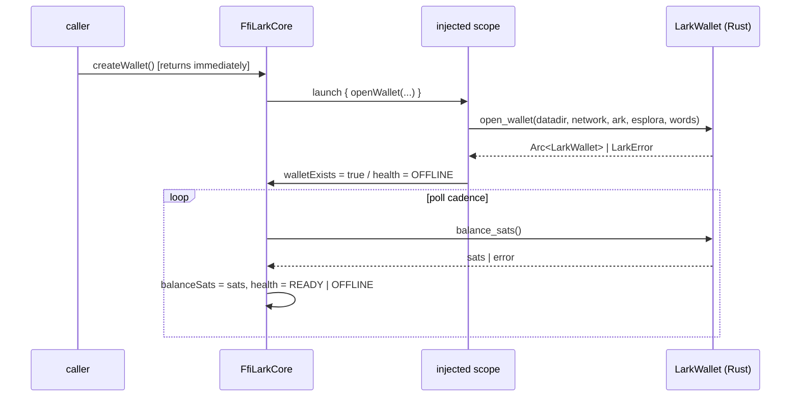
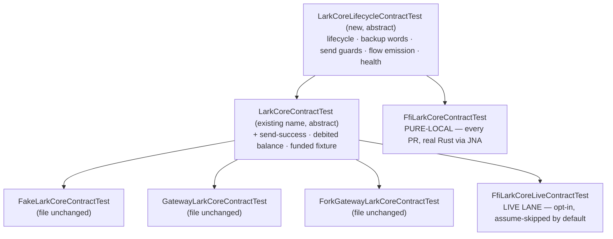

# feat: Kotlin bindings + FfiLarkCore (M2 U2)

## Goal Capsule

Make the already-shipped `rust/lark-ffi` crate drive the app's `LarkCore` seam from Kotlin: generate and commit the UniFFI Kotlin bindings, write an `FfiLarkCore` in `composeApp/src/androidMain` that adapts the crate's async surface to the seam's synchronous/StateFlow shape, and stand up a JVM test lane that runs the real Rust library over JNA on every PR — with the money-bearing members split onto an opt-in live-captaind lane.

Authority: this plan > the M2 parent plan > repo conventions > implementer judgment. Stop and surface rather than guess when: the seam would need a breaking change to accommodate the FFI surface, a seam member can only be satisfied with fabricated data, or the JNA/dylib test lane cannot be made deterministic on the macOS CI runner.

---

## Product Contract

### Summary

The app has three `LarkCore` implementations' worth of infrastructure but only two cores: the demo `FakeLarkCore` and the barkd-backed `GatewayLarkCore`. M2's Rust crate now exports a working wallet (`open_wallet`, `balance_sats`, `refresh`, `mint_address`, `deposit_address`, `send_bolt11`, `board`, `movements`, plus sealed backup crypto), live-verified against the hosted mutinynet captaind — but nothing in Kotlin calls it. This plan closes that gap with the adapter and the test lane, so subsequent M2 units (iOS delegate, persistence, `CoreMode.FFI` selection, cloud backups) build on a proven Kotlin binding rather than on a hypothesis.

### Problem Frame

Three frictions make this unit the one that has to be got right rather than got done:

- **Shape mismatch.** The seam's `createWallet()`/`restoreWallet()` are synchronous `fun`s and its balance/health are `StateFlow`s; the crate's `open_wallet`/`balance_sats` are `async` (Kotlin `suspend`). The seam cannot change — it is shared with the two shipped cores and with iOS, where Swift cannot implement a Kotlin `suspend` member (KT-38974). So the adapter absorbs the mismatch.
- **The contract suite cannot run wholesale against a fresh wallet.** `LarkCoreContractTest`'s fixture contract asserts a created wallet has a positive spendable balance (`LarkCoreContractTest.kt:53`), and 9 of its 11 tests route through that helper. A fresh in-process wallet has zero balance, and funding it needs real musig cosigning from a real Ark server. The parent plan's R1 ("runs the existing suite unchanged") and its own U2 test-split ("money-bearing members on the live lane") contradict each other; this plan resolves it (KTD-5) rather than papering over it.
- **The crate is not self-contained.** `lark-ffi` path-depends on two sibling fork checkouts, so any build step that compiles Rust makes the whole Gradle build depend on a Rust toolchain plus two clones. Where that dependency is allowed to bite decides whether a contributor can still run `./gradlew detekt` (KTD-2).

### Requirements

- **R1.** A Kotlin `FfiLarkCore` implements every `LarkCore` member against the in-process Rust wallet through the generated UniFFI bindings, with no fabricated values: any member the crate cannot source is absent (empty string, zero, em-dash) exactly as `GatewayLarkCore` does it, never a plausible-looking stand-in. (Advances parent R1.)
- **R2.** The seam is not modified. `FfiLarkCore` satisfies the existing interface as published; the async bridge lives entirely inside the adapter. (Advances parent R1; KTD-4 of the parent.)
- **R3.** A pure-local test lane runs the funding-free half of the seam contract against **real Rust** over JNA in `:composeApp:testDebugUnitTest` on every PR — wallet lifecycle, backup words, send guards, flow emission, health.
- **R4.** The money-bearing half of the seam contract (send-success, debited-balance, funded-balance fixture) runs against the live mutinynet captaind on an opt-in lane, is skipped visibly (not silently passed) when that lane is not selected, and the split is recorded in the PR. (Advances parent R11's honesty rule and the parent's U2 test-split.)
- **R5.** The existing `FakeLarkCore`, `GatewayLarkCore`, and fork-gateway contract runners keep their current coverage and stay green; no existing assertion is deleted, weakened, or moved to a lane that does not run.
- **R6.** `./gradlew detekt :composeApp:testDebugUnitTest` succeeds on a checkout with **no** Rust toolchain and **no** fork checkouts, except for the tests that require the real library, which skip visibly. Generated binding sources are excluded from detekt.
- **R7.** CI builds the Rust crate and runs the pure-local lane against it: the workflow clones both forks at their `rust/fork-pins.toml` SHAs, builds the host dylib, and exposes it to the JVM test task. The `SKIP_RUST` escape hatch is refused on the required lane. (Advances parent R11; KTD-9 of the parent.)
- **R8.** The generated bindings' provenance is verifiable: CI regenerates them from the built library and fails if the committed copy has drifted. (Instantiates KTD-2.)

### Scope Boundaries

Deferred to Follow-Up Work:

- **`CoreMode.FFI` selection and `buildCore` wiring** — parent U4 owns it, together with the platform datadir provider and the KTD-11 secure-storage mnemonic port. This plan constructs `FfiLarkCore` from injected values only; nothing in the app composes it yet.
- **Android on-device packaging.** `scripts/build-rust.sh` already carries the `BUILD_ANDROID=1` cargo-ndk leg that emits `jniLibs/*.so`. No Android NDK is available in this working environment, so this plan neither runs nor changes that leg: `FfiLarkCore` is JVM-verified here and becomes device-runnable when U4 wires it with the NDK present. Stated plainly rather than implied.
- **iOS.** Parent U3 owns the Swift delegate and XCFramework; nothing here touches `iosMain`.
- **Cloud backups (parent U5–U8).** The crate's sealed crypto ops are deliberately *not* surfaced through `FfiLarkCore` — they are the backup engine's callers, not seam members.
- **Channel rows and a fiat source.** `channels` stays the seam's never-fetched null; `fiatRate` stays the demo constant every core currently uses.
- **Extending the Rust surface.** `MovementInfo` carries no timestamp or counterparty, so activity rows degrade honestly (KTD-7). Widening the Rust record is parent-U1 surface work, filed as a follow-up, not smuggled in here.
- **TLS on the captaind gRPC endpoint.** Unrelated deploy infrastructure (Fly sidecar); the live lane uses the existing raw endpoint.

Outside this unit's identity:

- Changing any screen, view model, or state machine. This is a core-layer unit; the UI above the seam is untouched.

### Sources

- Parent plan: `docs/plans/2026-07-30-001-feat-m2-ffi-core-cloud-backups-plan.md` — U2 definition, R1/R11, KTD-3/4/9/11.
- Crate surface read this session: `rust/lark-ffi/src/lib.rs` (`generate_mnemonic`, `seal_seed_artifact`, `restore_seed_from_artifact`, `LarkError`), `rust/lark-ffi/src/wallet.rs` (`open_wallet` + the `LarkWallet` methods and `MovementInfo`).
- Seam and reference implementations read this session: `composeApp/src/commonMain/kotlin/xyz/lark/app/core/LarkCore.kt`, `FakeLarkCore.kt`, `core/gateway/GatewayLarkCore.kt`, `core/model/Money.kt`.
- Existing lanes read this session: `composeApp/src/commonTest/kotlin/xyz/lark/app/core/LarkCoreContractTest.kt` and its three runners; `composeApp/src/androidUnitTest/kotlin/xyz/lark/app/core/gateway/BarkdFixtureSpecTest.kt` (precedent for JVM-only tests extending commonTest classes).
- Build state read this session: `composeApp/build.gradle.kts` (no JNA, no desktop JVM target), `gradle/libs.versions.toml`, `build.gradle.kts` + `config/detekt/detekt.yml` (detekt scans all of `composeApp/src`, minimal overrides), `scripts/ci.sh` (no Rust leg), `scripts/build-rust.sh` (fork-pin verification + host build already written), `.github/workflows/ci.yml` (macOS runner, no Rust setup).
- **Fork reachability verified this session:** `git ls-remote` against `https://gitlab.com/ConorOkus/bark` and `https://github.com/instagibbs/rust-lightning` both answered **unauthenticated**, and both `fork-pins.toml` SHAs resolve on their pinned branches. No clone credential is required in CI — this retires the "CI fork-clone token" assumption carried in the project notes.
- No external research was run: the codebase has strong local patterns for every decision here (two shipped cores, an existing contract-suite convention, an existing CI script), and the one genuinely external mechanic — UniFFI 0.28 Kotlin/JNA library loading — is verified by inspecting the crate's own `uniffi-bindgen` entrypoint and resolved at execution time by running it.

---

## Planning Contract

### Key Technical Decisions

- **KTD-1.** `FfiLarkCore` lives at `composeApp/src/androidMain/kotlin/xyz/lark/app/core/ffi/FfiLarkCore.kt`. (session-settled: user-approved — chosen over commonMain alongside the seam and the other cores: UniFFI's Kotlin backend loads the native library through JNA, which is JVM/Android-only, and iOS gets a separate Swift delegate in parent U3.) `androidUnitTest` already depends on `commonTest` and `androidMain` in the KMP default hierarchy, which is what makes the JVM lane able to extend the shared contract base — precedent: `androidUnitTest/.../BarkdFixtureSpecTest.kt`.

- **KTD-2.** The generated UniFFI Kotlin bindings are **committed** to `composeApp/src/androidMain/kotlin/uniffi/`, with a CI job that regenerates and diffs them — chosen over generating them in a Gradle task: generation needs the built dylib, which needs a Rust toolchain plus two fork clones, so a generating task would make `./gradlew detekt` impossible for anyone without the full Rust setup (R6). Committing also makes every change to the FFI surface a reviewable diff. The drift check (R8) is what keeps "committed" from meaning "stale".

- **KTD-3.** The async bridge is a `CoroutineScope` plus a poll loop inside the adapter, mirroring `GatewayLarkCore`'s cadence structure. (session-settled: user-approved — chosen over making the seam's `createWallet`/`restoreWallet` suspend so they could await `open_wallet` directly: the seam is shared with two shipped cores and with iOS, where Swift cannot implement a Kotlin `suspend` member, KT-38974.) `createWallet()` launches `open_wallet` into the scope and flips `walletExists` on success; the poll loop reads `balance_sats()` on a cadence and classifies failures into health.

- **KTD-4.** The scope is **constructor-injected**, not created internally, and the poll cadence is injected as a tuning object exactly like `GatewayTuning` — chosen over an internally-created `CoroutineScope(Dispatchers.IO)`: the test lane must supply a real (non-virtual) scope while the seam's suspend members are still called from `runTest`, and an internal scope would make that untestable. Mirrors the shipped `GatewayLarkCore(api, scope, …, tuning)` shape.

- **KTD-5.** The seam contract suite is **split by funding requirement**, not annotated with ignores. (session-settled: user-approved — chosen over stubbing the Ark server so send/balance assertions could run in plain CI: bark requires real musig cosigning that no in-process stub supplies, so the money-bearing members are live-lane-verified.) A new abstract `LarkCoreLifecycleContractTest` holds every test that a zero-balance wallet can satisfy; the existing `LarkCoreContractTest` extends it, adds the two send-success tests, and tightens the shared "ready core" helper to assert a positive balance. The three existing runner files are therefore **unchanged** (they still extend `LarkCoreContractTest` and still run every assertion they run today), the FFI pure-local lane extends the lifecycle base, and the FFI live lane extends the full suite. Chosen over overriding money-bearing tests with `@Ignore` in the FFI runner: an ignore-override silently rots when the base suite grows a new funded test, whereas the split puts each new test on exactly one side of the line by construction. **This is the resolution of the parent plan's internal contradiction** between R1's "existing suite unchanged" and U2's own money-member lane split — the suite's *runners* stay unchanged and its coverage is preserved, but the claim that one lane runs all of it does not survive contact with `LarkCoreContractTest.kt:53`.

- **KTD-6.** The pure-local lane loads the host dylib via a `jna.library.path` system property pointed at `rust/lark-ffi/target/debug` by the Gradle test task — chosen over copying the artifact into a `darwin-aarch64` JNA resources directory: the property is one line of Gradle, needs no copy task or build-directory bookkeeping, and keeps exactly one on-disk copy of a 100MB+ artifact. Tests that need the library assume-skip when it is absent, which is what keeps R6 true on a Rust-free checkout.

- **KTD-7.** Members the crate cannot source degrade honestly, following `GatewayLarkCore`'s established policy rather than inventing one: `activity` rows carry the movement's signed sats and a status-derived label with an em-dash timestamp (`MovementInfo` exports neither a timestamp nor a counterparty); `recents` is empty (no counterparty to derive it from); `advancedStats()` reports the numbers the crate exposes and em-dashes/zeroes the rest; `channels` is the seam's never-fetched null; `fiatRate` is the demo constant every core currently uses. (session-settled: user-directed for `channels` and `fiatRate` — chosen over implementing channel rows and a fiat source now: channel actions are deferred M2 scope and no fiat source exists for any core.)

- **KTD-8.** `send(recipient, sats)` dispatches to `send_bolt11` only. The crate exports no Ark-address send, so a recipient that is not a BOLT11 invoice returns `SendResult.Failure` after the seam's guards — chosen over a best-effort attempt that would surface a confusing crate error: the seam's contract is a binary Success/Failure and an unsupported destination is honestly a failure. Ark-address sends are a follow-up on the Rust surface.

- **KTD-9.** Health is derived from operation outcomes, not a dedicated probe: a successful poll cycle is `READY`, a failed one is `OFFLINE`. `LarkError` is deliberately coarse (`Wallet { msg }`), so the adapter does **not** string-match error text to sub-classify offline reasons, and `STALE` is never reported because the crate exports no VTXO expiry — chosen over parsing `LarkError.msg`: message text is not a contract and matching on it would break silently on any fork bump.

### High-Level Technical Design

Directional guidance for review, not implementation specification.

**Where the pieces sit, and what crosses the JNA boundary.**



**The async bridge: a synchronous seam call becomes a launched job plus a poll cadence.**



**The contract-suite split (KTD-5) and which lane each runner lands on.**



---

## Implementation Units

### U1. Gradle + JNA + detekt scaffolding

**Goal:** The build can compile generated UniFFI bindings and run JVM tests that load a native library, on a checkout that may or may not have Rust.

**Requirements:** R6; KTD-1, KTD-2, KTD-6.

**Dependencies:** none.

**Files:** `gradle/libs.versions.toml` (JNA version + library aliases), `composeApp/build.gradle.kts` (JNA deps for `androidMain` and `androidUnitTest`; `testDebugUnitTest` system properties), `config/detekt/detekt.yml` (exclude the generated bindings path).

**Approach:** Add `net.java.dev.jna:jna` to the catalog. `androidMain` needs the `@aar` variant (it carries the packaged `.so` set for device runtime); `androidUnitTest` needs the plain JVM jar, because a host JVM cannot load the aar's Android libraries — carry a comment saying so, since the two-artifact split is the kind of thing a later reader deletes. Configure the Android unit-test task to set `jna.library.path` at `rust/lark-ffi/target/debug` (KTD-6) and to forward the live-lane opt-in environment variable. Resolve that path **absolutely, from the root project directory** — the test JVM's working directory is the module directory, not the repo root, so a bare relative string silently points at `composeApp/rust/…` and the library is never found. This is the single most likely cause of a "JNA can't load it" dead end. detekt's `source` is all of `composeApp/src`, so the generated package must be excluded in `config/detekt/detekt.yml` or `detekt` fails on machine-written code.

**Patterns to follow:** the existing `androidUnitTest.dependencies` block in `composeApp/build.gradle.kts`; the existing catalog comment style that explains *why* a version is pinned.

**Test scenarios:** Test expectation: none — build configuration with no behavior of its own. Its correctness is observed by U2's compile and U4's lane actually loading the library.

**Verification:** `./gradlew detekt :composeApp:testDebugUnitTest` still green with no source changes yet.

### U2. Generate and commit the UniFFI Kotlin bindings

**Goal:** `uniffi.lark_ffi` is a compilable Kotlin package in the repo, matching the crate exactly.

**Requirements:** R6, R8; KTD-2.

**Dependencies:** U1.

**Files:** `composeApp/src/androidMain/kotlin/uniffi/lark_ffi/lark_ffi.kt` (generated), `scripts/generate-bindings.sh` (new — the one documented command), `docs/gateway/` or a short note in the M2 runbook recording the regeneration recipe.

**Approach:** Build the host library, then run the crate's own bindgen entrypoint (`cargo run --bin uniffi-bindgen -- generate --library target/debug/liblark_ffi.dylib --language kotlin --out-dir …`) and land the output under `androidMain`. Wrap it in `scripts/generate-bindings.sh` so the drift check in U6 and a human run the identical command — a drift check that shells a different invocation than the documented one will report phantom drift. Do not hand-edit the generated file; if it needs changing, the crate changes. Confirm the emitted async functions land as Kotlin `suspend fun`s (the crate exports `open_wallet` and the live methods with `async_runtime = "tokio"`), since KTD-3's whole design rests on that.

**Test scenarios:** Test expectation: none — generated code, covered transitively by U4's lane, which cannot pass unless the bindings are correct.

**Verification:** `./gradlew :composeApp:compileDebugKotlinAndroid` compiles the generated package; `./gradlew detekt` green (proving the U1 exclusion works); the generated file's UniFFI contract-version/checksum lines are present.

### U3. Split the contract suite by funding requirement

**Goal:** A zero-balance core can be held to the seam contract without deleting or weakening any assertion the funded cores are held to today.

**Requirements:** R3, R4, R5; KTD-5.

**Dependencies:** none (independent of U1/U2; sequence it before U4 so U4 has a base to extend).

**Files:** `composeApp/src/commonTest/kotlin/xyz/lark/app/core/LarkCoreLifecycleContractTest.kt` (new abstract base), `composeApp/src/commonTest/kotlin/xyz/lark/app/core/LarkCoreContractTest.kt` (now extends the base; keeps the two send-success tests and the funded fixture assertion).

**Approach:** Move to the new base every test a zero-balance wallet can satisfy — `walletExistsFlipsFalseToTrueThroughCreateWallet`, `restoreWalletAlsoYieldsAnExistingWallet`, `markBackedUpFlipsTheBackedUpFlow`, `backupWordsAreNeverFake`, the three `sendRejects…` guards, `balanceFlowEmitsItsCurrentValueOnCollection`, `healthFlowEmitsReadyOnAHealthyCore`. Note that the three send guards genuinely hold at zero balance: `send(recipient, before + 1)` with `before == 0` is still a positive amount exceeding the balance, so the guard fires for the same reason it fires when funded. The base declares the shared "core with a wallet" helper **without** the balance assertion; `LarkCoreContractTest` overrides it to additionally assert `balanceSats.value > 0`, so the funded runners keep the exact fixture contract they have today. Keep `CoreFixture` (including `acknowledgeDebit`) on the base so both halves share one fixture interface. Carry the existing class KDoc's "deliberate divergences stay OUT of this suite" framing onto the new base, extended with the funding line — the docs are how the next person knows which side a new test belongs on.

**Test scenarios:** This unit's own proof is that the three existing runners are byte-identical and still pass:
- `FakeLarkCoreContractTest` — all 11 tests still execute and pass; the file is not edited.
- `GatewayLarkCoreContractTest` — all 11 still execute and pass; the file is not edited.
- `ForkGatewayLarkCoreContractTest` — its current test set still executes and passes; the file is not edited.
- Test-count check: the total number of executed contract-suite tests before and after the split is unchanged for these three runners (a silently-dropped test is the exact failure mode this refactor risks).

**Verification:** `./gradlew :composeApp:testDebugUnitTest` green; `git diff --stat` shows no changes to the three runner files.

### U4. FfiLarkCore + the pure-local contract lane

**Goal:** A real `LarkCore` backed by real Rust, proven by the funding-free contract suite running over JNA on every PR.

**Requirements:** R1, R2, R3, R6; KTD-1, KTD-3, KTD-4, KTD-6, KTD-7, KTD-8, KTD-9.

**Dependencies:** U1, U2, U3.

**Files:** `composeApp/src/androidMain/kotlin/xyz/lark/app/core/ffi/FfiLarkCore.kt` (new), `composeApp/src/androidUnitTest/kotlin/xyz/lark/app/core/FfiLarkCoreContractTest.kt` (new), and — only if the mapping earns its own home — `composeApp/src/androidMain/kotlin/xyz/lark/app/core/ffi/FfiMappings.kt` for the `MovementInfo` → `Transaction` translation.

**Approach:** Construct from injected values only (KTD-4, and because parent U4 owns configuration): datadir path, network, ark-server URL, esplora URL, the mnemonic words (KTD-11 — the platform holds them; this core never generates or persists them), the `CoroutineScope`, and a tuning object carrying the poll interval. `createWallet()` and `restoreWallet()` both launch the same open-or-create job — `open_wallet` is create-or-open by construction, and the crate's `force = true` create is server-free, so first-run onboarding does not require a reachable server. Guard against concurrent opens and against a second open when one already succeeded, mirroring `GatewayLarkCore.createOrAdoptWallet`'s early return.

A single poll loop owns all live reads, serialized by a mutex like the gateway's `pollMutex`: `balance_sats()` each cycle, and the stable-per-wallet values (`mint_address` for `receiveCode`, `deposit_address`) fetched once and cached, since both cost a server round-trip and neither changes for a given wallet — the same once-per-session caching the gateway applies to its receive targets. `movements()` refreshes the activity rows. Health per KTD-9. `refresh()` calls the crate's `refresh()` then runs one poll cycle, exactly as the gateway does. `send()` keeps the seam's guard order (not offline, positive, within balance) and then dispatches per KTD-8; the balance is never mutated locally, it arrives on the next poll — the gateway's rule, and the honest one for a wallet whose truth lives in the wallet.

Route every FFI failure through one small helper rather than scattering try/catch: the adapter's whole error policy is "an op failed, so we are offline", and one funnel is what keeps that true as members are added. That funnel is also the place the **mnemonic must never appear**: the injected words are the wallet's primary secret, so they are never logged, never interpolated into an error or health message, and never included in a `toString`. The repo already holds this line elsewhere (`GatewayLarkCore`'s mnemonic fetch never logs the response body, R15) — hold it here too.

**Each test gets a fresh datadir.** `open_wallet` is create-or-open against the datadir, so a leftover `wallet.sqlite` from a previous test is opened with the next test's injected words and fails on the mismatch — and `walletExists` would carry over between tests. The fixture allocates a per-test temporary directory and does not share one across the class. This is a precondition for the lane being deterministic, not a cleanup nicety.

**Execution note:** Contract-suite-first. Write `FfiLarkCoreContractTest` against the U3 base before implementing members; its failures are the work queue. Expect the JNA library-load step to need iteration before any assertion runs — get one test loading the dylib and reaching Rust before writing the adapter's body.

**Technical design (directional):** the fixture's real-await settle, which is the one genuinely novel test mechanic here —

```
settle():
  runBlocking with a timeout:
    repeat: if pending work has landed (walletExists set, balance polled at least once) -> return
            else small real delay
    on timeout -> fail with what was still pending
```

Because the core's scope is a real dispatcher (KTD-4), not the `TestScope`, `runCurrent()` cannot settle it — Rust completes on tokio/JNA threads outside the test scheduler. Suspend seam members called from `runTest` still await correctly: UniFFI's async bridge is continuation-based, so it resumes on completion rather than depending on virtual time. Mind the budget at both levels: `settle()`'s own timeout must sit comfortably inside `runTest`'s default timeout, or a slow first `open_wallet` surfaces as an opaque test-timeout instead of the fixture's "still pending: …" message. Raise `runTest`'s timeout for this lane rather than shrinking `settle()`'s.

**Patterns to follow:** `GatewayLarkCore` for the poll loop, mutex discipline, once-per-session caching, honest-absence policy, and injectable tuning; `FakeLarkCore` for member shapes and the class-KDoc convention of listing deliberate seams; `GatewayLarkCoreContractTest` for the fixture-runner shape.

**Test scenarios (pure-local lane — real Rust, no server):**
- The whole `LarkCoreLifecycleContractTest` set passes: create flips `walletExists`; restore likewise; `markBackedUp` flips `backedUp`; `backupWords` returns the 12 injected words (satisfying "never fake" with real ones); the three send guards return `Failure` and leave the balance untouched; `balanceSats` and `health` emit their current values on collection.
- Wallet creation with an **unreachable** ark server still yields `walletExists == true` — the server-free `force = true` create is what makes the per-PR lane possible, so it is asserted directly rather than assumed.
- A second `createWallet()` after a successful open does not open a second wallet or reset state.
- `activity` after create is empty, and never contains a fabricated row.
- `receiveCode` and `depositAddress` are the empty string (not a placeholder that could reach a QR code) when the server round-trip they need cannot complete.
- `channels.value` is null; `fiatRate.satsPerCent` is the demo constant.
- `send` with a non-BOLT11 recipient and an in-range amount returns `Failure` (KTD-8) and leaves the balance unchanged.
- Health: a poll cycle that cannot reach the server classifies `OFFLINE`; `STALE` is never emitted.
- Library-absent behavior: with no `liblark_ffi` on the JNA path the lane **skips visibly** (assume-style) rather than failing or silently passing — this is what R6 rests on, so it is asserted as a scenario, not left to convention.

**Verification:** `./gradlew :composeApp:testDebugUnitTest` runs `FfiLarkCoreContractTest` against the real dylib and passes; the same command on a checkout without the dylib reports those tests skipped and everything else green.

### U5. Live-captaind lane for the money-bearing members

**Goal:** The money-bearing half of the contract is really covered, on a lane that is honest about when it ran.

**Requirements:** R4; KTD-5.

**Dependencies:** U4.

**Files:** `composeApp/src/androidUnitTest/kotlin/xyz/lark/app/core/FfiLarkCoreLiveContractTest.kt` (new), a short "how to run the live lane" section in the M2/mutinynet runbook under `docs/`.

**Approach:** Extend the full `LarkCoreContractTest`, gate the whole class on an explicit opt-in environment variable (forwarded by U1's test-task wiring) plus a funded-wallet precondition, and assume-skip otherwise so a default run reports *skipped*, never *passed*. Point the fixture at the live mutinynet captaind and esplora.

**The funded wallet's mnemonic comes from the environment and is never committed.** A funded live wallet's 12 words are spendable money; a test file carrying them is a credential in git history. The endpoints and the mnemonic both arrive as environment variables alongside the opt-in flag, the class skips with a message naming what was missing when they are absent, and no default value for either is written into the repo — the same "empty by design, never a production default" rule `CoreConfig` already applies to `gatewayBaseUrl` and `arkServerUrl`. Note also that this lane deliberately speaks to the raw (non-TLS) captaind endpoint: acceptable for a gated test lane against a throwaway wallet, and explicitly **not** a precedent for the app's transport, which parent R4 binds to TLS. The fixture's `acknowledgeDebit` is a no-op here for the same reason it is on the gateway's poll path: the debit arrives from the wallet, not from the test. Document in the class KDoc that this lane needs a funded wallet, that `board(sats)` is the funding enabler, and what a maintainer must do to make it runnable — a gated lane with no runbook is a lane nobody ever runs.

**Test scenarios:** the two funded tests inherited from `LarkCoreContractTest` (`successfulSendSettlesIntoADebitedBalance`, `sendAllowsExactlyTheFullBalance`) plus the funded fixture assertion (`balanceSats > 0` after settle). Additionally:
- With the opt-in unset, the class reports **skipped** and the PR lane's result is unaffected.
- With the opt-in set but the wallet unfunded, the failure message says *unfunded*, not *send failed* — a lane whose failure mode is indistinguishable from a real regression is worse than no lane.

**Verification:** default `:composeApp:testDebugUnitTest` shows the live class skipped; one recorded manual run against the hosted mutinynet stack, with its result pasted into the PR per R4.

### U6. CI: Rust leg, fork clones, and the bindings drift check

**Goal:** CI proves the Rust crate builds, the pure-local lane really ran against it, and the committed bindings match the crate.

**Requirements:** R7, R8; KTD-2, KTD-6.

**Dependencies:** U2, U4.

**Files:** `.github/workflows/ci.yml` (Rust toolchain + cache, clone both forks at pinned SHAs into the checkout's parent, cargo cache), `scripts/ci.sh` (Rust leg; `SKIP_RUST` refused on the required lane), `scripts/clone-forks.sh` (new — read `rust/fork-pins.toml` and clone/checkout both siblings), `docs/` runbook note.

**Approach:** Both forks are public and clone unauthenticated (verified — see Sources), so use a plain `git clone` + `git checkout <sha>` driven by `fork-pins.toml`; no credential, no secret. Clone as siblings of the checkout so `lark-ffi`'s `../../../bark/bark` and bark's `../rust-lightning` both resolve — the layout `fork-pins.toml` already documents. Reuse `scripts/build-rust.sh` for the build rather than duplicating cargo invocations in the workflow: it already verifies the checkouts against the pins and fails loudly on drift, which is precisely the CI guarantee wanted. Add the Rust leg to `scripts/ci.sh` before the Gradle leg, since the Gradle test task needs the dylib to exist. Implement the R7 escape-hatch rule as: `SKIP_RUST=1` is honored locally and **refused with a non-zero exit** when the run is the required lane (CI), so a green required run can never mean "Rust was skipped" — parent KTD-9's whole point. Prefer a shallow clone of the pinned commit; note that these are large repos and a full clone plus a debug build of the bark+LDK forks is the dominant cost, so the cargo/registry cache matters (the workflow's current 45-minute timeout may need raising — measure, do not pre-tune).

**Test scenarios:** Test expectation: none as unit tests — this is CI configuration. Its proof is behavioral and must be observed, not assumed:
- `bash scripts/ci.sh` green locally with the forks present, and the run's output shows the Rust leg executed and `FfiLarkCoreContractTest` did **not** skip.
- `SKIP_RUST=1 bash scripts/ci.sh` skips Rust locally; the same with the required-lane marker set exits non-zero with a message naming the rule.
- The drift check fails when the committed bindings are edited by hand and passes on a clean tree.

**Verification:** the PR's CI run is green with the Rust leg visible in the log and the FFI lane not skipped; a deliberate local hand-edit of the generated bindings makes the drift check fail.

---

## Verification Contract

- **Kotlin/KMP:** `JAVA_HOME=/opt/homebrew/opt/openjdk@21 ./gradlew detekt :composeApp:testDebugUnitTest` — green, with `FfiLarkCoreContractTest` executing against the real host dylib.
- **Rust:** `scripts/build-rust.sh` (fork-pin verification + `cargo build` + `cargo test`) green.
- **Full gate:** `bash scripts/ci.sh` green locally, including the new Rust leg.
- **Rust-free checkout:** `./gradlew detekt :composeApp:testDebugUnitTest` green with the FFI lanes reported **skipped** (R6).
- **Regression floor:** the three existing contract runners are unedited and still pass every assertion they pass today (R5); the DEMO and GATEWAY paths are untouched.
- **Lane honesty:** the PR records which contract members ran on the per-PR lane and which ran on the live lane, with the live run's result pasted in (R4). A PR that does not say this has not satisfied R4.
- **Manual, recorded in the PR:** one live-captaind run of `FfiLarkCoreLiveContractTest` against the hosted mutinynet stack.

## Definition of Done

- R1–R8 hold. `FfiLarkCore` implements the seam with no fabricated values; the seam itself is unchanged; the funding-free contract half runs against real Rust on every PR and the money-bearing half runs, visibly gated, on the live lane; the three existing runners are unedited and green; a Rust-free checkout still builds and tests; CI builds the crate from pinned public fork clones with `SKIP_RUST` refused on the required lane; and the committed bindings are drift-checked.
- The parent plan's R1/U2 contradiction is resolved in the open: the plan states that `LarkCoreContractTest` cannot run wholesale on a zero-balance wallet, and KTD-5 records how coverage was preserved instead.
- Scope held: no `CoreMode.FFI` wiring, no iOS, no cloud-backup surface, no channel or fiat implementation, no Rust-surface changes. Each is either a parent unit or a filed follow-up.
- No dead experiments in the diff; the generated-bindings choice is documented at its decision point; abandoned approaches removed.
- The settled KTDs shipped as settled, and any implementation-time conflict with them was surfaced rather than worked around.

---

## Assumptions

Recorded because this plan was written headlessly, so these were resolved by judgment rather than confirmed:

- **A1.** UniFFI 0.28's Kotlin backend emits the crate's `async_runtime = "tokio"` exports as Kotlin `suspend fun`s. KTD-3's bridge design depends on it; U2's verification checks it as its first act, and a mismatch is a stop-and-surface, not a workaround.
- **A2.** `open_wallet` completes with **no reachable ark server or esplora**, on the strength of the crate's server-free `force = true` create path. The entire per-PR lane rests on this, which is why U4 asserts it as a named scenario rather than relying on it silently. If it turns out to need a server, the pure-local lane collapses into the live lane and the unit's shape must be re-decided — surface it, do not quietly move tests. The fallback shape, stated now so it does not have to be invented under pressure: the per-PR lane degrades to a bindings-compile plus library-load-and-reach-Rust smoke, the whole seam contract moves behind the U5 opt-in, and the PR says plainly that per-PR verification is a smoke rather than a contract.
- **A3.** JNA can load the crate's host dylib from a plain `jna.library.path` under the Android unit-test JVM. Expected to need iteration (the project notes flag this as finicky); KTD-6 is the first approach, and a JNA-resources copy task is the documented fallback if the property proves insufficient.
- **A4.** `androidUnitTest` sees `commonTest` and `androidMain` under the KMP default hierarchy, so the FFI runners can extend the shared contract bases. Supported by the existing `androidUnitTest/.../BarkdFixtureSpecTest.kt`.
- **A5.** A funded live wallet is reachable on the hosted mutinynet captaind for U5. If it is not, U5 lands as a gated, documented, never-yet-run lane and the PR says exactly that rather than implying coverage.

## Open Questions

Deferred to implementation — each is answerable only by running the thing:

- Does the JNA `@aar` / plain-jar split for `androidMain` versus `androidUnitTest` need any further packaging exclusion in the Android block? Resolve when the first device-oriented build runs (likely parent U4, not here).
- Does the workflow's 45-minute timeout survive a debug build of the bark + LDK forks on the macOS runner? Measure the first CI run; raise it only against a real number.
- Is a shallow single-commit clone sufficient for both forks, given bark path-deps `../rust-lightning`? Try shallow first; fall back to a full clone if cargo needs more history.
- Does `movements()` on a freshly created wallet return an empty vector rather than erroring without a server? Determines whether `activity` needs its own failure branch or shares the poll cycle's.

## Risks & Follow-Ups

- **The pure-local lane's foundation is A2.** If offline wallet creation does not work, this unit's per-PR verification story changes shape. Highest-value thing to prove first; U4's execution note puts it first deliberately.
- **JNA loading is the known-finicky step** (A3). Mitigated by getting one library-loading test green before writing adapter code, so the iteration is isolated from the logic.
- **CI wall-clock.** Adding a fork clone plus a Rust debug build to a 45-minute macOS job is the main schedule risk. Mitigated by caching and by measuring before tuning.
- **Follow-up: widen `MovementInfo`.** Adding a timestamp and counterparty to the Rust record would let `activity` and `recents` carry real content instead of KTD-7's honest degradation. Rust-surface work; file it against the parent plan's U1.
- **Follow-up: Ark-address send.** KTD-8 limits `send` to BOLT11 because the crate exports no arkoor send. File it against the parent plan's U1.
- **Stale project note corrected:** the notes carried "CI needs a fork-clone token" and "`fork-pins.toml` names `gsanders87/bark` but the pin only exists on `ConorOkus/bark`". Both are now false — the file already names `ConorOkus/bark`, and both forks clone unauthenticated (verified this session). No token work is needed.
