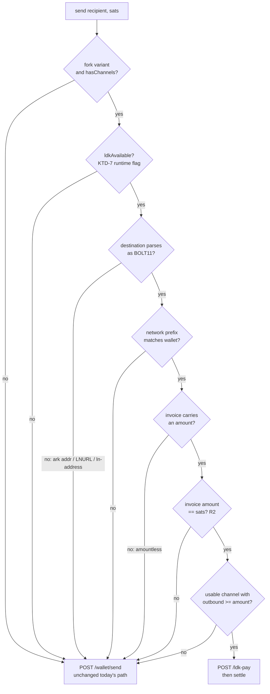
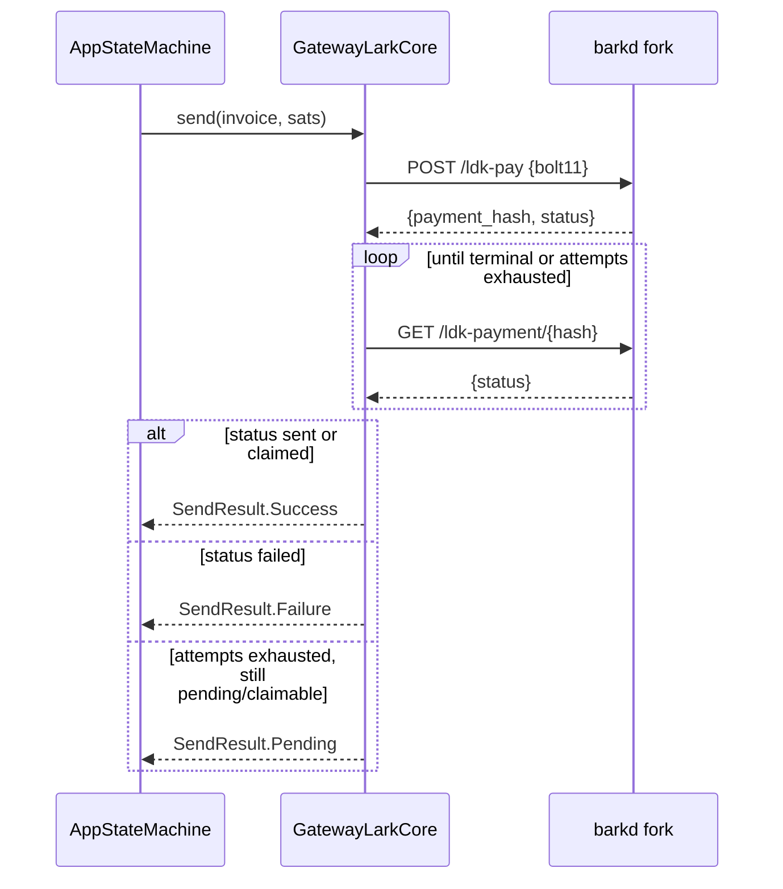
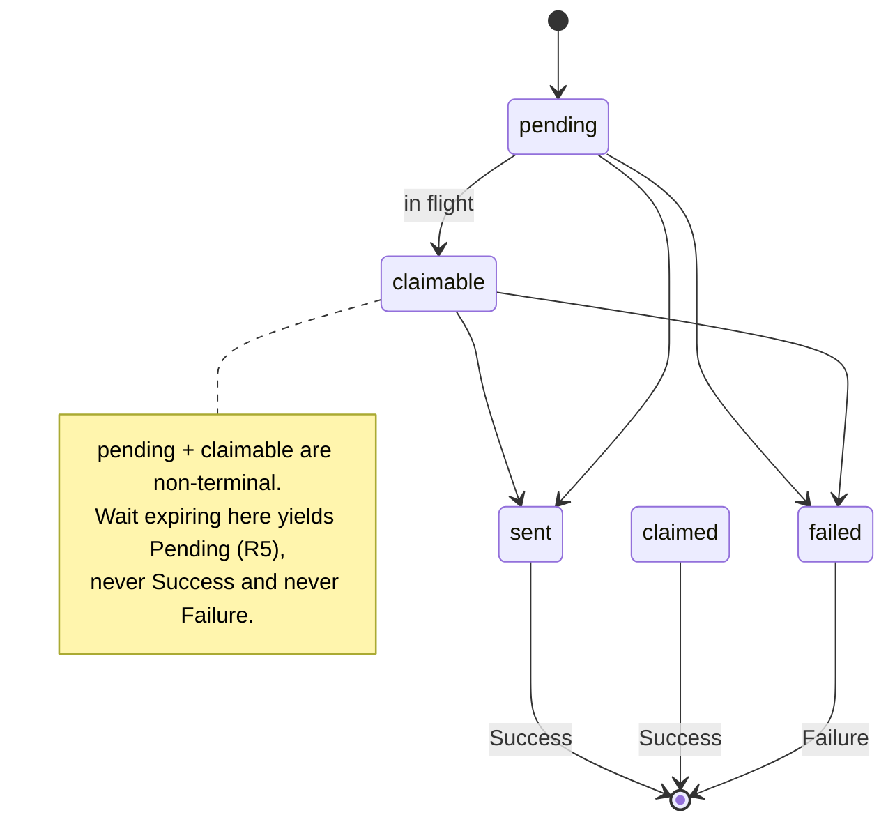

# Channel-native Lightning send and receive - Plan

## Goal Capsule

Make the wallet's own LDK channels carry money, not just render in Advanced. A BOLT11 send routes over `ldk-pay` when the channel can actually carry it, and proves settlement instead of trusting an HTTP 200; a Get-paid request with an amount mints a channel invoice via `ldk-invoice` when inbound liquidity exists. Every precondition that fails degrades to today's Ark path silently and honestly — the stock variant and the demo core are untouched.

Authority: this plan > repo conventions > implementer judgment on open details. Stop and surface rather than guess when: the fork's live wire shape contradicts the vendored spec, the routing decision would need to move out of the core, `SendResult` would need a fourth state, or channel routing would change behavior on the stock variant.

---

## Product Contract

### Summary

The 2026-07-29 milestone made channels *visible* (`docs/plans/2026-07-29-001-feat-lark-channels-plan.md`, merged as PR #18) and deliberately deferred every money-moving operation. This plan takes the deferred half: outgoing BOLT11 payments preferring the wallet's own channel over the Ark server's Lightning bridge, and incoming payments over that same channel.

The channel path is not merely an alternative route — it is the first send path in this app that can *prove* a payment settled. `POST /wallet/send` returns `{"message": "..."}`; `POST /lightning/channels/ldk-pay` returns `{payment_hash, status}` and `GET /lightning/channels/ldk-payment/{hash}` resolves that hash to a terminal state. Channel sends therefore land on a truthful screen while the Ark path's acknowledgement-vs-settlement gap stays tracked in #32.

### Problem Frame

Three things block channel payments today:

1. **No wire surface.** `BarkdApi` exposes `channels()` only. `ldk-pay`, `ldk-invoice`, `ldk-payment/{hash}`, and `ldk-payments` are unimplemented, as are their DTOs.
2. **No routing decision, and no way to make one safely.** `ldk-pay` accepts `{bolt11}` with **no amount field**, so the invoice's embedded amount is what gets paid — while the seam's `send(recipient, sats)` carries a separately-entered `sats`. The app has no BOLT11 parser (`scannedSats` is the hardcoded demo constant `SCAN_SATS`; `resolveSendDestination` passes destination strings through untouched for barkd to route). Routing over a channel without reading the invoice amount would let the review screen promise one figure while the channel pays another.
3. **The seam can't express either outcome.** `SendResult` is `Success | Failure` with nothing between (`core/model/Money.kt`), so a payment still in flight has no honest representation. `LarkCore.receiveCode` is a *synchronous* `String` property, so it cannot express "mint an invoice for N sats" — the same constraint that forced KTD-6 of the origin plan.

A fourth constraint is operational and was confirmed live while planning: the deployed stack advertises channel support it does not have. `GET /wallet/ark-info` on `https://lark-barkd.fly.dev` returns `supports_channels: true`, yet all three LDK endpoints return `500 {"message":"... LDK node not initialized"}`. The identity check from the origin plan's R5 passes, `hasChannels` is set, and the channel path engages against a daemon with no LDK node at all. Today that already makes `fetchChannelsState()` issue a failing request every poll cycle forever.

### Requirements

**Send routing:**

- R1. In the fork variant, a send whose destination is an amount-bearing BOLT11 invoice for this wallet's network routes over `POST /lightning/channels/ldk-pay` when a usable channel holds enough outbound liquidity to carry the invoice amount.
- R2. Channel routing is gated on the invoice's own amount matching the amount the app is sending. When the parsed invoice amount and the seam's `sats` disagree, the channel path is refused — the review screen's figure and the paid figure must never diverge.
- R3. Every failed precondition falls back to today's `POST /wallet/send` with unchanged behavior, never to a failure: non-BOLT11 destination (Ark address, LNURL, lightning address), amountless invoice, wrong-network invoice, unparseable invoice, no usable channel, insufficient outbound liquidity, LDK unavailable, or stock variant.

**Settlement truth:**

- R4. A channel send resolves to a terminal LDK state before the app claims anything: `sent`/`claimed` → `Success`, `failed` → `Failure`. `pending`/`claimable` are non-terminal and keep polling `GET /lightning/channels/ldk-payment/{hash}`.
- R5. When the bounded settlement wait expires without a terminal state, the send resolves to a new third seam state, `SendResult.Pending` — the money may be in flight, so neither "Sent." nor a failure may be shown. `Pending` gets its own honest landing.
- R6. `SendResult.Pending` is only ever produced by the channel path this milestone. The Ark path keeps mapping `200` → `Success` exactly as today; correcting that is #32's job, not this plan's.

**Channel receive:**

- R7. A Get-paid request carrying an amount mints a channel invoice via `POST /lightning/channels/ldk-invoice` and the receive code becomes `bitcoin:?ark=<address>&lightning=<bolt11>` — the same BIP-321 convention the app's own send-side parser already prefers (`ark` first, `lightning` as fallback).
- R8. Inbound liquidity is honest: an invoice is minted only when inbound capacity across usable channels covers the requested amount. Inbound capacity is `capacity_sat - local_balance_msat/1000` summed over usable channels, which is **zero on a freshly VTXO-funded channel** — the expected state. When it is insufficient, no invoice is minted and the code stays ark-only. An unpayable invoice is never shown.
- R9. An amountless Get paid stays ark-only, unchanged from today (`ldk-invoice` requires `amount_sat`). The seam's synchronous `receiveCode` keeps serving that case untouched.

**Capability honesty:**

- R10. `supports_channels: true` is not trusted as proof of a live LDK node. When any LDK endpoint reports not-initialized (or otherwise fails), channel capability is treated as runtime-unavailable: routing falls back per R3, no invoice is minted, and no channel failure is ever reclassified as a health problem (`CycleOutcome.note()` stays bypassed, per the origin plan's U4).
- R11. Runtime-unavailable LDK stops the per-cycle hammering that exists today: after a not-initialized response, channel polling drops to a slow re-probe rather than a request every cycle, so a stack whose LDK comes up later is still picked up. This corrects a pre-existing defect in the shipped channels code rather than adding new behavior — `fetchChannelsState()` currently retries every cycle forever against the deployed stack — and is in scope only because it is the same capability gate this plan already rewrites.
- R15. Payment secrets never leave the core. `LdkPaymentInfo.detail` carries the **payment preimage** when a payment reaches `sent`; it is a payment proof and is treated like the mnemonic already is — never logged, never placed in an error body, never surfaced in the UI or a display model. The `detail` field is consumed only to distinguish statuses, and its failure-reason variant is likewise not rendered as user copy (cf. #11 on error-body retention).

**Guard correctness:**

- R14. The core's pre-send spendability guard is route-aware. `send()` today refuses when `sats > balanceFlow.value`, which is the *VTXO* balance from `GET /wallet/balance` — channel funds are locked in the channel and are not counted in `spendable_sat`. A channel-routed send must therefore be gated on channel outbound liquidity, not on the VTXO balance, or a wallet with a funded channel and few VTXOs would refuse a payment its channel can carry. The Ark path's guard is unchanged.

**Verification:**

- R12. All routing, settlement, degradation, and receive logic is proven against the scriptable `GatewayTestHarness` with fork fixtures validated schema-scoped against `docs/gateway/barkd-fork-openapi-0.1.0-beta.6.json`. The live stack is a manual smoke pass only.
- R13. The stock variant and the demo core are behaviorally untouched: the existing suites pass unchanged and stock-path test counts do not decrease.

### Scope Boundaries

**Deferred to Follow-Up Work:**

- The Ark path's acknowledgement-vs-settlement gap (#32) — this plan makes the *channel* path settlement-truthful and adds the `Pending` state that #32 will need, but deliberately leaves `dispatchSend`'s `200` → `Success` mapping alone.
- Real fee display for either send path (#15). `ldk-pay` exposes no fee estimate and the spec has no channel-send fee endpoint, so the em-dash rule applies; the review screen's static "Fee: None" copy is #15's to fix and is not made worse here.
- Send-side text entry and clipboard paste (#14). Channel sends are exercised through the harness and, for the live smoke, the same temporary-constant technique #14 documents.
- Ark-mediated Lightning receive via `POST /lightning/receives/invoice` (#17's own suggested shape). This plan uses the *channel* invoice; the Ark-mediated path is a second source for the same slot and deserves its own decision once channel receive is real.
- Inbound liquidity as a product story — no channel rebalancing, no splicing, no "open a channel with inbound" flow. R8 degrades honestly; making inbound *exist* is protocol/infrastructure work.
- LNURL and lightning-address sends over channels (`ldk-pay` takes a raw BOLT11 only).
- Reconciling channel payments into Activity from `GET /ldk-payments`. The send outcome is proven per-payment via `ldk-payment/{hash}`; a channel-payment ledger in Activity is a separate surface.

**Outside this milestone's identity:**

- Channel open, close, force-close, offboard, and refresh operations (`/lightning/channels/open`, `/{id}/force-close`, `/offboard`, `/refresh`) — still deferred behind a future exits surface, exactly as the origin plan's R8 left them.
- Any change to the stock 0.4.0 behavior or the demo core's behavior.
- Fixing the hosted stack's uninitialized LDK node, or rebasing the fork (infrastructure/team work, not app work).

### Sources

- Vendored fork spec: `docs/gateway/barkd-fork-openapi-0.1.0-beta.6.json`; summary `docs/gateway/barkd-fork-api.md`. Endpoint and schema facts below are read from it, not from memory.
- Origin plan: `docs/plans/2026-07-29-001-feat-lark-channels-plan.md` (merged PR #18) — supplies the variant/capability architecture, the channels snapshot seam, and the deferral this plan picks up.
- Live probe of `https://lark-barkd.fly.dev` (2026-08-03): `ark-info` reports `supports_channels: true`, `network: signet`, `vtxo_expiry_delta: 8640`; `balance` reports `spendable_sat: 100000`; `lightning/channels`, `lightning/channels/balance`, and `lightning/channels/ldk-payments` all return `500 "LDK node not initialized"`.
- Issues: #32 (acknowledgement vs settlement, with the live 2026-08-03 evidence of two silently-failed BOLT11 sends), #17 (Get paid is ark-only; BIP-321 `&lightning=` shape), #15 (fee honesty), #14 (send input).
- Local stack runbook: `docs/gateway/local-mutinynet.md` — where channels were last proven live (2026-07-29, `ready=true, usable=true`).

Wire shapes this plan depends on, quoted from the vendored spec:

| Endpoint | Request | Response |
| --- | --- | --- |
| `POST /api/v1/lightning/channels/ldk-pay` | `LdkPayRequest {bolt11}` — **no amount** | `LdkPaymentInfo {payment_hash, status, detail?}` |
| `GET /api/v1/lightning/channels/ldk-payment/{hash}` | path `hash` | `LdkPaymentInfo` |
| `POST /api/v1/lightning/channels/ldk-invoice` | `LdkInvoiceRequest {amount_sat, expiry_secs?}` | `LdkInvoiceInfo {bolt11, payment_hash}` |
| `GET /api/v1/lightning/channels/ldk-payments` | — | `[LdkPaymentEntry {payment_hash, status, direction, amount_msat, detail?}]` |

`status` is one of `pending`, `claimable`, `sent`, `claimed`, `failed`. `LightningChannelInfo` supplies `capacity_sat` and `local_balance_msat`, which is the only available source for inbound capacity.

---

## Planning Contract

### Key Technical Decisions

- **KTD-1. Both send and receive ship in this plan.** (session-settled: user-directed — chosen over a send-only first increment: the user wants the full channel payment surface in one plan.) Consequence, accepted deliberately: receive's inbound-liquidity dependency is coupled into a send path that would otherwise ship without it. R8 absorbs that by degrading to ark-only rather than blocking the plan, so a zero-inbound stack still ships working send.

- **KTD-2. The routing decision lives in the core as a pure function, not in the UI or state machine.** A `ChannelRoute` decision function takes (destination, sats, the raw `LightningChannelInfo` list, capabilities, `ldkAvailable`) and returns route-over-channel or route-over-ark-with-reason. It reads the raw wire list rather than the `ChannelsSnapshot` display model, because display models round and format for presentation and must never gate money. Chosen over deciding in `AppStateMachine` (would break the seam that keeps screens core-agnostic, and would need channel data in the render model for a non-display purpose) and over inlining the conditionals in `dispatchSend` (untestable in isolation; this is the highest-consequence branch in the app).

- **KTD-10. Channel routing is automatic and invisible, not a user choice.** When the preconditions hold, the channel path is taken without asking. Chosen over a user-selectable route (a "pay via channel / via Ark" control): the canonical design has no such affordance, the distinction is protocol plumbing the product deliberately hides ("everything LARK handles for you"), and the channel path is strictly better where it applies — it is the only one that can prove settlement. The cost of this choice is that users cannot force either path, which is why every fallback reason is testable (U3) and recorded for diagnostics rather than surfaced as copy.

- **KTD-3. `SendResult` gains exactly one state: `Pending`.** Chosen over mapping a settlement timeout to `Failure` (a lie — the money may be in flight, and telling a user a payment failed when it may succeed is the mirror of the #32 bug), over blocking the send call until a terminal state (an unbounded spinner on a stuck HTLC), and over a richer result type carrying hash/status (nothing above the seam consumes them this milestone; add them when a consumer exists).

- **KTD-4. Settlement is proven by polling `ldk-payment/{hash}`, not by reconciling `/wallet/movements`.** The hash comes straight back from `ldk-pay` and the LDK payment surface is authoritative for channel payments; movements is the Ark ledger and is what #32 must use for the Ark path. Bounded attempts on the core's existing tuning knobs, so the harness drives it in virtual time.

- **KTD-5. A BOLT11 human-readable-part parser is app-side and deliberately minimal.** It reads the network prefix and the amount (`m`/`u`/`n`/`p` multipliers) and reports amountless explicitly — no signature checking, no data-part decode, no dependency added. Chosen over pulling in a Lightning library for one field (a large dependency on every target for a prefix parse) and over asking barkd (no endpoint decodes an invoice). The parser's only job is gating R1/R2; anything it cannot confidently read routes to Ark per R3.

- **KTD-6. Channel receive is an additive async seam member with an ark-only default.** `suspend fun requestReceiveCode(sats: Long): String` (or equivalent) returns the composed code, defaulting to today's synchronous `receiveCode` so `FakeLarkCore` and the stock variant inherit unchanged behavior — mirroring KTD-4 of the origin plan. Chosen over making `receiveCode` async (would touch every caller and the demo core for a fork-only capability) and over a fork-only side channel (breaks the seam).

- **KTD-7. LDK availability is a runtime fact cached in the core, separate from the compile-time `hasChannels` capability.** `hasChannels` says the endpoints exist in this variant; an `ldkAvailable` runtime flag says the daemon actually has a node. Chosen over trusting `supports_channels` from ark-info (proven false on the deployed stack 2026-08-03) and over probing before every send (adds a round trip to the money path).

- **KTD-8. Test strategy inherits the origin plan's KTD-7 unchanged:** fork fixtures validated schema-scoped against the vendored spec, driving `GatewayTestHarness`; the live stack is a manual smoke, never a CI dependency.

- **KTD-9. Branch from `main`.** The origin plan's base (PR #13/#18) is merged, so KTD-8 of that plan no longer applies.

### High-Level Technical Design

Directional guidance for review, not implementation specification.

**Send routing decision** — the plan's highest-consequence branch. Every `ark` edge is a silent fallback to today's behavior (R3), never a user-visible failure:

**Settlement, and where each seam state comes from** (R4/R5). The bounded wait is what makes `Pending` reachable:

**LDK payment status → seam state.** The mapping is total: every spec-listed status has a defined destination, and an unrecognized status is treated as non-terminal (keep polling) rather than guessed at:

**Receive composition** (R7/R8): Get paid holds a requested amount → core checks inbound capacity across usable channels → mints `ldk-invoice` only if covered → composes `bitcoin:?ark=<addr>&lightning=<bolt11>`. Insufficient inbound, unavailable LDK, or no amount all yield today's ark-only code. No new failure state.

### Assumptions

- The vendored spec matches the fork's live wire shape for the four LDK endpoints. The 2026-08-03 probe could not confirm response bodies (no LDK node), so U1's fixtures are spec-derived; a live shape contradiction is a stop-and-surface per the Goal Capsule.
- `ldk-pay` is synchronous only to the point of accepting the payment: its returned `status` may already be `pending`, which is why R4 polls rather than trusting the first response.
- `ldk-invoice`'s `amount_sat` minimum of 0 is a schema floor, not an invitation to mint zero-amount invoices; R9 keeps amountless requests on the ark-only path.
- Mutinynet BOLT11 invoices carry the signet human-readable prefix. U2's parser pins the accepted prefix set against a real invoice during implementation rather than assuming one; a prefix it does not recognize routes to Ark (R3), so a wrong guess degrades instead of misrouting.
- `GET /ldk-payment/{hash}` accepts the hex hash exactly as `ldk-pay` returned it (no re-encoding).

### Open Questions

- **The `Pending` landing's copy and visual are not in the canonical design.** The design has SENT and FAILED screens only. Recorded assumption for implementation: reuse the Sent screen's layout with honest in-flight copy (e.g. "On its way" plus a line that the payment has not settled yet), and no fabricated timing promise. This is a real product decision made by default under pipeline mode — flag it for design review in the PR rather than treating it as settled.
- **Where the live smoke happens.** The hosted stack cannot run it (LDK not initialized). Default: the local mutinynet stack per `docs/gateway/local-mutinynet.md`, where channels last worked. If that stack is unavailable, the DoD records the smoke as blocked with the probe evidence rather than claiming a pass.
- **Whether inbound capacity is ever non-zero on the current topology.** If the wallet's only channel is one it funded, R8's guard will always take the ark-only branch and channel receive will be dead code in practice — correct, honest, and unproven live. U9's smoke records which branch was actually observed.

- **The home balance does not move when a channel send succeeds.** `balanceSats` is `spendable_sat` from `GET /wallet/balance`, which counts VTXOs; a channel payment debits `local_balance_msat` instead. So a successful channel send leaves the home figure unchanged while the Advanced bridge row drops. Nothing here is *wrong* — no number is fabricated — but it will read as surprising. Deliberately not fixed in this plan: whether the headline balance should include channel local balance is a product decision about what "your money" means, and it touches the home screen this plan otherwise does not open. Recorded so the smoke does not read it as a bug.

- **The keypad's own balance guard stays VTXO-based.** `AppStateMachine.isOverBalance` blocks confirming an amount above `core.balanceSats`, so a channel-payable amount above the VTXO balance is refused *before* routing is ever consulted. Left as-is this milestone: the guard can only under-permit, never over-permit, so it risks no money — but it does cap channel sends at the VTXO balance in practice. Lifting it needs the balance decision above.

### Risks & Dependencies

| Risk | Mitigation |
| --- | --- |
| No LDK node on the deployed stack, so neither path is exercisable live | R10/R11 make it degrade honestly and stop the request hammering; R12 puts all proof on the harness so CI never depends on the stack |
| A misrouted send pays a different amount than the review screen showed | R2's amount-match gate plus KTD-5's conservative parser: anything unparseable routes to Ark |
| `Pending` leaks into the Ark path and turns today's successes into ambiguity | R6 scopes `Pending` to the channel path; a stock-suite regression test pins it |
| Settlement polling wedges the send mutex on a stuck HTLC | KTD-4's bounded attempts on core tuning; `sendMutex` is released when the bounded wait ends |
| An in-place Ark fallback after a failed `ldk-pay` pays the invoice twice | U4 restricts in-place fallback to the not-initialized case, which provably attempted nothing; every other `ldk-pay` failure resolves to `Failure` with no retry, pinned by a request-count assertion |
| A funded channel plus a thin VTXO balance refuses a payable send | R14's route-aware guard, with the keypad's own VTXO-based cap recorded as a known limitation in Open Questions |
| **Money-path code merged without ever running against a real channel.** No reachable stack has an initialized LDK node, so every unit here is harness-proven and live-unproven — the one risk this plan cannot mitigate away | Accepted deliberately, not hidden: R3's fallbacks mean the untested path is *inert* wherever channels are absent, so the blast radius on the deployed stack is nil. The DoD requires the PR to state plainly that the channel path is harness-proven only, and U9 records which branches were actually observed. Treat a live smoke as a release gate for enabling the path, not for merging it |
| A payment preimage or failure reason leaks into a log or the UI | R15 treats `detail` like the mnemonic; the class-level no-logging-plugin rule already in `BarkdApi` covers the transport |
| Inbound liquidity is structurally zero, making R7 unreachable | Accepted per KTD-1; R8 degrades to ark-only and U9 records the observed branch |

---

## Implementation Units

### Phase 1 — Wire surface and decision logic (pure, no core changes)

### U1. LDK wire surface on BarkdApi

**Goal:** The four LDK endpoints and their DTOs exist, fork-gated, with no behavior change anywhere.
**Requirements:** R1, R4, R7; KTD-8.
**Dependencies:** none.
**Files:** `composeApp/src/commonMain/kotlin/xyz/lark/app/core/gateway/BarkdApi.kt`, `core/gateway/BarkdDtos.kt`; tests `composeApp/src/commonTest/kotlin/xyz/lark/app/core/gateway/BarkdApiTest.kt`.
**Approach:** Add `ldkPay(LdkPayRequest)`, `ldkPayment(hash)`, `ldkInvoice(LdkInvoiceRequest)`, and `ldkPayments()` beside the existing `channels()`, each KDoc-marked fork-only per the class contract. DTOs mirror the spec table in Sources exactly, including nullable `detail` and the `status`/`direction` strings — keep them strings and map to enums in U3/U4 so an unknown server value cannot throw at decode (`ignoreUnknownKeys`/`explicitNulls = false` already handle additive drift). No new capability flag is needed: `hasChannels` already covers endpoint existence, and runtime availability is U4's `ldkAvailable` (KTD-7).
**Patterns to follow:** the existing `channels()`/`nextAddress()` fork-only members and the `BarkdResult` call shape.
**Execution note:** Start with failing route tests asserting each new call's method and path.
**Test scenarios:** each new call hits its exact spec path with the right method; `ldk-pay` serializes `{bolt11}` and no amount field; `ldk-invoice` serializes `amount_sat` and omits `expiry_secs` when null; `LdkPaymentInfo` decodes with `detail: null` and with a preimage; an unrecognized `status` string decodes without throwing; a 500 `{"message": "... LDK node not initialized"}` maps to `BarkdResult.HttpError` carrying that body; `ldk-payments` decodes an empty array and a two-entry array.
**Verification:** New and existing `BarkdApiTest` suites green; no stock-path test changed.

### U2. BOLT11 human-readable-part parser

**Goal:** The app can read an invoice's network and amount, or say honestly that it cannot.
**Requirements:** R2, R3; KTD-5.
**Dependencies:** none.
**Files:** `composeApp/src/commonMain/kotlin/xyz/lark/app/core/gateway/Bolt11.kt` (new); tests `composeApp/src/commonTest/kotlin/xyz/lark/app/core/gateway/Bolt11Test.kt` (new).
**Approach:** A pure function returning a small result type: recognized-with-amount (network + sats), recognized-amountless (network), or unrecognized. Parse only the human-readable part — prefix, then optional amount digits with an optional `m`/`u`/`n`/`p` multiplier — up to the `1` separator. Amount arithmetic is integer sats; a sub-satoshi amount (e.g. `p` multipliers below 1000) is *not* representable and must return unrecognized rather than rounding money. Pin the accepted network prefixes against a real mutinynet invoice during implementation (see Assumptions). No dependency, no signature or data-part handling.
**Patterns to follow:** `resolveSendDestination`/`arkReceiveUri` in `GatewayMappers.kt` — pure, internal, conservative, returning null/unrecognized rather than guessing.
**Execution note:** Implement test-first; this is a money-gating parser and its edge cases are the point.
**Test scenarios:** amount-bearing invoice for the wallet's network parses to the exact sats for each of `m`, `u`, `n`, and `p` multipliers; a bare-digits amount with no multiplier (BTC units) parses correctly; an amountless invoice reports amountless, not zero; a sub-satoshi `p` amount reports unrecognized rather than rounding to 0 or 1; a mainnet-prefixed invoice reports its network so R3 can refuse it; uppercase invoice text parses (BOLT11 permits it); garbage, empty string, an ark address, an LNURL, and a lightning address all report unrecognized; a prefix-only string with no `1` separator reports unrecognized.
**Verification:** Parser suite green with every scenario above covered.

### U3. Channel liquidity and the routing decision

**Goal:** One tested pure function decides channel-vs-Ark, with a reason.
**Requirements:** R1, R2, R3, R8; KTD-2.
**Dependencies:** U2 (parser), and U1 only for the channel DTO shape.
**Files:** `composeApp/src/commonMain/kotlin/xyz/lark/app/core/gateway/ChannelRouting.kt` (new); tests `composeApp/src/commonTest/kotlin/xyz/lark/app/core/gateway/ChannelRoutingTest.kt` (new).
**Approach:** Two pure functions over the raw `LightningChannelInfo` list (not the display snapshot — display models round for presentation and must not gate money): outbound capacity as `local_balance_msat/1000` over usable channels, and inbound as `capacity_sat - local_balance_msat/1000` over usable channels. Then the routing function of the flowchart above, returning a sealed decision — `OverChannel(bolt11)` or `OverArk(reason)` — where the reason is an enum used for tests and diagnostics, never surfaced as user-facing copy. Only `is_usable` channels count toward either figure; `OPENING` and `UNUSABLE` channels contribute nothing. Millisat-to-sat conversion truncates toward zero so the wallet never claims liquidity it does not have.
**Patterns to follow:** the existing pure mappers in `GatewayMappers.kt`; the `ChannelState` derivation from the origin plan's U4.
**Execution note:** Test-first, one failing test per `OverArk` reason — the fallback branches are the safety property.
**Test scenarios:** amount-bearing matching-network invoice within outbound liquidity → `OverChannel`; each R3 precondition yields its own `OverArk` reason (non-BOLT11, amountless, wrong network, unparseable, no usable channel, insufficient outbound, LDK unavailable, stock variant); invoice amount differing from `sats` by one sat → `OverArk` (R2); an `OPENING` channel with ample capacity does not count as outbound; two usable channels' outbound sums; a channel whose `local_balance_msat` is not a whole-sat multiple truncates down, so an amount equal to the rounded-up figure is refused; inbound is zero when `local_balance_msat/1000 == capacity_sat` (the freshly-funded case, R8); inbound sums across usable channels only.
**Verification:** Routing suite green; every `OverArk` reason has a test.

### Phase 2 — Core behavior

### U4. Channel send with proven settlement

**Goal:** A routed channel send reports what actually happened.
**Requirements:** R1, R4, R5, R6, R10, R11, R14, R15; KTD-3, KTD-4, KTD-7, KTD-10.
**Dependencies:** U1, U3.
**Files:** `composeApp/src/commonMain/kotlin/xyz/lark/app/core/model/Money.kt` (`SendResult.Pending`), `core/gateway/GatewayLarkCore.kt` (the core, plus the `GatewayTuning` data class declared in that same file — add the settlement attempt budget and interval there); tests `composeApp/src/commonTest/kotlin/xyz/lark/app/core/gateway/GatewayLarkCoreForkTest.kt`, `GatewayLarkCoreTest.kt`.
**Approach:** Add `Pending` to the `SendResult` sealed interface. Make `send()`'s `payable` guard route-aware per R14: resolve the route *before* the spendability check, then gate a channel route on outbound liquidity and an Ark route on `balanceFlow.value` exactly as today. In `dispatchSend`, `OverArk` keeps today's exact code path (R6); `OverChannel` calls `ldkPay` then polls `ldkPayment(hash)` on a bounded budget from tuning, mapping per the state diagram — unrecognized status is non-terminal. `triggerPoll()` on a terminal success exactly as the Ark path does; never mutate the balance locally.

Add the `ldkAvailable` runtime flag (KTD-7): initially unknown-and-optimistic, set false when any LDK call reports not-initialized, consulted by routing and by receive. Fold R11 into the existing `fetchChannelsState()`: once `ldkAvailable` is false, poll channels on a slow re-probe cadence instead of every cycle, and keep bypassing `CycleOutcome.note()` so health is never affected (R10).

Failure handling on `ldk-pay` splits on whether anything could have been attempted, because the wrong choice here risks paying twice:
- **Not-initialized** (the deployed stack's signature) means the daemon has no LDK node and provably attempted nothing, so this send falls back to the Ark path in-place and `ldkAvailable` goes false for subsequent sends.
- **Any other `ldk-pay` failure** — a different 500, a decode failure, or unreachable — resolves to `Failure` with **no** Ark retry. A generic error cannot prove the payment was not attempted, and re-sending over Ark could pay the invoice twice.
- A 2xx that yields no usable `payment_hash` is a contract violation, not an acceptance: `Failure`, no retry.

Because the double-pay guard turns on that classification, note which way it fails: not-initialized is recognized by matching the fork's 500 message body, so if the fork ever reworded it the response classifies as *generic* — which resolves to `Failure` with no retry. The fragile match therefore degrades toward the safe side (a refused send) and never toward a second payment. Keep the match narrow for that reason; do not broaden it to all 500s.
**Patterns to follow:** `dispatchSend`'s existing structure and `sendMutex` discipline; `fetchChannelsState`'s deliberate `note()` bypass; the harness's virtual-time cadence tests.
**Execution note:** Red-first per outcome: a harness script per terminal status, plus one that never settles to pin `Pending`.
**Test scenarios:** routed send whose payment reaches `sent` → `Success` and a poll is triggered; `claimed` → `Success`; `failed` → `Failure` with the balance untouched; status stuck at `pending` past the attempt budget → `Pending`, and the mutex is free for a subsequent send; `claimable` then `sent` across two polls → `Success`; an unrecognized status keeps polling rather than resolving; `ldk-pay` returning 500 not-initialized → this send completes over the Ark path **and** `ldkAvailable` goes false so the next send routes to Ark without an LDK call; a generic `ldk-pay` 500 → `Failure` with **no** `/wallet/send` request issued (the double-pay guard — assert the request count); an unreachable `ldk-pay` → `Failure` with no Ark retry; a 2xx `ldk-pay` body with no usable hash → `Failure`, no retry; after `ldkAvailable` goes false, `/lightning/channels` is polled on the slow cadence, not every cycle, and health never leaves READY; a channel-routed send for an amount above the VTXO balance but within outbound liquidity is **allowed** (R14), while the same amount on the Ark path is still refused; a non-BOLT11 send on the fork variant never touches an LDK endpoint; the full stock send suite passes unchanged and never produces `Pending` (R6, R13).
**Verification:** Fork and stock core suites green; `LarkCoreContractTest` unaffected.

### U5. The Pending landing

**Goal:** A payment still in flight gets a screen that does not lie.
**Requirements:** R5; Open Questions (copy is a flagged default).
**Dependencies:** U4.
**Files:** `composeApp/src/commonMain/kotlin/xyz/lark/app/state/AppStateMachine.kt`, `state/AppModel.kt`, `composeApp/src/commonMain/kotlin/xyz/lark/app/ui/screens/pay/` (the pending landing, reusing the Sent screen's structure), `App.kt` if a route is added; tests `composeApp/src/commonTest/kotlin/xyz/lark/app/state/AppStateMachineTest.kt`.
**Approach:** `AppStateMachine`'s send completion currently picks `Route.SENT` or `Route.FAILED` from `result is SendResult.Success`. Make the mapping exhaustive over the sealed interface so a future state cannot silently fall into a wrong landing. `Pending` gets its own landing with honest in-flight copy and no timing promise — no fabricated "arrives in N seconds". Keep the confirmed-amount snapshot behavior identical to the Sent path.
**Patterns to follow:** the existing SENT/FAILED routing and `FailedScreen.kt`'s structure; the em-dash/never-fake-numbers rule for anything not known.
**Test scenarios:** `Pending` from the core lands on the pending route, not SENT and not FAILED; the pending model carries the same confirmed amount and recipient the Sent screen would show; `Success` still lands on SENT and `Failure` on FAILED (regression); the pending copy contains no settlement claim and no timing figure; navigating back from the pending landing returns to the same place the Sent screen does.
**Verification:** State-machine suite green; visual check on the simulator against a harness-driven pending case.

### U6. Channel invoice receive in the core

**Goal:** The core can mint a channel invoice and compose the dual-param code, or honestly decline.
**Requirements:** R7, R8, R9, R10; KTD-6.
**Dependencies:** U1, U3 (inbound capacity).
**Files:** `composeApp/src/commonMain/kotlin/xyz/lark/app/core/LarkCore.kt` (additive async member with an ark-only default), `core/FakeLarkCore.kt` (inherits the default), `core/gateway/GatewayLarkCore.kt`, `core/gateway/GatewayMappers.kt` (URI composition); tests `GatewayLarkCoreForkTest.kt`, `GatewayMappersTest.kt`, `FakeLarkCoreTest.kt`.
**Approach:** Seam member per KTD-6, defaulting to today's synchronous `receiveCode` so the demo core and stock variant are untouched. In the fork core: check `ldkAvailable` and inbound capacity ≥ requested amount; if covered, `ldkInvoice(amount)` and compose `bitcoin:?ark=<cached addr>&lightning=<bolt11>` by extending the existing `arkReceiveUri` composition rather than string-concatenating at the call site; otherwise return the plain ark-only code. Apply the same shape guard to the returned `bolt11` that `arkReceiveUri` applies to addresses — a URI-breaking invoice string is never embedded. Do not cache the composed code across different amounts; do not mint on every recomposition (mint once per requested amount). Cache with the invoice's lifetime in mind: `ldk-invoice` defaults to a 3600s expiry, so a cached invoice older than the expiry it was minted with must be re-minted rather than served stale — pass `expiry_secs` explicitly so the app knows the window it is caching against.
**Patterns to follow:** `mintReceiveAddressIfNeeded`'s guard-and-degrade discipline and its bounded-attempt rule; `arkReceiveUri`'s charset check; the origin plan's KTD-4 additive-seam-with-default shape.
**Execution note:** Red-first on the degradation paths — zero inbound is the *expected* live state, so it deserves the first test.
**Test scenarios:** requested amount within inbound capacity mints one invoice and returns `bitcoin:?ark=…&lightning=…` with both params; zero inbound capacity (freshly funded channel) mints nothing and returns the ark-only code (R8); requested amount one sat above inbound → ark-only; `ldkAvailable` false → ark-only and no LDK call; stock variant and demo core return exactly today's `receiveCode` (R13); a bolt11 failing the shape guard is not embedded and the code stays ark-only; an `ldk-invoice` 500 leaves the code ark-only and does not affect health; the same amount requested twice mints once; a different amount mints again; a cached invoice past its `expiry_secs` window is re-minted rather than served stale; the composed URI keeps `ark` first so the app's own parser still prefers it.
**Verification:** Fork core and mapper suites green; demo/stock receive behavior byte-identical to today.

### U7. Get paid amount plumbing

**Goal:** The amount the user requests reaches the core and the composed code reaches the screen.
**Requirements:** R7, R9.
**Dependencies:** U6.
**Files:** `composeApp/src/commonMain/kotlin/xyz/lark/app/state/AppStateMachine.kt`, `state/AppModel.kt` (`ReceiveModel`), `composeApp/src/commonMain/kotlin/xyz/lark/app/ui/screens/receive/ReceiveScreen.kt`; tests `AppStateMachineTest.kt`.
**Approach:** `keypadConfirm()` in `KeypadMode.RECEIVE` currently calls `back()` and the digits are dropped — `renderReceive` reads only `core.receiveCode`. Persist the confirmed request amount in `MachineState`, and have `renderReceive` present the code the core returns for that amount, falling back to `core.receiveCode` when there is no amount (R9). Because the seam member is `suspend`, the render path cannot call it synchronously: request the code when the amount is confirmed and hold the result in state, keeping `render` pure. Show the requested amount on the Receive screen so the QR's meaning is visible. Clearing the amount returns to the ark-only code.
**Patterns to follow:** the existing `copyCode()` job-in-state pattern for async work driven from the state machine; the `confirmedAmountDisplay` snapshot idiom in the send flow.
**Test scenarios:** confirming a receive amount requests a code for exactly that sats value and renders it; the requested amount is displayed alongside the code; no amount → today's ark-only code and copy unchanged; clearing/re-entering an amount re-requests once per distinct amount; a core that declines (ark-only) still renders a valid copyable code with no error state; `copyCode()` copies the composed code, not the bare address; the demo core's receive rendering is unchanged (R13).
**Verification:** State-machine suite green; simulator check that the Receive screen renders and copies the composed code.

### Phase 3 — Proof

### U8. Fork LDK fixtures and schema validation

**Goal:** Every LDK wire shape the app consumes is pinned against the vendored spec.
**Requirements:** R12; KTD-8.
**Dependencies:** U1.
**Files:** `composeApp/src/commonTest/kotlin/xyz/lark/app/core/gateway/ForkFixtures.kt` (extend the existing fork set), `composeApp/src/androidUnitTest/kotlin/xyz/lark/app/core/gateway/BarkdForkFixtureSpecTest.kt` (extend), `GatewayTestHarness.kt` (`Paths` entries for the four LDK routes so scripts and request-count assertions can address them).
**Approach:** Mirror the established validator: each new fixture validates schema-scoped against `barkd-fork-openapi-0.1.0-beta.6.json` (this pattern caught 14 missing ArkInfo fields previously). Fixtures needed: `LdkPaymentInfo` in each status, `LdkInvoiceInfo`, an `ldk-payments` array, and the not-initialized 500 error body. `androidUnitTest` because the JSON-schema library is JVM-only — the existing constraint, not a new one.
**Test scenarios:** every new fork fixture passes its spec schema; a deliberately broken fixture fails (validator sanity); the fixture set covers all four endpoints U1 added plus the not-initialized error shape.
**Verification:** Validator suite green in CI.

### U9. Runbook and channel-payment smoke

**Goal:** Someone can reproduce a channel send and receive, and the LDK-not-initialized trap is written down.
**Requirements:** R12; Open Questions (smoke location, observed inbound branch).
**Dependencies:** U4, U6, U7.
**Files:** `docs/gateway/local-mutinynet.md` (extend), `docs/gateway/barkd-fork-api.md` (the four LDK endpoints in the capabilities table).
**Approach:** Add a channel-payment smoke stage to the existing staged procedure: confirm a usable channel exists *before* attempting anything (`GET /lightning/channels` answering with a channel, not a 500), send a BOLT11 over the channel and observe a terminal LDK status, then attempt a receive and record which R8 branch was taken. Document the deployed-stack trap explicitly: `supports_channels: true` with `500 "LDK node not initialized"` means the channel path is inert and everything falls back to Ark — that is correct behavior, not a regression. Note the temporary-constant technique (#14) as the only way to enter a real invoice until send input ships.
**Test scenarios:** Test expectation: none — documentation.
**Verification:** A cold read reproduces the smoke; the observed branch and stack are recorded in the PR body.

---

## Verification Contract

- Unit/contract tests: `JAVA_HOME=/opt/homebrew/opt/openjdk@21 ./gradlew :composeApp:testDebugUnitTest` — parser, routing, fork core send/receive, state machine, fixture validators.
- Full gate: `scripts/ci.sh` (what CI runs) must pass, including the Rust leg and the bindings-drift check it already enforces.
- Live smoke (manual, never CI): per U9, against a stack whose `GET /lightning/channels` actually answers. The hosted `lark-barkd.fly.dev` cannot serve this today (LDK not initialized, probed 2026-08-03); the local stack per `docs/gateway/local-mutinynet.md` is the default target.
- Quality gates: no new detekt suppressions beyond the file-level patterns already established; stock-path test counts do not decrease (R13).

## Definition of Done

- R1–R15 demonstrably hold on the harness: routing takes the channel path when every precondition is met and falls back silently otherwise; the pre-send guard is route-aware; settlement resolves to `Success`/`Failure`/`Pending` from real LDK statuses; channel receive mints only when inbound covers the amount; LDK-unavailable degrades honestly and stops the per-cycle hammering; no preimage reaches a log, an error body, or the UI.
- The PR body states plainly that the channel path is harness-proven and live-unproven, and that it stays inert on any stack without an initialized LDK node.
- No path can pay an invoice twice: the only in-place Ark fallback after an `ldk-pay` attempt is the not-initialized case, and a request-count assertion proves no `/wallet/send` follows any other `ldk-pay` failure.
- The stock variant and demo core are behaviorally unchanged, with their suites green and no `Pending` reachable on the Ark path.
- Every `OverArk` fallback reason and every LDK status has a test; the BOLT11 parser's money-edge cases (sub-satoshi, amountless, wrong network) are covered.
- Fork LDK fixtures schema-validated; CI green on a PR based on `main`.
- U9 runbook committed. The live smoke is either performed and evidenced in the PR body, or recorded as blocked with the LDK-not-initialized evidence — never silently skipped.
- The `Pending` landing's copy is flagged in the PR for design review (see Open Questions), not presented as a settled design decision.
- No dead experiments in the diff; no channel open/close/force-close/offboard shipped; no change to the Ark path's `200` → `Success` mapping (#32 stays open).
