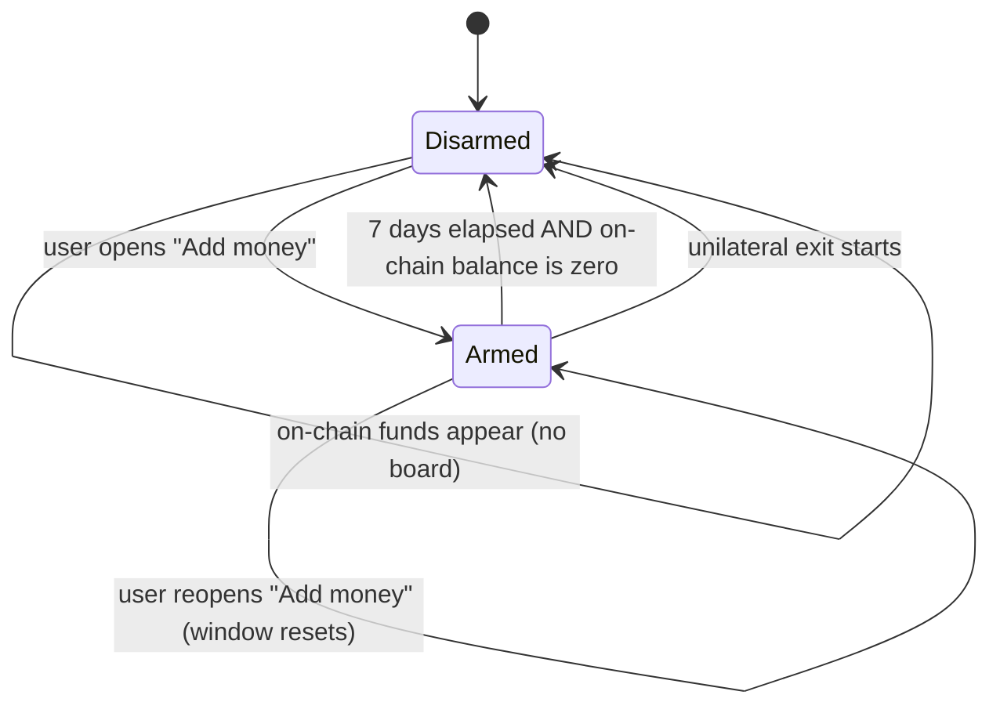
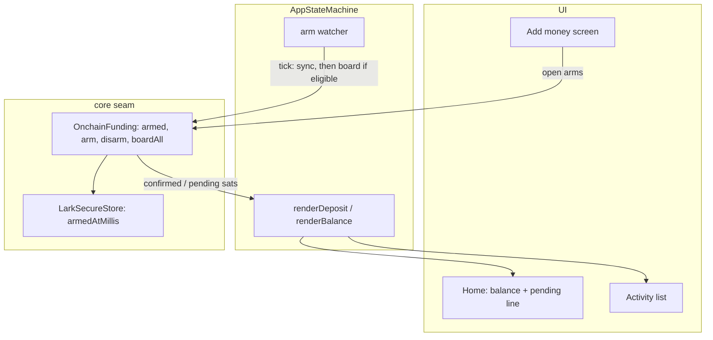

# Invisible Boarding for Deposits - Plan

## Goal Capsule

- **Objective:** Make an on-chain deposit become spendable on its own, and remove boarding from the user's vocabulary entirely.
- **Product authority:** This Product Contract. Onboarding structure, unilateral exit, and alternative funding routes (card, Lightning) are not active scope.
- **Open blockers:** None. The arm-window duration in KTD-6 is an agent pick that has not been validated against real deposit timing.
- **Product Contract preservation:** Product Contract unchanged. Planning added the Planning Contract and everything below it; no R-ID, AE-ID, or Key Decision was edited.

---

## Product Contract

### Summary

Opening "Add money" is the whole gesture. Whatever bitcoin arrives at the address shown becomes spendable without a second tap, and no user-facing surface ever says "board" or "Ark". The wait appears as a pending line beneath the Home balance and as an entry in Activity, so it stays visible wherever the user goes and still makes sense after they close the app.

### Problem Frame

Funding a wallet currently takes two deliberate acts that the user experiences as one intention. They tap "Move bitcoin in", land on the deposit screen, send bitcoin, and then have to tap "Check again" repeatedly until confirmations land — the screen does not poll — before a gold "Move it in" button becomes enabled and they tap it too.

Every one of those taps has exactly one sane answer. Nobody opens "Add money", sends bitcoin to the address the app gave them, and then declines to make it spendable. The tapping is ceremony around a decision already made.

Worse, the ceremony is expressed in vocabulary borrowed from the protocol. "Move it in" and the settling screen's copy both ask the user to hold a model of two places money can live — on-chain and in the Ark — in order to understand a wait that is really just "your deposit is confirming". The concept buys the user nothing and costs them the whole mental model of the underlying technology.

The cost lands hardest at the worst moment: a first-time user, mid-onboarding, with a zero balance, staring at a disabled button.

### Key Decisions

- KTD-1. **Boarding is never named to the user.** The mechanism stays; the vocabulary goes. `board`, `boarding`, `Ark`, and `VTXO` remain the engineering terms of art defined in `CONCEPTS.md`, and remain visible on the Advanced screen, but no ordinary user-facing surface uses them. (session-settled: user-directed — chosen over exposing boarding as an explicit user step: abstracting the underlying tech is a product goal in its own right, not just tap reduction.)

- KTD-2. **Boarding is armed by intent, not always on.** Opening "Add money" arms automatic boarding. Money that appears in the on-chain wallet without that intent is never boarded automatically. (session-settled: user-directed — chosen over app-wide automatic boarding: a unilateral exit lands funds in the same on-chain wallet that boarding watches, so an always-on rule would silently pull an exit straight back into the Ark and undo the one property that makes Ark safe to hold money in. Intent-scoping preserves one explicit user action per movement of funds while still collapsing the confirm and the intent into a single gesture.)

- KTD-3. **The wait lives on Home, in two places.** A pending line beneath the balance carries the amount and the wait; an Activity entry carries the record. (session-settled: user-directed — chosen over a deposit-screen-only treatment and over folding in-flight funds into the headline balance: Home is the screen users return to, so the wait must survive them closing the app; and a headline balance that includes unspendable funds would leave Pay live over money that cannot pay.)

- KTD-4. **Copy speaks in spendability, never movement.** State is described as what the user can and cannot do with their money — "before you can spend" — not as where the money is or what is happening to it. (session-settled: user-directed — chosen over movement-framed copy such as "before it can move in": movement framing reintroduces the two-places model that KTD-1 removes.)

- KTD-5. **No dedicated settling screen.** The app shows no separate screen for a deposit in progress. (session-settled: user-directed — chosen over keeping it as a first-run beat: with the wait on Home, a dedicated screen means two surfaces narrating one wait, and the existing screen already concedes the point with a "Go to my wallet" escape.)

- KTD-6. **The arm survives closure, expires on a timer, and is revoked by exit.** The armed state persists across app launches, expires seven days after "Add money" was last opened, never expires while the on-chain wallet holds a balance, and is cleared immediately when a unilateral exit starts. **This is an agent decision, not a user-confirmed one.** The shape follows from the constraints — a deposit from an exchange can take hours, so a session-scoped arm would strand it; money that arrived under the user's intent must never go quiet, so a balance blocks expiry; and exit must revoke unconditionally rather than relying on the window having lapsed. The seven-day figure itself is unvalidated.

### Requirements

**Automatic boarding**

- R1. Opening the "Add money" screen arms automatic boarding.
- R2. While armed, a confirmed on-chain balance at or above the server minimum boards without user action, on any sync performed while the app is open.
- R3. The armed state persists across app launches.
- R4. The armed state expires seven days after "Add money" was last opened, and does not expire while the on-chain wallet holds a non-zero balance.
- R5. Starting a unilateral exit clears the armed state immediately, and on-chain funds produced by an exit never arm it.
- R6. The "Add money" screen detects arriving deposits on its own while open; the user never taps to check.
- R7. The app performs no automatic board when it is not armed.

**What the user sees**

- R8. Home shows funds that have arrived but are not yet spendable as a pending line beneath the balance, visually distinct from the spendable figure.
- R9. Activity shows each in-flight deposit as an incoming entry marked as not yet complete.
- R10. When a deposit becomes spendable, the balance moves, the pending line clears, and the Activity entry resolves in place.
- R11. When a deposit cannot become spendable on its own — below the server minimum, or repeated failure — the pending line states the reason and what the user can do about it.

**Copy and vocabulary**

- R12. No ordinary user-facing surface uses the words "board", "boarding", "Ark", or "VTXO". The Advanced screen is exempt.
- R13. User-facing copy describes state in terms of what the user can spend, not where money is or what is moving.

**Flow**

- R14. Onboarding completes without waiting for a deposit to settle; the user reaches Home with the deposit still in flight.
- R15. The app shows no dedicated screen for a deposit in progress.
- R16. Automatic boarding behaves identically whether "Add money" was reached during onboarding or from Settings.

### Arm lifecycle

### Key Flows

- F1. First deposit during onboarding
  - **Trigger:** User taps "Move bitcoin in" on the Add money step.
  - **Steps:** Boarding arms. User sends bitcoin to the displayed address. The screen detects the arrival on its own. The user leaves for Home whenever they like. The pending line shows the amount arriving; the Activity entry appears. On confirmation the funds board without a tap; the balance moves and the pending line clears.
  - **Outcome:** Spendable balance, no second tap, no boarding vocabulary anywhere in the flow.
  - **Covered by:** R1, R2, R6, R8, R9, R10, R14, R15

- F2. Deposit that arrives after the user has closed the app
  - **Trigger:** User sends from an exchange, closes LARK, returns hours later.
  - **Steps:** The arm survived the launch. The first sync after reopening finds the confirmed balance and boards it.
  - **Outcome:** Money is already spendable, or visibly in flight on Home, without the user returning to the deposit screen.
  - **Covered by:** R2, R3, R4, R8

- F3. Deposit below the server minimum
  - **Trigger:** A confirmed on-chain amount lands under the minimum board.
  - **Steps:** No board fires. The pending line says the amount arrived and that more is needed before it can be spent. The arm does not expire while the balance sits there. Topping up clears it, because the whole balance boards together.
  - **Outcome:** Money is visibly stuck with a stated remedy, never silently absent.
  - **Covered by:** R4, R11, R13

- F4. Unilateral exit while armed
  - **Trigger:** User starts a unilateral exit within the arm window.
  - **Steps:** The arm clears before any exit funds land on-chain. The resulting on-chain balance is ignored by automatic boarding.
  - **Outcome:** The exit stands. Nothing pulls the funds back into the Ark.
  - **Covered by:** R5, R7

### Acceptance Examples

- AE1. **Covers R2, R6.** Given boarding is armed and the user is on "Add money", when a deposit above the minimum reaches the required confirmations, then it boards without any tap and without the user having pressed a check control.
- AE2. **Covers R4.** Given the arm was set eight days ago and the on-chain wallet holds a confirmed balance above the minimum, when the app syncs, then the balance still boards — the timer does not strand money that arrived under the user's intent.
- AE3. **Covers R4, R7.** Given the arm was set eight days ago and the on-chain wallet is empty, when funds later appear on-chain, then no board fires.
- AE4. **Covers R5, R7.** Given boarding is armed and the user starts a unilateral exit, when exit funds confirm in the on-chain wallet, then no board fires and the funds remain on-chain.
- AE5. **Covers R11, R13.** Given a confirmed on-chain balance below the server minimum, when the user views Home, then the pending line names the shortfall in terms of spending rather than movement, and names topping up as the remedy.
- AE6. **Covers R8, R10.** Given a deposit is in flight, when the user views Home, then the spendable balance and the arriving amount are separately legible; and when the deposit settles, the arriving amount is absorbed into the balance rather than being shown twice.
- AE7. **Covers R12.** Given any ordinary user-facing screen, when its copy is read, then it contains none of "board", "boarding", "Ark", or "VTXO".

### Scope Boundaries

- Unilateral exit itself stays a stub. R5 guarantees exit cannot arm or trigger a board when it is implemented; it does not implement exit.
- Card purchase and Lightning funding routes are unchanged and out of scope.
- The Advanced screen keeps its protocol vocabulary. It exists for people who want the machinery.
- No change to the server minimum, to fee handling, or to how much of the balance a board consumes — boarding still takes the whole confirmed balance and pays its fee from it.
- Restore remains a separate onboarding path and is untouched.

#### Deferred to Follow-Up Work

- Wiring `ExitScreen`'s `onStart` to a real exit. U2 adds the disarm hook the future implementation must call; it does not build exit.
- Backfilling pending-state rendering for outbound payments. U6 adds the pending flag to the whole activity pipeline, but only the deposit path's presentation is in scope here.

### Dependencies and Assumptions

- The engine boards the whole confirmed balance and computes the fee itself; callers pass no amount (`OnchainFunding.boardAll`, `composeApp/src/commonMain/kotlin/xyz/lark/app/core/OnchainFunding.kt`).
- Confirmation alone does not make a board spendable — the wallet must also register it during its upkeep pass. Any "is it spendable yet" signal must account for registration, not just confirmation.
- `OnchainFunding` is an optional capability. Cores that cannot board (demo, gateway) have no deposit step at all, and nothing in this contract applies to them.
- Assumed: a deposit sent from an exchange can take hours to arrive. This is what makes a session-scoped arm untenable and drives KTD-6.

### Outstanding Questions

**Deferred to Planning**

- The seven-day arm window is an agent pick, not a validated figure. Planning may implement it as stated; the value should be easy to change.
- Retry policy for a board that fails for transient reasons — how many attempts, over what period, before R11's stuck message fires.
- Whether the Activity entry for an in-flight deposit needs a new pending state on the transaction model, which currently carries none (`composeApp/src/commonMain/kotlin/xyz/lark/app/core/model/Transaction.kt`).

### Sources

- `composeApp/src/commonMain/kotlin/xyz/lark/app/ui/screens/onboarding/DepositScreen.kt` — the current deposit screen, its "Check again" / "Move it in" controls, and the status line this contract replaces.
- `composeApp/src/commonMain/kotlin/xyz/lark/app/state/AppStateMachine.kt` — `goDeposit`, `checkForDeposit`, `boardConfirmed`, and `watchBoardSettle`.
- `composeApp/src/commonMain/kotlin/xyz/lark/app/core/OnchainFunding.kt` — the boarding capability seam.
- `composeApp/src/commonMain/kotlin/xyz/lark/app/ui/screens/onboarding/BoardingScreen.kt` — the settling screen R15 removes.
- `composeApp/src/commonMain/kotlin/xyz/lark/app/ui/screens/settings/SettingsScreen.kt` — the post-onboarding "Add money" entry that R16 covers.
- `rust/lark-ffi/src/wallet.rs` — the on-chain BDK wallet backs both boarding and unilateral exit, which is the conflict KTD-2 and R5 exist to prevent.
- `CONCEPTS.md` — canonical definitions of Board, registration, and why a whole-balance board cannot be expressed as a named amount.

---

## Planning Contract

### Key Technical Decisions

- KTD-P1. **The arm lives on `OnchainFunding`, not `LarkCore`.** Arming is only meaningful for an engine that owns an on-chain wallet, which is exactly the distinction `OnchainFunding` already draws. Putting it on `LarkCore` would force the demo and gateway cores to carry members they can only answer dishonestly — the reason the capability was split out in the first place. Instantiates KTD-2.

- KTD-P2. **The arm is persisted as a wall-clock epoch-millis timestamp in `LarkSecureStore`, absent meaning disarmed.** A single nullable timestamp expresses arm, re-arm, and expiry without a second field. `LarkSecureStore` is already the home for device-local facts the Rust core does not persist (the mnemonic and the backed-up flag), and the arm is a third of exactly that kind. Wall-clock rather than the machine's existing monotonic clock: `TimeSource.Monotonic` restarts at process launch, so it cannot measure a seven-day window across the app closures R3 exists to survive. Instantiates KTD-6.

- KTD-P3. **One arm watcher replaces `watchBoardSettle`.** A single coroutine, started when the wallet opens and when the user arms, syncs the chain and boards anything eligible on an interval, and stops when disarmed or when the on-chain wallet is empty. The existing `watchBoardSettle` is a bounded 15×20s poll tied to the settling screen's lifetime; with that screen gone (KTD-5) and the wait now surviving app closure (R3), a route-scoped poll is the wrong shape. Instantiates KTD-2, KTD-5.

- KTD-P4. **`Transaction` gains a `pending` flag; the mapper stops flattening it.** `MovementState.Pending` already crosses the FFI seam and `ffiMovementsNewestFirst` already admits pending movements into the activity list — but `Transaction` carries no status, so a pending board currently renders as an ordinary completed "Received" row. R9 is therefore a correctness fix to an existing silent misrepresentation, not new plumbing.

- KTD-P5. **R12 is enforced by a source-scanning test in `androidUnitTest`.** A vocabulary guard reads the composable sources under `ui/screens/` and fails on the forbidden words in string literals. It cannot live in `commonTest` — that compiles for iOS too and has no filesystem. `androidUnitTest` is JVM and already runs under the documented `:composeApp:testDebugUnitTest` gate, so the guard costs no new CI wiring. The posture mirrors `ShippedCoreConfigTest` (assert the thing review keeps missing), though the mechanism differs: that one checks a constant, this one reads source. Copy rules that live only in review comments decay.

- KTD-P6. **Board failures retry silently three times before surfacing.** Transient failures (server unreachable mid-round) are common and self-correcting, and a wallet that cries wolf on the first blip teaches users to ignore it. Three consecutive failures across watcher ticks is a real problem worth R11's message. Resolves the retry-policy open question.

### High-Level Technical Design

The watcher is the only thing that calls `boardAll`. Nothing in the UI does, which is what makes R7 checkable: there is exactly one call site to audit.

### Assumptions

- A board in flight appears in `movements()` with `MovementState.Pending`, so U6's pending row needs no new FFI export. Verify at implementation; if bark does not record a movement until the board confirms, U6 falls back to synthesising the row from `OnchainFunding.pendingSats` and the unit's file list gains no Rust changes either way.
- `KeychainSecureStore` can hold a non-secret scalar alongside the mnemonic. If storing a timestamp in the Keychain proves awkward, `UserDefaults` is an acceptable backing store for this one value — it is not a secret, only device-local.

### Risks and Mitigations

| Risk | Why it matters here | Mitigation |
|---|---|---|
| A board fires without user intent | This is the failure the whole intent-scoping design exists to prevent, and it moves real money and pays a real fee | One `boardAll` call site (KTD-P3), gated on `fundingArmed`; U2 tests the exit path specifically; U3 tests the disarmed-with-balance case |
| The arm outlives the user's intent | A deposit arriving weeks later — or exit funds after a stub becomes real — would board silently | Window expiry (R4) plus unconditional disarm on exit (R5); the balance-blocks-expiry rule is scoped to funds already present, so it cannot extend the arm for money that has not arrived |
| The watcher hammers the server or the battery | It now runs outside a single screen's lifetime, unlike the bounded poll it replaces | Idle interval when the on-chain wallet is empty; brisk interval only while something is pending; cancelled on disarm; U3 asserts a single watcher after repeated arming |
| Silent failure replaces a visible disabled button | Today a stuck deposit is obvious (greyed CTA); afterwards nothing is clickable, so the copy is the only signal | R11 plus U5's three-state line, and the below-minimum state is asserted to name its remedy rather than just its condition |
| Losing the disabled-CTA feedback hides a below-minimum deposit | The user may top up blind, or assume the money is gone | The minimum stays in the deposit-screen explainer (U7), and the pending line names the shortfall (U5) |

---

## Implementation Units

### U1. Arm state on the funding seam

- **Goal:** Give the app a persistent, capability-scoped way to record that the user asked for money to arrive.
- **Requirements:** R1, R3, R5 (partial); KTD-P1, KTD-P2
- **Dependencies:** none
- **Files:**
  - `composeApp/src/commonMain/kotlin/xyz/lark/app/core/OnchainFunding.kt` — add `val fundingArmed: Boolean`, `fun armFunding()`, `fun disarmFunding()`
  - `composeApp/src/commonMain/kotlin/xyz/lark/app/core/ffi/LarkSecureStore.kt` — add `fun loadFundingArmedAt(): Long?` and `fun storeFundingArmedAt(millis: Long?)`
  - `iosApp/iosApp/KeychainSecureStore.swift` — implement both
  - `composeApp/src/iosMain/kotlin/xyz/lark/app/core/ffi/DelegateBackedLarkCore.kt` — implement the three `OnchainFunding` members against the store
  - `composeApp/src/commonTest/kotlin/xyz/lark/app/state/AppStateMachineTest.kt` — fake funding gains arm state
- **Approach:** `fundingArmed` computes from the stored timestamp against the injected wall clock: armed when the timestamp is present and either within the window or the on-chain wallet is non-empty. `armFunding()` writes the current time (re-arming resets the window). `disarmFunding()` clears it. The window constant lives beside the other timing constants in `AppStateMachine.kt` so it is trivially changeable per the Product Contract's open question.
- **Patterns to follow:** `backedUp` / `markBackedUp` across `LarkCore`, `DelegateBackedLarkCore`, and `KeychainSecureStore` — same shape, same synchronous store access, same per-core divergence where a core cannot honestly answer.
- **Test scenarios:**
  - Covers AE3. Arming, then advancing the clock past the window with a zero on-chain balance, reports disarmed.
  - Covers AE2. Arming, then advancing past the window with a non-zero on-chain balance, still reports armed.
  - Re-arming inside the window moves the expiry forward rather than leaving the original deadline.
  - `disarmFunding()` inside the window reports disarmed immediately, even with a non-zero balance.
  - A core with no stored timestamp reports disarmed.
- **Verification:** `./gradlew detekt :composeApp:testDebugUnitTest` passes; the arm survives a simulated process restart in the fake (state read back from the store, not from memory).

### U2. Arm on intent, disarm on exit

- **Goal:** Wire the two events that change the arm — opening "Add money", and starting an exit.
- **Requirements:** R1, R5, R16
- **Dependencies:** U1
- **Files:**
  - `composeApp/src/commonMain/kotlin/xyz/lark/app/state/AppStateMachine.kt` — `goDeposit()` arms; a new `startExit()` disarms
  - `composeApp/src/commonMain/kotlin/xyz/lark/app/App.kt` — `ExitRoute`'s `onStart` calls `machine.startExit()` instead of navigating directly
  - `composeApp/src/commonTest/kotlin/xyz/lark/app/state/AppStateMachineTest.kt`
- **Approach:** `goDeposit()` already serves both entry points (onboarding's fund card and the Settings row), so arming there satisfies R16 with no branching. `startExit()` disarms and then performs the existing navigation; exit itself stays a stub, but the hook exists so the future implementation cannot forget it.
- **Execution note:** Write the exit-disarm test first. It guards a footgun that is currently unreachable, so nothing else will catch a regression here until exit ships.
- **Test scenarios:**
  - Covers AE4. Starting an exit while armed reports disarmed, and a subsequent watcher tick with a confirmed on-chain balance performs no board.
  - Entering the deposit screen from onboarding arms.
  - Entering the deposit screen from Settings arms identically.
  - Exit-then-deposit re-arms — disarming is not permanent.
- **Verification:** `./gradlew detekt :composeApp:testDebugUnitTest` passes; no call path reaches `boardAll` without the arm being set.

### U3. The arm watcher

- **Goal:** Board eligible funds automatically while armed, with no user action anywhere.
- **Requirements:** R2, R6, R7; KTD-P3, KTD-P6
- **Dependencies:** U1, U2
- **Files:**
  - `composeApp/src/commonMain/kotlin/xyz/lark/app/state/AppStateMachine.kt` — replace `watchBoardSettle` with the watcher; `boardConfirmed` becomes private to it; delete `checkForDeposit`'s user-facing entry point
  - `composeApp/src/commonTest/kotlin/xyz/lark/app/state/AppStateMachineTest.kt`
- **Approach:** One coroutine, started on wallet open and on arm, cancelled on disarm. Each tick calls `syncOnchain()`, then boards when armed and confirmed sats meet the minimum, then calls `refresh()` so registration can complete and the balance can move. The watcher idles (long interval) when the on-chain wallet is empty and polls briskly when something is pending. Three consecutive `boardAll` failures set a sticky failure flag that U5 renders; a success clears it.
- **Execution note:** Existing `watchBoardSettle` tests will fail once it is deleted — rewrite them against the watcher rather than deleting them; they encode real timing behaviour worth keeping.
- **Test scenarios:**
  - Covers AE1. Armed, confirmed balance above minimum: a tick boards exactly once and the balance moves. A second tick does not board again.
  - Covers AE3, AE4. Disarmed with a confirmed balance above minimum: no tick ever boards.
  - Confirmed balance below the minimum: no board, no failure flag, watcher keeps polling.
  - Two consecutive board failures do not surface a failure; the third does.
  - A board that succeeds after two failures clears the failure flag.
  - The watcher stops after disarm and does not resume on its own.
  - Only one watcher runs after repeated arming — re-arming cancels the previous job rather than stacking pollers.
- **Verification:** `./gradlew detekt :composeApp:testDebugUnitTest` passes; grep confirms `boardAll` has exactly one call site.

### U4. Pending funds on the Home balance

- **Goal:** Show arriving money beneath the spendable balance, distinct from it.
- **Requirements:** R8, R10; KTD-P1
- **Dependencies:** U1
- **Files:**
  - `composeApp/src/commonMain/kotlin/xyz/lark/app/state/AppModel.kt` — `BalanceModel` gains a nullable pending descriptor
  - `composeApp/src/commonMain/kotlin/xyz/lark/app/state/AppStateMachine.kt` — `renderBalance` populates it from `OnchainFunding`'s confirmed + pending sats
  - `composeApp/src/commonMain/kotlin/xyz/lark/app/ui/screens/home/HomeSections.kt` — `BalanceBlock` renders the line
  - `composeApp/src/commonTest/kotlin/xyz/lark/app/state/AppStateMachineTest.kt`
- **Approach:** The pending descriptor is null when nothing is in flight, so Home is unchanged for the common case. In-flight means any non-zero on-chain balance, confirmed or not — from the user's perspective a deposit that has confirmed but not yet boarded and one that has not confirmed are the same wait. The amount is formatted through the existing `MoneyFormat` path and respects hidden-balance mode exactly as the headline figure does.
- **Patterns to follow:** `BalanceModel`'s existing pre-masked-string contract — the machine masks, the screen renders as-is.
- **Test scenarios:**
  - Covers AE6. Non-zero on-chain balance produces a pending descriptor distinct from the spendable figure; zero on-chain balance produces null.
  - Covers AE6. When the board settles and the on-chain wallet empties, the descriptor clears and the spendable figure has moved — the amount is never shown in both places at once.
  - Hidden-balance mode masks the pending amount as well as the headline.
  - A core with no `OnchainFunding` produces null, and Home renders unchanged.
- **Verification:** `./gradlew detekt :composeApp:testDebugUnitTest` passes; Home renders identically to today when no deposit is in flight.

### U5. Stuck-money messaging on the pending line

- **Goal:** Say what is wrong and what to do when a deposit cannot become spendable on its own.
- **Requirements:** R11, R13
- **Dependencies:** U3, U4
- **Files:**
  - `composeApp/src/commonMain/kotlin/xyz/lark/app/state/AppStateMachine.kt` — the pending descriptor gains its reason text
  - `composeApp/src/commonMain/kotlin/xyz/lark/app/ui/screens/home/HomeSections.kt`
  - `composeApp/src/commonTest/kotlin/xyz/lark/app/state/AppStateMachineTest.kt`
- **Approach:** Three states on one line: arriving (normal wait), below minimum (name the shortfall and that topping up fixes it, since the whole balance boards together), and repeatedly failing (per KTD-P6). All three phrased in spending terms per KTD-4 — the below-minimum case reads as needing more before it can be spent, never as money that cannot move.
- **Test scenarios:**
  - Covers AE5. Confirmed balance below the minimum yields text naming the shortfall and topping up, containing no movement verb.
  - Covers AE5, AE7. None of the three states' strings contain "board", "Ark", "move in", or "VTXO".
  - The sticky failure flag from U3 produces the failure text; clearing it restores the normal wait text.
  - Below-minimum takes precedence over the plain arriving state when both could apply.
- **Verification:** `./gradlew detekt :composeApp:testDebugUnitTest` passes. These strings are asserted here, on the rendered model, not by U8's source guard — they are composed in `AppStateMachine.kt`, and a blanket scan of the state layer would false-positive on the Advanced screen's VTXO stats.

### U6. In-flight deposits in Activity

- **Goal:** Show an in-flight deposit as an incoming entry that is visibly not yet complete.
- **Requirements:** R9, R10; KTD-P4
- **Dependencies:** none
- **Files:**
  - `composeApp/src/commonMain/kotlin/xyz/lark/app/core/model/Transaction.kt` — add a `pending` flag
  - `composeApp/src/commonMain/kotlin/xyz/lark/app/core/ffi/FfiMappers.kt` — `ffiActivity` carries `MovementState.Pending` through instead of dropping it
  - `composeApp/src/commonMain/kotlin/xyz/lark/app/core/gateway/GatewayMappers.kt` — same, for parity
  - `composeApp/src/commonMain/kotlin/xyz/lark/app/state/AppStateMachine.kt` — `renderActivityRow` carries the flag
  - `composeApp/src/commonMain/kotlin/xyz/lark/app/ui/screens/activity/ActivityScreen.kt` — render the not-yet-complete treatment
  - `composeApp/src/commonTest/kotlin/xyz/lark/app/core/ffi/` — mapper tests
- **Approach:** This corrects an existing misrepresentation: pending movements already reach the activity list and already render as completed rows. Carrying the flag through fixes that for every pending movement, not just deposits; only the deposit presentation is in scope to design, and outbound pending rows inherit the same treatment for free.
- **Execution note:** Confirm first that a board in flight actually produces a `Pending` movement. If bark records nothing until confirmation, synthesise the row from `OnchainFunding.pendingSats` instead and drop the mapper changes — see Assumptions.
- **Test scenarios:**
  - A `Pending` movement maps to a `Transaction` with the flag set; a `Successful` one does not.
  - Covers AE6. A pending incoming row shows the intended amount, matching the existing pending-amount rule.
  - When the movement flips to `Successful`, the row resolves in place rather than a second row appearing.
  - `Failed` and `Canceled` movements stay excluded from the list, unchanged.
  - Gateway and FFI mappers agree on the flag for equivalent inputs.
- **Verification:** `./gradlew detekt :composeApp:testDebugUnitTest` passes; a pending row is visually distinguishable from a settled one.

### U7. Deposit screen without the ceremony

- **Goal:** Remove the two taps and rewrite the screen in spendability language.
- **Requirements:** R6, R12, R13
- **Dependencies:** U3
- **Files:**
  - `composeApp/src/commonMain/kotlin/xyz/lark/app/ui/screens/onboarding/DepositScreen.kt` — remove the "Move it in" CTA and the "Check again" control; rewrite the title, explainer, and status line
  - `composeApp/src/commonMain/kotlin/xyz/lark/app/state/AppModel.kt` — `DepositModel` sheds `canBoard`, `checking`, `boarding`, and the copy fields the removed controls needed
  - `composeApp/src/commonMain/kotlin/xyz/lark/app/App.kt` — `DepositRoute` sheds the removed callbacks
  - `composeApp/src/commonTest/kotlin/xyz/lark/app/state/AppStateMachineTest.kt`
- **Approach:** What remains is an address, a QR, a copy control, and one honest status line driven by the same state U5 renders on Home. The screen keeps "Copy" — that is a real user action with a real alternative, not ceremony. The minimum still appears in the explainer, since telling someone the minimum before they send is cheaper than telling them after.
- **Test scenarios:**
  - Covers AE1. The screen exposes no control that triggers a board or a chain check.
  - The status line reflects arriving, below-minimum, and failure states consistently with Home.
  - Copy still works and still flips its label.
  - The address-not-ready state still renders while the wallet is opening.
  - Covers AE7. No string on the screen contains the forbidden vocabulary.
- **Verification:** `./gradlew detekt :composeApp:testDebugUnitTest` passes; the iOS app builds and the screen renders with only Copy as an action.

### U8. Remove the settling screen and guard the vocabulary

- **Goal:** Delete the redundant screen, land onboarding on Home, and make R12 a build failure rather than a review note.
- **Requirements:** R12, R14, R15; KTD-P5
- **Dependencies:** U4, U5, U7
- **Files:**
  - `composeApp/src/commonMain/kotlin/xyz/lark/app/ui/screens/onboarding/BoardingScreen.kt` — delete
  - `composeApp/src/commonMain/kotlin/xyz/lark/app/state/Route.kt` — remove `BOARDING` from the enum and the onboarding set
  - `composeApp/src/commonMain/kotlin/xyz/lark/app/state/AppStateMachine.kt` — remove `startBoarding`; onboarding completes to Home
  - `composeApp/src/commonMain/kotlin/xyz/lark/app/App.kt` — remove the route branch
  - `composeApp/src/commonMain/kotlin/xyz/lark/app/ui/screens/onboarding/FundScreen.kt` — copy audit
  - `composeApp/src/androidUnitTest/kotlin/xyz/lark/app/ui/CopyVocabularyTest.kt` — new
- **Approach:** `FundScreen`'s `onMoveBitcoinIn` currently falls back to `startBoarding` when the core cannot board; with the settling screen gone that fallback disappears and the card is simply absent for such a core, matching how the Settings entry already behaves. The vocabulary guard walks the composable source under `composeApp/src/commonMain/kotlin/xyz/lark/app/ui/screens/`, excluding `settings/AdvancedScreen.kt`, and fails on the forbidden words in string literals. It resolves the source root relative to the module directory rather than the process working directory, which differs between local and CI runs.
- **Patterns to follow:** `composeApp/src/commonTest/kotlin/xyz/lark/app/core/ShippedCoreConfigTest.kt` for the posture and the shape of a failure message that tells the reader what to do; `composeApp/src/androidUnitTest/kotlin/xyz/lark/app/core/ffi/FfiHostLibraryTest.kt` for a JVM-only test living outside `commonTest`.
- **Test scenarios:**
  - Covers AE7. The guard fails when a forbidden word is introduced into a user-facing screen string, and passes on the current tree.
  - The guard does not fire on the Advanced screen.
  - Covers R14. Completing onboarding with a deposit in flight lands on Home, with the pending line present.
  - Backing out of onboarding still lands on Welcome, with `BOARDING` gone from the onboarding route set.
  - No route branch or navigation call references the deleted screen.
- **Verification:** `./gradlew detekt :composeApp:testDebugUnitTest` passes; the guard fails on a deliberately introduced violation; the iOS app builds.

---

## Verification Contract

| Gate | Command | Applies to | Done signal |
|---|---|---|---|
| Shared tests + static analysis | `./gradlew detekt :composeApp:testDebugUnitTest` | U1–U8 | Green; needs JDK 21 |
| Rust host build + tests | `bash scripts/build-rust.sh` | U6 only, and only if the assumption fails and an FFI change is needed | Green |
| iOS build | `scripts/build-xcframework.sh` then `cd iosApp && xcodegen generate && xcodebuild -scheme iosApp -configuration Debug -destination 'platform=iOS Simulator,name=iPhone 17 Pro' build` | U1 (Swift store), U4, U6, U7, U8 | Builds clean |
| Vocabulary guard | Included in the gradle test gate | U8 | Fails on a deliberately introduced violation |

Manual check worth doing once on the simulator against the hosted stack: send a deposit, background the app, reopen, and confirm the balance moved without a tap.

## Definition of Done

- All sixteen requirements are satisfied, with AE1–AE7 covered by named tests.
- `boardAll` has exactly one call site, inside the arm watcher.
- No ordinary user-facing string contains "board", "boarding", "Ark", or "VTXO" — screen literals enforced by U8's source guard, machine-composed strings by U5's model assertions.
- `Route.BOARDING` and `BoardingScreen.kt` are gone, with no dangling references.
- The arm survives an app restart and is cleared by starting an exit.
- `./gradlew detekt :composeApp:testDebugUnitTest` is green and the iOS app builds.
