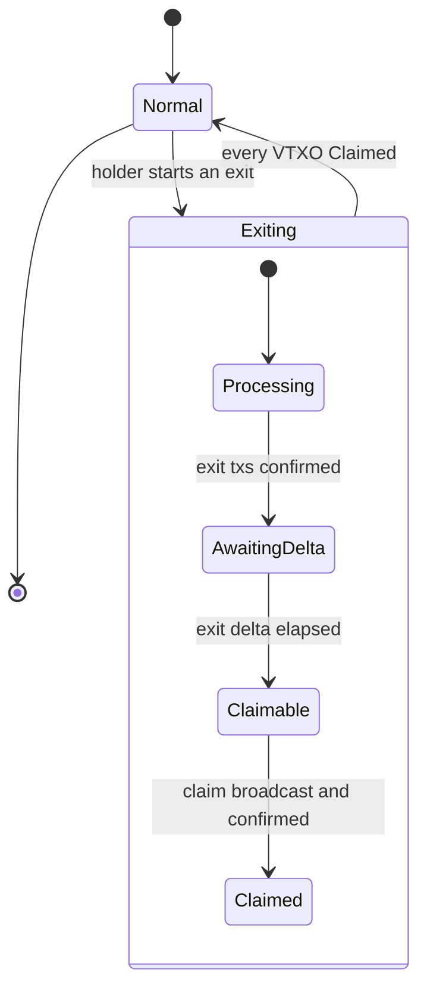
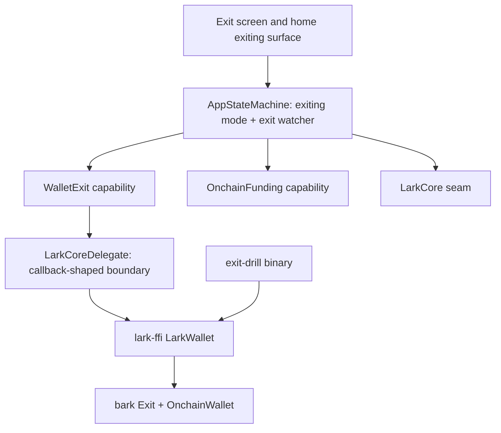

# Unilateral Exit - Plan

## Goal Capsule

- **Objective:** Make unilateral exit real for VTXOs — a wallet can leave the Ark without the Ark server, land its funds on-chain, and send them to an address the holder names. Channel exit is not active scope.
- **Product authority:** This plan owns VTXO exit and the on-chain send that makes exited funds reachable. Channel force-close resolution, background progression, and tester-facing comprehension are named as surrounding work, not requirements here.
- **Open blockers:** None.
- **Product Contract preservation:** Product Contract extended 2026-08-14 — five surface decisions added as Key Decisions, R19–R24 added, and the third Key Decision corrected where it wrongly described post-exit funds as sitting outside the holder's control. Amended again the same day from implementation: R13a/R13b/R20c added, R13, R19 and R20a corrected where they described sources the engine does not offer. No prior decision reversed; the corrections are to facts the plan asserted, not to choices the user made.
- **State:** U1–U7 and U9 are landed on `feat/unilateral-exit`, along with U8's first piece (the exit screen's figures, `dc9e77c`). U8's remaining four pieces — the exiting surface, the stalled treatment, the completion receipt, and on-chain as a destination kind — are unbuilt. Two Definition-of-Done items sit outside U8 and remain unmet: the drill has never been recorded reaching `Claimed` with captaind stopped, and `docs/liveness-envelope.md` still lists exit as a missing fallback. `KTD-5` sequenced the drill ahead of the screens deliberately — building U8 before that recorded run inverts the order this plan chose, and does so knowingly.

---

## Product Contract

### Summary

Unilateral exit becomes a wallet-level state: starting one takes the wallet out of the Ark, every app open resumes it until every VTXO is claimed on-chain, and the wallet then returns to normal with a spendable on-chain balance. A general on-chain send makes those funds reachable. A re-runnable headless drill proves the whole path with the Ark server stopped.

### Problem Frame

The app already makes the claim. `composeApp/src/commonMain/kotlin/xyz/lark/app/ui/screens/settings/ExitScreen.kt` tells the user "You don't need permission from anyone to do this — that's the point of LARK," under a button whose handler disarms the funding intent and navigates home (`composeApp/src/commonMain/kotlin/xyz/lark/app/state/AppStateMachine.kt:275`). The figures on that screen — a `~$1.80` miner fee, `about 24 hours` to spendable — are string literals. The claim is made and unbacked, which is worse than not making it.

The cost is not hypothetical. `docs/liveness-envelope.md` derives the safe-to-leave-closed bound and then names this gap directly: because exit is a stub, "the server's continued operation is part of the envelope, not a fallback." Every guarantee the wallet currently offers rests on captaind staying up. That is acceptable on a test network and nowhere else, and it cannot be argued down — only demonstrated away.

Nothing about the underlying mechanism is missing. The pinned bark fork (`rust/fork-pins.toml`) ships a complete exit engine. What is missing is the path from the app to it, the state that survives an app restart, and any evidence the path works when the server is gone.

### Key Decisions

- **Exiting is a state the wallet is in, not a screen it shows.** (session-settled: user-directed — chosen over a foreground progress screen and a two-visit "you can close the app now" flow: only a wallet-level mode resumes on every open and structurally prevents boarding back into a wallet that is leaving.) An exit takes hours across `Processing → AwaitingDelta → Claimable → Claimed`, and nothing runs while the app is closed. Making it a mode means every launch drives it forward before anything else, and the app never has to guess whether the user remembers an exit is in flight.

- **An exit runs to completion; there is no cancel.** (session-settled: user-approved — chosen over cancel-before-broadcast and over retiring the wallet outright: a transaction in the mempool cannot be recalled, so a stop control after that point would misrepresent what the app can do.) Cancel-before-broadcast buys seconds of optionality for a whole extra state. Retiring the wallet would force a new wallet per test run, which is hostile to the reason this is being built. Exiting mode therefore ends at `Claimed`, and the wallet becomes an ordinary wallet that can board again — the existing arm-on-deposit-screen funding guard keeps exit proceeds from being swept back in. The accepted consequence is that a stalled exit holds the wallet in the mode indefinitely; the wallet reports the stall and keeps retrying rather than offering a way out that would not be true.

- **Withdraw is a general capability, not a step inside the exit.** (session-settled: user-directed — chosen over carrying a destination address through the exit and over a sweep-only button on the post-exit screen.) On-chain send becomes available whenever there is an on-chain balance, which also rescues stuck boards and leftover change. The consequence is that reaching an *external* address is two deliberate actions rather than one.

  **Correction (2026-08-14).** This decision previously read that a holder who exits and stops "has funds in the app's on-chain wallet, not at an address they control." That was wrong and it distorted the post-exit surface: `OnchainWallet::load_or_create(network, seed64, …)` (`rust/lark-ffi/src/wallet.rs:95`) is seeded from the same Keychain mnemonic that backs the Ark wallet (`:102`), so claimed funds land at an address the holder already holds the keys for. There is no custody gap at the end of an exit. The send exists to move funds *elsewhere* — a hardware wallet, an exchange — which is a preference, not a safety step, and the post-exit surface must not imply otherwise.

- **Channel exit is out.** (session-settled: user-directed — chosen over covering channel force-close through the same path: VTXOs landing on-chain is a sufficient proof of the property, and no shipping core holds a channel to exit.) `LarkCore.channels` stays null on every core except the channel-fork gateway, and the FFI exposes no channel surface, so channel exit would be built against a path that does not exist yet.

- **Prove it headless before building the screen, and keep the drill.** (session-settled: user-approved — chosen over building the product arc first and taking the proof at the end.) A three-hour nondeterministic flow debugged through a phone UI is the wrong loop; a headless drill fails in minutes with logs. Keeping the drill rather than discarding it extends the fork-pin discipline already in `rust/fork-pins.toml` to the one property the README promises publicly, so a bark bump cannot silently break the exit claim.

### Key Decisions — the exit surfaces (2026-08-14)

Added after walking the holder's flow rung by rung. These settle U8's product shape, which the original plan left to planning assumptions.

- **Burial in Advanced is the gate; there is no second confirmation.** (session-settled: user-directed — chosen over a point-of-no-return confirm dialog and over letting exiting mode carry the warning alone.) Reaching the exit already costs three deliberate acts — Settings, Advanced, and a warning-coloured CTA — and `AdvancedScreen.kt:121` is the only caller of `Route.EXIT`. A modal on top of that is theatre, not consent. Recorded so the absence reads as a decision rather than an oversight.

- **While exiting, the wallet's headline is time, not money.** (session-settled: user-directed — chosen over a banner above an intact home screen and over a takeover headlined "Leaving the Ark".) The exiting surface replaces the balance and action area, and the largest thing on it is time-to-claimable. The holder cannot spend the balance and does not need it restated; the only question they have during a multi-hour wait is how long. A banner was rejected because it forces a headline balance slot that no honest value fits — the spendable figure is zero, and `AGENTS.md` forbids rendering that as `0`.

- **A stalled exit is headlined by its reason, not by a dead countdown.** (session-settled: user-directed — chosen over an em-dash estimate and over flipping the headline to elapsed time.) When `KTD-10`'s stall condition holds, the reason takes the headline, elapsed time drops to the subline, and the step list marks the stalled step. An estimate that cannot be met is the most visible lie on the screen; when nothing is progressing, *why* is the only real information. The accepted cost is a new copy surface — every `ExitError` variant needs a plain-language string, because the reason is now the largest text in the app.

- **Landing produces a one-time receipt.** (session-settled: user-directed — chosen over returning silently to an ordinary home and over a standing post-exit nudge.) When the last VTXO reaches `Claimed`, the holder sees the amount landed, the miner fee, and the elapsed time, with a single dismissal. This is the moment LARK's central claim comes true, and a three-hour irreversible operation that ends without acknowledgement is indistinguishable from one that never ran. A standing nudge was rejected because its condition — "an on-chain balance exists" — is equally true of a plain deposit that was never an exit.

- **A fee-starved exit is the one stall the holder can clear, and the app says so.** (agent-recommended after two undecided prompts, accepted as the working decision — revisable.) Every other stall category is reported and retried with no action, exactly as `R18` requires. This one is different because retrying provably cannot succeed: exit and claim transactions pay their fees from the on-chain wallet, and a holder who boarded their whole balance has nothing there. Telling them to wait would be false, and the fix — deposit on-chain — is a route the wallet already has. This is not a cancel and not an abandon: the exit stays in flight and resumes as soon as the funds land. See the Dependencies note recording the fee-sourcing assumption this rests on.

- **On-chain is a destination kind in the existing pay flow, not a separate screen.** (session-settled: user-directed — chosen over a dedicated send screen in Advanced and over a detect-then-hand-off interstitial.) `classifySendInput` gains an on-chain branch and `REVIEW` gains a route row and quoted fee; keypad, sending, sent, and failed are reused. This keeps `R11`'s "general capability" framing honest — burying the send in Advanced would make it read as exit machinery — and it closes a live defect rather than routing around it: `ARK_ADDRESS_SHAPE` (`GatewayMappers.kt:116`) already matches `tb1q…`, so an on-chain address passes `isPayableDestination` today and then fails at `bark::ark::Address::from_str` (`wallet.rs:237`).

### Actors

- A1. Wallet holder — starts the exit, and holds the keys to both the wallet's own on-chain address and any external address they nominate for an onward send. For the proof scenario this is the developer, not an unbriefed tester.
- A2. Ark server — present in normal operation, deliberately absent in the scenario that matters. Its absence must not block any step of an exit.
- A3. Chain source — the esplora endpoint the wallet reads and broadcasts through. This is the only counterparty an exit genuinely requires.

### Exit states

While in `Exiting` the wallet accepts no sends or receives, keeps the funding intent disarmed, and resumes from its persisted state on every app open. Leaving `Exiting` is the only exit from the mode; there is no path back to `Normal` that does not pass through `Claimed`.

### Requirements

**Exit lifecycle**

- R1. A wallet holding VTXOs can start a unilateral exit with no reachable Ark server.
- R2. A started exit advances through the exit states whenever the app is open, without further user action.
- R3. Exit state survives app termination and resumes on the next open.
- R4. A started exit cannot be cancelled; it terminates only at `Claimed`.
- R5. An exit covers the wallet's whole VTXO set, not a selected subset.

**Wallet mode and guards**

- R6. While an exit is in flight the wallet reports an exiting state, and the home surface shows the amount leaving and the amount landed on-chain so far. *(Amended 2026-08-14 — previously required off-chain / in-flight / on-chain distinguished. R5 exits the whole VTXO set, so the off-chain figure is zero for the entire exit; rendering a permanently-zero row asserts nothing and conflicts with the never-fabricate rule. Superseded by R19 for the headline.)*
- R7. While an exit is in flight, sending and receiving are unavailable.
- R8. While an exit is in flight the funding intent stays disarmed, so no on-chain funds are boarded back into a wallet that is leaving.
- R9. When the last VTXO reaches `Claimed`, exiting mode ends and the wallet becomes an ordinary wallet with an on-chain balance and no VTXOs, able to board again.

**On-chain send**

- R10. A wallet with an on-chain balance can send to a holder-supplied on-chain address.
- R11. On-chain send is available whenever an on-chain balance exists, not only after an exit.
- R12. An on-chain send names its miner fee before the holder confirms it.

**Honest figures**

- R13. The exit screen's amount, miner fee, and time-to-spendable are derived from wallet and network state rather than hardcoded. Any figure that cannot be derived is shown as an unknown; none is defaulted, estimated, or silently dropped.
- R13a. The miner fee is shown as unknown until the engine exposes an exit-cost estimate. *(Added 2026-08-14 after implementation. `estimate_exit_cost` is `pub(crate)` in the pinned bark fork — see Dependencies — so no caller above the engine can price an exit. The row is kept rather than removed: an em-dash reports that the cost is not known, where an absent row would not report that the cost exists.)*
- R13b. Time-to-spendable is shown as unknown whenever the exit delta cannot be read. *(Added 2026-08-14. The delta lives on the Ark server's `ArkInfo` and is not persisted, so a wallet with no reachable server cannot know it — which is the wallet most likely to be on this screen. Being able to say so is part of the requirement, not a shortfall against it.)*

**Proof**

- R14. A headless drill runs board → exit → claim → withdraw against the deployed stack and prints each state transition.
- R15. The drill reaches `Claimed` with captaind stopped.
- R16. The drill is re-runnable, and when its stack is unreachable it skips visibly rather than passing silently.

**Stalled exits**

- R17. An exit that cannot progress is reported as stalled, with the reason, and the wallet stays in exiting mode.
- R18. Every app open retries a stalled exit. No user action is needed to resume it, and none is offered to abandon it. *(Amended 2026-08-14 — R20b carves out the one category where retry provably cannot succeed. The no-abandon half of this requirement is unchanged and absolute.)*

**The exit surfaces** *(added 2026-08-14)*

- R19. While an exit is progressing, the exiting surface replaces the home screen's balance and action area rather than sitting above them. Its headline carries a number only where one is derivable: during `AwaitingDelta` it is the time to claimable, computed from the exit's own claimable height against the chain tip at the network's block spacing. During `Processing` and `Claimable` — where the remaining time depends on unknown confirmation time — the headline is the state in plain language and no figure is shown. *(Amended 2026-08-14 during implementation: originally said the countdown came from the exit delta. It does not, and the difference matters — the claimable height is persisted with the exit, so the in-flight countdown works with no Ark server, while the delta does not and would have made the countdown fail in exactly the scenario this plan is built to demonstrate.)*
- R20. While an exit is stalled, the headline is a plain-language statement of the reason, elapsed-since-stall moves to the subline, and the stalled step is marked in the step list. No raw enum name, error string, or txid reaches the surface.
- R20a. `ExitError`'s variants are classified into a small set of holder-meaningful categories before they cross the seam — chain unreachable, insufficient on-chain funds for exit fees, uneconomic, broadcast rejected, and unexpected. The seam carries the category; the engine's raw message is retained for logs only. Copy is written per category, not per variant. *(Amended 2026-08-14 during implementation: originally four categories. `ClaimFeeExceedsOutput` and `DustLimit` are not fee starvation — the shortfall is between a VTXO's value and its own exit cost, so depositing cannot clear them — and they are not "unexpected" either. Folding them into either existing category would have made the surface lie about what the holder can do.)*
- R20b. A stall whose category is insufficient on-chain funds for exit fees says so and offers the on-chain deposit route, because retrying cannot clear it. This is the sole exception to R18's no-action rule; every other category is reported and retried with no action offered. Depositing to unstick an exit does not leave exiting mode and is not a cancel.
- R20c. The classification is exhaustive by fallback, not by match: an engine variant this build does not recognise reports as unexpected rather than failing to compile or being mistaken for an actionable category. *(Added 2026-08-14. The fork pin can add variants, and the failure mode worth designing against is a new funding-shaped error quietly landing somewhere that offers no deposit — or somewhere that offers one when it cannot help.)*
- R21. When exiting mode ends, the holder is shown a one-time completion receipt naming the amount landed, the miner fee paid, and the elapsed time, before the ordinary home surface. It is shown once per exit and does not reappear on subsequent opens, including across a relaunch between completion and dismissal. The shown-once state is a completion timestamp held in the platform secure store beside the funding intent, not a boolean — bark does not persist it and it must survive app termination for the same reason the funding intent does.
- R22. The completion receipt does not describe the landed funds as needing to be moved to safety. They are already at an address the holder's seed controls; any onward send is presented as optional.
- R23. An on-chain address entered in the pay flow is recognised as on-chain, routed to the on-chain send, and shown with its route and quoted miner fee before confirmation. An on-chain address is never offered as payable through the Ark path.
- R24. Adding on-chain as a destination kind leaves the Ark and Lightning send paths behaviourally unchanged. This requirement exists because R23 modifies shared code on the wallet's primary payment path, not exit-only code.

### Key Flows

- F1. Exit with the server gone
  - **Trigger:** A1 starts an exit while A2 is unreachable.
  - **Actors:** A1, A3
  - **Steps:** The wallet opens despite a failed Ark handshake; the exit is started for the whole VTXO set; exit transactions are signed, broadcast and confirmed through A3; the exit delta elapses; the claim is broadcast and confirmed.
  - **Outcome:** Funds are confirmed in the wallet's on-chain balance and exiting mode has ended.
  - **Covered by:** R1, R2, R4, R5, R9

- F2. Resume after relaunch
  - **Trigger:** A1 force-quits the app while an exit is between `Processing` and `Claimable`.
  - **Actors:** A1
  - **Steps:** The app is relaunched; the wallet loads its persisted exit state; the exiting surface appears before any other wallet state; progress resumes from where it stopped.
  - **Outcome:** No progress is lost and no user action is needed to resume.
  - **Covered by:** R3, R6

- F3. Withdraw after exit
  - **Trigger:** A1 has an on-chain balance following a completed exit.
  - **Actors:** A1, A3
  - **Steps:** A1 supplies a destination address; the wallet shows the miner fee; A1 confirms; the transaction is broadcast through A3.
  - **Outcome:** Funds move from the wallet's own on-chain address to the external address A1 nominated. This is a relocation, not a rescue — the funds were already under A1's keys before the send (see the third Key Decision's correction).
  - **Covered by:** R10, R11, R12, R22, R23

### Acceptance Examples

- AE1. **Covers R1.** Given captaind is stopped and the wallet holds VTXOs, when the holder starts an exit, then the exit starts and progresses rather than failing on a server error.
- AE2. **Covers R3, R6.** Given an exit is in `AwaitingDelta`, when the app is force-quit and reopened, then the wallet reports exiting state and resumes progressing without user action.
- AE3. **Covers R7, R8.** Given an exit is in flight, when the holder opens the deposit screen and sends on-chain funds to the address shown, then those funds are not boarded while the exit is in flight.
- AE4. **Covers R4.** Given an exit has reached `Processing`, when the holder looks for a way to stop it, then no cancel control is offered.
- AE5. **Covers R9.** Given the last VTXO reaches `Claimed`, when the holder returns to home, then the wallet reports a normal state with an on-chain balance, no VTXOs, and boarding available again.
- AE6. **Covers R16.** Given the deployed stack is unreachable, when the drill runs, then it reports a skip rather than a pass.
- AE7. **Covers R17, R18.** Given an exit cannot progress, when the holder opens the app, then the wallet reports the exit as stalled with its reason and retries it, and offers no way to leave exiting mode.
- AE7a. **Covers R13a, R13b.** Given the holder opens the exit screen, when the engine cannot price an exit and no server can supply the delta, then the miner fee and the wait both read as unknown and neither shows a number.
- AE7b. **Covers R13b.** Given a reachable server supplies an exit delta of 144 blocks, when the holder opens the exit screen, then the wait reads at the network's real spacing — about an hour, not about a day.
- AE8. **Covers R19.** Given an exit is in `AwaitingDelta`, when the holder opens the app, then the largest thing on the surface is the estimated time to claimable, and the balance and action area are not shown.
- AE8a. **Covers R19.** Given an exit is in `Processing` or `Claimable`, when the holder opens the app, then the headline names the state in plain language and shows no time figure.
- AE9. **Covers R20, R20a.** Given an exit has stalled, when the holder opens the app, then the headline states the category in plain language, elapsed-since-stall appears beneath it, and no enum name, engine message, or txid is rendered.
- AE9a. **Covers R20b.** Given an exit is stalled for want of on-chain funds to pay its fees, when the holder opens the app, then the surface says so and offers the deposit route — and taking it does not leave exiting mode.
- AE9b. **Covers R20b.** Given an exit is stalled for any other category, when the holder opens the app, then it is reported and retried and no action is offered.
- AE10. **Covers R21, R22.** Given the last VTXO reaches `Claimed`, when the holder next opens the app, then a one-time receipt appears before ordinary home naming the amount landed, the miner fee, and the elapsed time, without implying the funds still need moving to safety — and it does not reappear after dismissal, including when the app is relaunched between completion and dismissal.
- AE11. **Covers R23.** Given the holder pastes an on-chain address into the pay flow, when they continue, then it is routed to the on-chain send and reviewed with its route and quoted fee, rather than being offered through the Ark path.
- AE12. **Covers R24.** Given the holder pays an Ark address or a BOLT11 invoice, when on-chain has been added as a destination kind, then classification, review, and settlement behave exactly as they did before.

### Success Criteria

- The property is demonstrable: captaind is stopped on the deployed stack, an exit is run from a device, and sats arrive at an address the holder named. Any step that needs the Ark server is a failure of this criterion.
- The property is repeatable without a device: the drill runs the same path unattended and asserts its terminal state.
- The property is drivable by hand: the holder can start an exit, watch it progress, and see it claim, without reading logs to know what is happening.
- `docs/liveness-envelope.md` can be rewritten to stop listing exit as a missing fallback.

### Scope Boundaries

**Deferred for later**

- Channel exit — force-close resolution through the exit path, once a shipping core holds channels.
- Background progression while the app is closed (issue #28). Exit remains bounded by how often the holder opens the app.
- Comprehension for an unbriefed tester. The bar here is that the path works and re-runs, not that it explains itself to a stranger.
- Selecting which VTXOs to exit, and coin control or amount selection on the on-chain send.

**Blast radius acknowledged**

- R23 modifies the wallet's primary payment path, not exit-only code: destination classification and the review screen are shared by every Ark and Lightning send. R24 and AE12 exist to hold that line. This is the one place this plan reaches outside the exit.

**Outside this work's shape**

- Any cancel, abort, or undo affordance. This is a decision, not a deferral — see Key Decisions. R20b's deposit route is not an exception: it unsticks an exit, it does not end one.

<!-- ce-section: work-relationships -->
### How This Work Fits Together

This plan owns one area: VTXO exit through to a spendable on-chain balance, plus the on-chain send that makes that balance reachable. The breakdown below is the current understanding, not a committed roadmap; a later plan may revise, split, or discard any of it.

- Channel exit
  - Depends on a shipping core exposing channels at all — neither the FFI nor the stock gateway does today.
  - Shares the exit engine and the exiting-mode state this plan establishes.
  - Still to decide: whether an exit should be refused while a channel exists, or should force-close it.
- Background progression (issue #28)
  - Enables an exit to advance without the holder opening the app, shortening the window this plan leaves open.
  - Can proceed independently of this plan.
- Tester-facing comprehension
  - Depends on this plan's mode and surfaces existing first.
  - Can proceed independently once they do.

### Dependencies / Assumptions

- The exit engine comes from the pinned bark fork (`rust/fork-pins.toml`), whose `bark/src/exit/mod.rs` provides whole-wallet exit, progression, and claiming. A pin bump can change exit behavior, which is the reason R14–R16 keep a standing drill.
- `Wallet::open` tolerates a failed Ark handshake — it logs a warning and proceeds with no server (`bark/src/lib.rs:938-947` in the pinned fork). R1 rests on this.
- Exit state is loaded by `Wallet::open_with_onchain`, not by `Wallet::open`. `rust/lark-ffi/src/wallet.rs:100` currently calls the latter, so persisted exits are invisible after relaunch. R3 cannot hold until this changes; it is a prerequisite, not an option.
- The FFI exposes no exit surface and no on-chain send today (`rust/lark-ffi/src/wallet.rs`), so both are new across the whole seam.
- Assumed: mutinynet's `vtxo_exit_delta` of 144 blocks (~72 minutes, per `docs/liveness-envelope.md`) sets the floor on how fast a drill run can complete.
- `ExitError` (`bark/bark/src/exit/models/error.rs` in the pinned fork) is a bounded `thiserror` enum of 26 variants deriving `Clone + Debug + PartialEq + Eq`, which is what makes R20a's classification possible rather than string-matching. A pin bump can add variants, so the classifier needs an explicit unexpected fallback rather than an exhaustive match that fails to compile.
- **Verified 2026-08-14, and stronger than first recorded.** `ExitStartState::progress` (`bark/src/exit/progress/states.rs:58-67` in the pinned fork) compares `onchain.get_balance()` against `estimate_exit_cost` and returns `InsufficientFeeToStart` *before the exit leaves its first state*. So a fee shortfall is not a stall that happens partway through — it is a precondition on starting at all, and an exit that fails it has broadcast nothing. A wallet that boarded its whole balance holds roughly nothing on-chain (`CONCEPTS.md`: a board pays its fee out of the coins it moves), so the natural first run — fund, board everything, exit — hits this. R20b is therefore the path a first-time tester meets, not an edge case, which is the reason it earns an action where R18 gives none.
- bark's own code already separates this case: `InsufficientConfirmedFunds` logs at `warn!` with "can't progress at this time" while every other variant logs at `error!` (`bark/src/exit/mod.rs:472-478`). The category split in R20a follows a line the engine had already drawn.
- **`estimate_exit_cost` is `pub(crate)`** (`bark/src/exit/progress/util.rs:30`), and no public method on `Exit` exposes an equivalent. This is what blocks R13a, and it also blocks any pre-flight check that would catch a fee shortfall before the holder starts an exit rather than after. Both need a change in the fork or upstream; neither is reachable from this repo.

### Outstanding Questions

**Deferred to Planning**

- What threshold marks an exit as stalled rather than merely slow (R17).
- Whether the drill is a binary in the Rust crate or an opt-in test in the Kotlin live lane.
- How often exit progression is driven while the app is open, and whether it shares the existing maintenance cadence.
- Whether the on-chain send offers a fee-rate choice or a single default.
- ~~Where the exiting-state surface sits on the home screen.~~ Resolved 2026-08-14: it replaces the balance and action area, headlined by time-to-claimable. See the surface Key Decisions.

**Open, and outside this repo to answer**

- Getting `estimate_exit_cost` — or an equivalent public method on `Exit` — exposed upstream in `ark-bitcoin/bark`. Until it exists, R13a keeps the miner fee as an unknown and no pre-flight affordability check is possible, so the first stall a fully-boarded tester meets is one the app can only explain after the fact. **Not yet filed anywhere**; raising it on the upstream tracker is a decision for the maintainer of this repo's fork relationship, not something this plan can close.
- Whether to carry a fork patch in the meantime. Cheap in isolation — a visibility change plus a pin bump — but it puts this repo's fork ahead of upstream on a surface upstream may shape differently, which is a cost the fork-pin discipline exists to keep visible.

### Sources / Research

- `composeApp/src/commonMain/kotlin/xyz/lark/app/ui/screens/settings/ExitScreen.kt` — the screen existed with its amount, fee, and readiness figures as literals. Resolved 2026-08-14 (`dc9e77c`); kept here because the Problem Frame is written against that state.
- `composeApp/src/commonMain/kotlin/xyz/lark/app/state/AppStateMachine.kt:275` — `startExit()` disarms the funding intent and navigates home; no exit is performed. The surrounding comments document the board-during-exit hazard that R8 preserves.
- `composeApp/src/commonMain/kotlin/xyz/lark/app/core/LarkCore.kt:40-44` — `channels` stays null on every core except the channel-fork gateway.
- `rust/lark-ffi/src/wallet.rs:71-121` — `open_wallet` calls `Wallet::open`; the public surface has no exit and no on-chain send.
- `bark/src/exit/mod.rs` in the pinned fork — whole-wallet and per-VTXO exit, progression, and claiming.
- `bark/src/lib.rs:900-975` in the pinned fork — `Wallet::open` server tolerance; `Wallet::open_with_onchain` exit-state loading.
- `docs/liveness-envelope.md` — exit delta, worst-case exit timing, and the standing note that exit's absence makes server uptime part of the envelope.
- `rust/fork-pins.toml` — the bark pin the exit engine comes from.

---

## Planning Contract

### Key Technical Decisions

- KTD-1. **Exiting is a wallet-level state, not a screen.** (session-settled: user-directed — chosen over a foreground progress screen and a two-visit release flow: only a wallet-level mode resumes on every app open and structurally prevents boarding back into a wallet that is leaving.) Implements Key Decision 1. The mode lives in `AppStateMachine` as machine state derived from the exit capability's reported status, not as a route.

- KTD-2. **No cancel; exiting mode ends at `Claimed`.** (session-settled: user-approved — chosen over cancel-before-broadcast and over retiring the wallet: a transaction in the mempool cannot be recalled, so a stop control after that point would misrepresent what the app can do.) Implements Key Decision 2. No unit exposes an abort path, and `WalletExit` has no cancel member — the absence is enforced by the interface, not by UI omission.

- KTD-3. **Claims land in the wallet's own on-chain address; withdraw is a separate general send.** (session-settled: user-directed — chosen over carrying a destination address through the exit and over a sweep-only button.) Implements Key Decision 3. **Planning conflict, recorded and proceeding as settled:** `Exit::drain_exits` in the pinned fork takes a destination `Address` and builds the claim PSBT directly to it, so bark can reach a holder-named address in one transaction. Routing claims into the app's own on-chain wallet first therefore costs one extra on-chain transaction and its miner fee per exit. This is a cost, not a defect — the decision buys a reusable send path that also rescues stuck boards — but the extra fee is real and belongs on the record.

- KTD-4. **Channel exit is out of scope.** (session-settled: user-directed — chosen over covering channel force-close through the same path: no shipping core exposes channels and VTXOs landing on-chain is sufficient proof.) Implements Key Decision 4. `Exit::progress_exits` is called through the library path that passes `None` for the channel driver, leaving `ChannelBridgeTx`/`ChannelCommitment`/`ChannelSwept` inert.

- KTD-5. **Drill first, and the drill is kept.** (session-settled: user-approved — chosen over building the product arc first and over treating the drill as scaffolding.) Implements Key Decision 5. U1–U4 land and prove the mechanism before any seam or UI work begins.

- KTD-6. **A stalled exit is reported and retried, never abandoned.** (session-settled: user-directed — chosen over automatic fee escalation, unlocking the wallet after N failures, and exposing raw txids.) Implements Key Decision 6.

- KTD-7. **Exit is a capability interface beside `LarkCore`, not a member of it.** `LarkCore` is the universal seam every core implements; exit is available only to a core that holds keys and an on-chain wallet. `OnchainFunding` already establishes the pattern — a nullable capability injected into `AppStateMachine` alongside the core — so `WalletExit` follows it. Folding exit onto `LarkCore` would force `FakeLarkCore` and both gateway cores to carry members they cannot honour.

- KTD-8. **A dedicated exit watcher, modelled on the funding watcher, drives progression.** `startFundingWatcher()` in `composeApp/src/commonMain/kotlin/xyz/lark/app/state/AppStateMachine.kt` is the precedent: a scoped job that polls while a condition holds. The exit watcher is separate rather than folded in because the two have opposite lifecycles — the funding watcher must be *disarmed* while exiting (R8), so sharing a loop would couple a guard to the thing it guards.

- KTD-9. **The drill is a Rust binary, not a Kotlin live-lane test.** Resolves the open area. The exit path is entirely inside the crate; a Kotlin test would add the FFI and Gradle surface to every debugging round without testing anything the binary cannot. The binary also runs against a stopped captaind without a simulator, which is the scenario that matters.

- KTD-10. **Stalled means three consecutive progress passes returning an error for the same VTXO.** Resolves the open area. `ExitProgressStatus` carries `error: Option<ExitError>` per VTXO, so the count is available without inventing bookkeeping. Three passes rather than one avoids reporting a stall for a single transient chain-source failure.

- KTD-11. **On-chain send uses one fee rate from the chain source; no picker.** Resolves the open area. `OnchainWallet::send` takes a `FeeRate`, and mutinynet's fee market makes a chooser noise rather than control. R12 requires the fee be *shown* before confirmation, which is satisfied without making it adjustable.

### High-Level Technical Design

Exit crosses every layer of the seam. The capability interface is what keeps `LarkCore` untouched.

The drill enters at the FFI, below the delegate boundary, which is what lets it run with no simulator and no Kotlin.

### Assumptions

Recorded because this plan was enriched headlessly; each is a planning bet, not a user decision.

- ~~The exiting surface replaces the home screen's balance and action area rather than appearing as a banner above it, matching the wallet-mode framing of KTD-1.~~ **Promoted 2026-08-14 from a planning bet to a user decision** — the takeover was chosen over a banner, and the headline is time rather than money. See the surface Key Decisions.
- Exit progression polls on a fixed cadence independent of the funding watcher's adaptive one, since exit has no equivalent of "nothing has arrived yet".
- The drill targets the Fly stack described in `docs/gateway/local-mutinynet.md` and reads its endpoints from environment variables rather than hardcoding them.
- `Exit::progress_exits` is safe to call when no exit is in flight and returns without effect, so the watcher does not need a separate "is there an exit" probe before each pass.

### Sequencing

U1 → U2 → U3 → U4 prove the mechanism in Rust with no app involved. U5 opens the seam and can start once U2 and U3 have landed their FFI surface. U6 depends on U5 only and is testable against the fake. U7 carries the new surface to iOS. U8 is last because it consumes everything below it.

**Amended 2026-08-14.** U1–U7 are landed. U9 was added by document review and runs before U8, which depends on it: the stall category and the receipt flag are seam and transport changes, so U8 cannot write its stall copy or its shown-once behaviour until they exist. Order is now U9 → U8. U9 is also the one unit that reopens landed surfaces (U2, U5, U7) rather than only adding to them.

U4's binary exists but has no recorded run reaching `Claimed` with captaind stopped, so the proof KTD-5 sequenced ahead of the screens is not yet in hand. U8 may proceed regardless — that is a deliberate inversion, recorded in the Goal Capsule — but the drill run remains a Definition-of-Done item and U8 passing its own tests does not discharge it.

---

## Implementation Units

### U1. Load exit state when the wallet opens

- **Goal:** A persisted in-flight exit is visible after the process restarts.
- **Requirements:** R3
- **Dependencies:** none
- **Files:** `rust/lark-ffi/src/wallet.rs`
- **Approach:** `open_wallet` calls `Wallet::open`, which does not load exit state; `Wallet::open_with_onchain` does, by calling `exit.load(onchain)`. Switch the existing-wallet branch to the onchain-aware variant, which already has the `OnchainWallet` in scope from the line above it. The creation branch already passes the onchain wallet.
- **Patterns to follow:** the existing branch structure in `open_wallet` that chooses between open and create on `read_properties`.
- **Execution note:** Write the reopen assertion first — it fails against the current code, which is the proof the change is load-bearing.
- **Test scenarios:**
  - Opening a wallet whose database holds an exit in a non-terminal state reports that exit as in flight.
  - Opening a wallet with no exit history reports no exit and does not error.
  - Opening a wallet with a fully claimed exit reports no exit in flight.
- **Verification:** `cargo test` in `rust/lark-ffi` passes, including the new reopen coverage.

### U2. Exit lifecycle on the Rust FFI

- **Goal:** The crate can start an exit, advance it, and report where it is.
- **Requirements:** R1, R2, R4, R5, R17
- **Dependencies:** U1
- **Files:** `rust/lark-ffi/src/wallet.rs`, `composeApp/src/androidMain/kotlin/uniffi/lark_ffi/lark_ffi.kt`, `iosApp/iosApp/Generated/lark_ffi.swift`, `iosApp/FfiThreadingTests/Generated/lark_ffi.swift`
- **Approach:** Add three exported members on `LarkWallet`: start an exit for the whole wallet, advance the exit, and read exit status. Start maps to `Exit::start_exit_for_entire_wallet`; advance maps to `Exit::progress_exits` with `None` for the fee-rate override and the library path that leaves channel stages inert (KTD-4); status maps over `ExitProgressStatus` into an FFI-safe record carrying the VTXO count per state, an overall stage, and a per-exit error string. Expose no cancel member (KTD-2). The generated bindings are committed and CI diffs them against the crate, so regenerate and commit them in this unit.
- **Patterns to follow:** the existing `board_all` / `vtxo_summary` members — `#[uniffi::export(async_runtime = "tokio")]`, `Result<_, LarkError>`, plain records over crate types.
- **Test scenarios:**
  - Starting an exit on a wallet with VTXOs moves the reported stage off "none".
  - Starting an exit twice does not duplicate exits or error.
  - Starting an exit on a wallet with no VTXOs is a no-op rather than an error.
  - Advancing an exit with no exit in flight returns without effect.
  - Status reports a per-VTXO error string when the underlying progress status carries one.
  - No exported member offers cancellation or abandonment.
- **Verification:** `cargo test` passes; `bash scripts/generate-bindings.sh` leaves no diff against the committed bindings.

### U3. On-chain send on the Rust FFI

- **Goal:** The crate can spend the on-chain balance to a supplied address, and can quote the fee first.
- **Requirements:** R10, R11, R12
- **Dependencies:** none
- **Files:** `rust/lark-ffi/src/wallet.rs`, `composeApp/src/androidMain/kotlin/uniffi/lark_ffi/lark_ffi.kt`, `iosApp/iosApp/Generated/lark_ffi.swift`, `iosApp/FfiThreadingTests/Generated/lark_ffi.swift`
- **Approach:** Add an exported member that sends a named amount to an address via `OnchainWallet::send`, and one that returns the miner fee a given send would pay so the UI can show it before confirmation (KTD-11). Use the chain source's fee estimate rather than accepting a caller-supplied rate. The wallet already holds the `OnchainWallet` behind a mutex; follow the existing locking discipline.
- **Patterns to follow:** `onchain_balance` and `onchain_sync` for how the onchain mutex is taken and released.
- **Test scenarios:**
  - Sending to a valid address for less than the confirmed balance succeeds and reduces the on-chain balance.
  - Sending more than the confirmed balance fails and leaves the balance untouched.
  - Sending to a malformed address fails with a validation error rather than panicking.
  - Sending to an address on the wrong network fails.
  - A fee quote for a valid send returns a positive value; quoting does not broadcast.
- **Verification:** `cargo test` passes; bindings regenerate with no diff.

### U4. Headless exit drill

- **Goal:** A re-runnable binary proves board → exit → claim → withdraw against the deployed stack, including with captaind stopped.
- **Requirements:** R14, R15, R16
- **Dependencies:** U1, U2, U3
- **Files:** `rust/lark-ffi/src/bin/exit-drill.rs`, `docs/gateway/local-mutinynet.md`
- **Approach:** A binary that opens or creates a wallet at a supplied datadir, then walks the phases in order, printing each state transition with its block height and elapsed time. Endpoints come from environment variables (KTD-9 assumption). When the configured stack is unreachable, report a skip with an exit status distinct from both success and failure — a skip must never read as a pass, which is the failure mode `docs/solutions/test-failures/silently-skipped-test-lane-passes-ci.md` documents. Document the invocation, including the captaind-stopped variant, alongside the existing stack notes.
- **Patterns to follow:** the `uniffi-bindgen` binary for `[[bin]]` wiring; the `LARK_REQUIRE_FFI` discipline in `scripts/ci.sh` for making a skip loud.
- **Execution note:** Run this against the live Fly stack before the seam work starts — its whole purpose is to fail early, in Rust, rather than late through a phone.
- **Test scenarios:**
  - With the stack reachable and captaind running, the drill reaches a claimed exit and reports it.
  - With captaind stopped, the drill still reaches a claimed exit.
  - With the chain source unreachable, the drill reports a skip and does not report success.
  - Re-running the drill against an already-exited wallet does not report a false pass.
- **Verification:** the drill run against the Fly stack reaches a claimed exit and prints the transition log; the captaind-stopped run does the same.

### U5. WalletExit seam, fake, and contract tests

- **Goal:** The app has an exit capability it can program against, with a deterministic implementation for tests.
- **Requirements:** R2, R4, R5, R17, R18
- **Dependencies:** U2
- **Files:** `composeApp/src/commonMain/kotlin/xyz/lark/app/core/WalletExit.kt`, `composeApp/src/commonMain/kotlin/xyz/lark/app/core/FakeWalletExit.kt`, `composeApp/src/commonTest/kotlin/xyz/lark/app/core/WalletExitContractTest.kt`
- **Approach:** A capability interface with start, advance, and an observable status carrying stage, counts, and a stall signal — no cancel member (KTD-2, KTD-7). The stall signal is computed by the implementation from consecutive errored passes (KTD-10), so callers never count. The fake drives a scripted progression under virtual time so the state machine can be tested without a chain.
- **Patterns to follow:** `composeApp/src/commonMain/kotlin/xyz/lark/app/core/OnchainFunding.kt` for capability shape; `FakeLarkCore`'s injected `workDelay` for virtual-time control; the existing `LarkCoreContractTest` family for contract-test structure.
- **Test scenarios:**
  - A scripted progression reports each stage in order and terminates at claimed.
  - Advancing after the terminal stage is a no-op.
  - Three consecutive errored passes for the same VTXO raise the stall signal; two do not.
  - A stall that later clears lowers the signal without leaving the mode.
  - The interface exposes no member that ends an exit early.
- **Verification:** `./gradlew :composeApp:testDebugUnitTest` passes.

### U6. Exiting mode in the app state machine

- **Goal:** The wallet enters, holds, and leaves the exiting mode with its guards intact.
- **Requirements:** R6, R7, R8, R9, R18
- **Dependencies:** U5
- **Files:** `composeApp/src/commonMain/kotlin/xyz/lark/app/state/AppStateMachine.kt`, `composeApp/src/commonTest/kotlin/xyz/lark/app/state/AppStateMachineTest.kt`, `composeApp/src/commonTest/kotlin/xyz/lark/app/state/ExitingModeTest.kt`
- **Approach:** Replace the body of `startExit()` — which currently only disarms funding and navigates home — with entry into the exiting mode: disarm funding as it already does, then start the exit through the capability and launch the exit watcher. The watcher is a separate scoped job modelled on `startFundingWatcher()` (KTD-8), started from `init` as well so a persisted exit resumes at launch without user action. While the mode holds, send and receive are refused and the funding watcher stays down. When the capability reports the terminal stage, the mode ends and normal state resumes with boarding available again.
- **Patterns to follow:** `startFundingWatcher()` / `pollFundingOnce()` for the job-and-poll shape; the `init` block's launch-time watcher start for resume-at-launch; the existing `update {}` / `render()` discipline for state changes.
- **Test scenarios:**
  - Covers AE2. A machine constructed with an exit already in flight enters exiting mode without user action and advances it.
  - Covers AE3. While exiting, opening the deposit screen does not arm funding and no board is attempted.
  - Covers AE5. When the capability reports the terminal stage, the mode ends, the wallet reports normal state, and boarding is available.
  - Covers AE4. No machine entry point ends an exit early.
  - While exiting, a send attempt is refused and the balance is untouched.
  - Covers AE7. A raised stall signal is reported in the model and the watcher keeps advancing.
  - Entering exiting mode cancels an already-running funding watcher.
- **Verification:** `./gradlew :composeApp:testDebugUnitTest` passes.

### U7. iOS delegate transport for exit and on-chain send

- **Goal:** The new crate surface reaches the shipping iOS core.
- **Requirements:** R1, R2, R10, R12
- **Dependencies:** U2, U3, U5
- **Files:** `composeApp/src/commonMain/kotlin/xyz/lark/app/core/ffi/LarkCoreDelegate.kt`, `composeApp/src/commonMain/kotlin/xyz/lark/app/core/ffi/FfiMappers.kt`, `composeApp/src/iosMain/kotlin/xyz/lark/app/core/ffi/DelegateBackedLarkCore.kt`, `iosApp/iosApp/` Swift delegate implementation
- **Approach:** Add callback-shaped members for start, advance, status, on-chain send, and fee quote — non-suspend with completion handlers, because Kotlin/Native forbids Swift from implementing a suspend member. Map the FFI records into the seam's own types in `FfiMappers`, and lift the callbacks back into the suspending capability on the iOS side.
- **Patterns to follow:** the existing delegate members' `onResult(value, error)` / `onDone(error)` contract and the report-exactly-once rule stated in `LarkCoreDelegate`'s KDoc; the existing lifting in `DelegateBackedLarkCore`.
- **Test scenarios:**
  - Each new delegate member reports exactly once on success and exactly once on failure.
  - A reported error surfaces as a failed capability call rather than a hang.
  - Status mapping preserves stage, counts, and the stall signal.
  - A call made before the wallet is open reports an error rather than crashing.
- **Verification:** `./gradlew :composeApp:linkDebugFrameworkIosSimulatorArm64` succeeds and the iOS app builds.

### U9. Stall categories and the receipt flag across the seam

*Added 2026-08-14 by document review. These are seam and transport changes, not UI, so they cannot live inside U8 — and U8's stall and receipt work depends on both.*

- **Goal:** The app receives a stall category it can write copy against, and can remember that a receipt was shown.
- **Requirements:** R20a, R21
- **Dependencies:** U2, U5, U7 (all landed — this amends their surfaces)
- **Files:** `rust/lark-ffi/src/wallet.rs`, `composeApp/src/androidMain/kotlin/uniffi/lark_ffi/lark_ffi.kt` (regenerated), `composeApp/src/commonMain/kotlin/xyz/lark/app/core/WalletExit.kt`, `composeApp/src/commonMain/kotlin/xyz/lark/app/core/ffi/LarkSecureStore.kt`, `composeApp/src/commonMain/kotlin/xyz/lark/app/core/ffi/FfiMappers.kt`, `iosApp/iosApp/` Swift implementations
- **Approach:** Classify `ExitError` into the R20a categories inside the crate and carry the category on `ExitStatusInfo` alongside the existing message, which becomes log-only. Match on the variant groups rather than the whole 26-variant set, with an explicit unexpected arm so a pin bump that adds variants still compiles (R20c) — an exhaustive match here is a liability, not a safety net. Widen `WalletExit`'s `reason: String?` to carry the category. Add a completion-timestamp member to `LarkSecureStore` beside `loadFundingArmedAt` / `storeFundingArmedAt`, whose shape and rationale it copies exactly. Also expose the two chain figures the screens need and cannot otherwise reach: the exit delta as an optional (null when no server can be asked) and the exit's claimable height, carried on the status because it is read on the same poll.
- **Patterns to follow:** `LarkSecureStore`'s existing funding-intent pair for the persisted-timestamp shape; the `FfiMappers` record-to-seam-type mapping already written for exit status; the delegate's report-exactly-once contract for any new transport member.
- **Hazards:** the Kotlin bindings are committed and drift-checked — regenerate with `scripts/generate-bindings.sh` and commit the diff rather than hand-editing. `LarkSecureStore` is platform-implemented, so a new member breaks the iOS build until the Swift side implements it.
- **Test scenarios:**
  - Each category is produced by at least one representative `ExitError` variant.
  - An unrecognised or newly-added variant maps to the unexpected category rather than failing to compile or panicking.
  - When VTXOs disagree, the category with an action outranks the ones without — a clearable stall is never hidden behind a transient one.
  - The engine's raw message is retained on the status but is not the field the seam exposes as the reason.
  - A stored completion timestamp survives a simulated process restart; an absent one reads as never-shown.
  - The exit delta reports null rather than a default when no server can be asked.
- **Verification:** `cargo test` in `rust/lark-ffi` passes; `bash scripts/generate-bindings.sh` leaves no diff; `./gradlew :composeApp:testDebugUnitTest :composeApp:linkDebugFrameworkIosSimulatorArm64` passes.

### U8. Exit and on-chain send screens

- **Goal:** The screens tell the truth and the paths are reachable.
- **Requirements:** R6, R10, R12, R13, R19, R20, R20b, R21, R22, R23, R24
- **Dependencies:** U6, U7, U9
- **Files:** `composeApp/src/commonMain/kotlin/xyz/lark/app/ui/screens/settings/ExitScreen.kt`, `composeApp/src/commonMain/kotlin/xyz/lark/app/ui/screens/home/`, `composeApp/src/commonMain/kotlin/xyz/lark/app/core/gateway/SendInput.kt`, `composeApp/src/commonMain/kotlin/xyz/lark/app/core/gateway/GatewayMappers.kt`, the review screen under `ui/screens/send/`, a new completion-receipt screen, `composeApp/src/commonTest/kotlin/xyz/lark/app/ui/`
- **Approach:** Five pieces, settled by the 2026-08-14 surface decisions.
  1. **Honest figures on the exit screen.** *(Landed 2026-08-14 — `dc9e77c`.)* Replace the literals at `ExitScreen.kt:87-89`. The fee is an unknown (R13a): U3's quote path prices an on-chain *send*, not an exit, and nothing above the engine can price an exit at all. The wait is derived from the exit delta at the network's real spacing, and is an unknown whenever no server can supply the delta (R13b). No routing change — `AdvancedScreen.kt:121` remains the sole caller of `Route.EXIT`, now via a machine intent that reads the delta on the way.
  2. **The exiting surface.** Replaces the home balance and action area while exiting. Headline is time-to-claimable; beneath it the amount leaving and the amount landed so far, then the four states in plain language. Send and receive unavailable.
  3. **The stalled treatment.** Second headline state on the same surface: the category takes the headline, elapsed-since-stall drops to the subline, the stalled step is marked. Copy is written per R20a category, not per `ExitError` variant — five strings, not twenty-six. The fee-starved category additionally offers the deposit route (R20b); no other category offers anything. Which categories carry an action is read from the seam rather than decided here, so the UI cannot drift from the classification.
  4. **The completion receipt.** One-time screen shown before ordinary home on leaving exiting mode: amount landed, miner fee, elapsed, single dismissal. Reads and writes the completion timestamp U9 adds to `LarkSecureStore`.
  5. **On-chain as a destination kind.** `classifySendInput` gains an on-chain branch and `REVIEW` gains a route row and quoted fee; keypad, sending, sent, and failed are reused unchanged. This also closes a live defect: `ARK_ADDRESS_SHAPE` (`GatewayMappers.kt:116`) matches `tb1q…`, so an on-chain address currently passes `isPayableDestination` (`SendInput.kt:56-60`) and fails downstream at `bark::ark::Address::from_str` (`wallet.rs:237`).
- **Patterns to follow:** the existing `SurfaceCard` / `ExitRow` composition in `ExitScreen.kt`; the Advanced screen's real-countdown rendering for expiry, which already computes at the network's actual block spacing; `AttentionBanner` (`HomeSections.kt:52`) for tone, though the exiting surface is a takeover rather than a banner.
- **Hazards:** mutinynet's 30-second blocks — any height-to-duration conversion here takes the spacing explicitly or lands 20× wrong (`AGENTS.md`). And no fabricated numbers: the spendable balance during an exit is genuinely nothing, so it is not rendered as `0`.
- **Test scenarios:**
  - The exit screen renders the wallet's actual spendable amount, not a constant.
  - The exit screen's miner fee reads as unknown and never as a number, until the engine exposes a cost estimate.
  - The readiness estimate is derived from the exit delta and block spacing, at the network's real spacing rather than a Bitcoin-default assumption.
  - With no reachable server the readiness estimate reads as unknown rather than falling back to a default.
  - Covers AE8. In `AwaitingDelta` the surface headlines time-to-claimable and replaces the balance and action area.
  - Covers AE8a. In `Processing` and `Claimable` the headline names the state and shows no figure.
  - Send and receive are not offered while exiting.
  - Covers AE9. A stalled exit headlines its category, demotes elapsed time, and marks the stalled step; no enum name, engine message, or txid is rendered.
  - Covers AE9a, AE9b. The fee-starved category offers the deposit route and taking it does not leave exiting mode; every other category offers no action.
  - Covers AE10. The completion receipt appears before ordinary home, shows landed amount, miner fee, and elapsed time, and does not reappear after dismissal — including when the app is relaunched between completion and dismissal.
  - The completion receipt does not tell the holder their funds need moving to safety.
  - Covers AE11. An on-chain address in the pay flow is classified on-chain, reviewed with its route and quoted fee, and never offered through the Ark path.
  - Covers AE12. Ark and BOLT11 sends classify, review, and settle exactly as before.
  - The on-chain send is reachable with an on-chain balance and no prior exit.
- **Verification:** `./gradlew :composeApp:testDebugUnitTest :composeApp:assembleDebug` passes and the exit flow is walkable on the simulator.

---

## Verification Contract

| Gate | Command | Applies to | Done signal |
| --- | --- | --- | --- |
| Rust unit and integration | `cargo test` in `rust/lark-ffi` | U1, U2, U3, U9 | All tests pass, including new exit and on-chain send coverage and the stall-category mapping |
| Binding drift | `bash scripts/generate-bindings.sh` then `git diff --quiet HEAD -- composeApp/src/androidMain/kotlin/uniffi` | U2, U3, U9 | No diff — committed bindings match the crate |
| Shared and app tests | `./gradlew :composeApp:testDebugUnitTest` | U5, U6, U8, U9 | All tests pass |
| iOS framework link | `./gradlew :composeApp:linkDebugFrameworkIosSimulatorArm64` | U7, U9 | Links clean — U9 adds a `LarkSecureStore` member, so this fails until the Swift side implements it |
| Full lane | `bash scripts/ci.sh` | all | Exits 0 with `LARK_REQUIRE_FFI=1` set, so the FFI lane cannot skip silently |
| Exit drill, server up | `cargo run --bin exit-drill` in `rust/lark-ffi`, against the Fly stack | U4 | Reaches a claimed exit and prints the transition log |
| Exit drill, captaind stopped | `cargo run --bin exit-drill` in `rust/lark-ffi`, with captaind stopped | U4 | Reaches a claimed exit |

## Definition of Done

- Every requirement R1–R24 (including R13a, R13b, R20a, R20b, R20c) is implemented or explicitly deferred in writing.
- Acceptance examples AE1–AE12 (including AE7a, AE7b, AE8a, AE9a, AE9b) have corresponding passing tests.
- The exit screen shows no hardcoded amount, fee, or duration — and no invented one either: a figure the app cannot derive reads as unknown.
- The exit drill reaches a claimed exit with captaind stopped, and its output is recorded.
- Sats from an exit reach an address named by the holder, through the general on-chain send.
- `bash scripts/ci.sh` passes with the FFI lane verified rather than skipped.
- `docs/liveness-envelope.md` no longer lists unilateral exit as a missing fallback.
