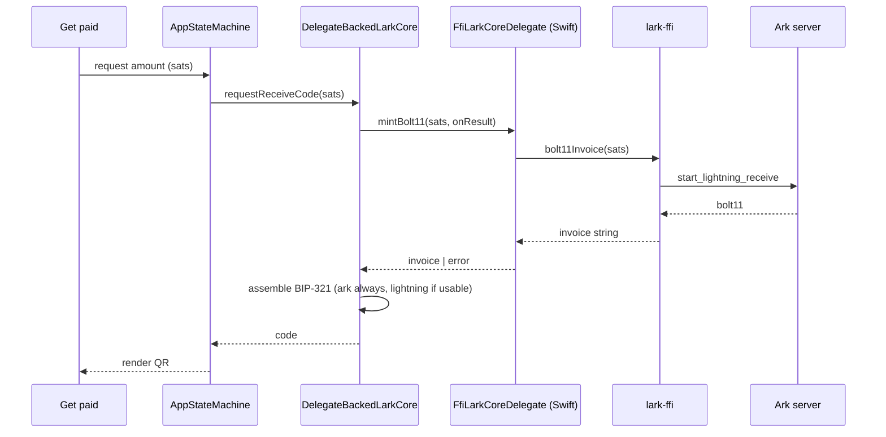
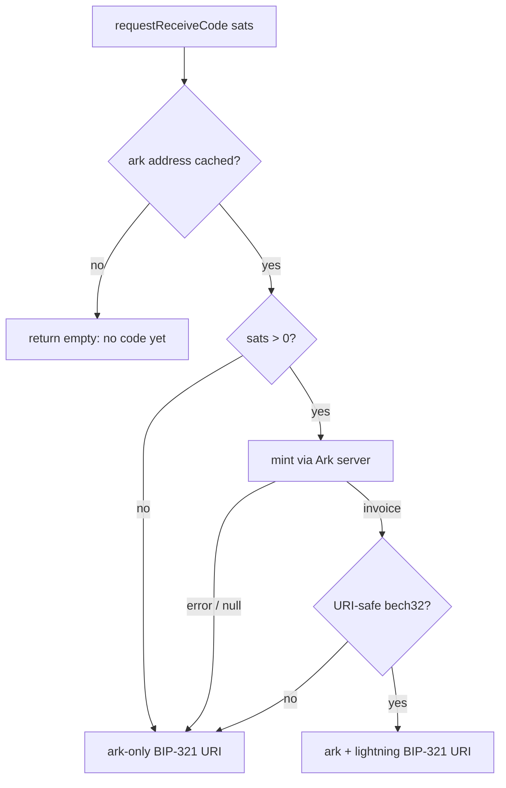

# Lightning-First Funding and Receive - Plan

## Goal Capsule

- **Objective:** A first-time holder can be paid over Lightning into an empty wallet, and that payment is how the wallet becomes funded. The everyday Get paid code carries a Lightning invoice whenever an amount is known, and no ordinary surface names Ark.
- **Product authority:** This Product Contract. On-chain deposit and the invisible-boarding flow stay as they are; BOLT12 in either direction is out of scope.
- **Open blockers:** None. Two agent picks are recorded as assumptions (A1, A2) rather than settled product choices.
- **Product Contract preservation:** Authored here (`ce-plan-bootstrap`) from a settled-decisions brief. KTD-5 carries a conflict call-out where research contradicted one clause of a settled decision.

---

## Product Contract

### Summary

Ark has no ecosystem reach, so the wallet should speak Lightning wherever it can. Two things change. The Get paid code becomes a BIP-321 URI that carries a Lightning invoice alongside the Ark address instead of being a bare Ark address, and "Add money" gains a Lightning route that works on a wallet with no balance at all — which is what lets someone start using Lark without ever making an on-chain deposit or meeting an Ark-specific concept.

### Problem Frame

Today the FFI core's Get paid code is a raw Ark address (`composeApp/src/iosMain/kotlin/xyz/lark/app/core/ffi/DelegateBackedLarkCore.kt:189`). Only a wallet that already understands Ark can pay it, so the holder's first act is to explain a new protocol to whoever is paying them — or to give up and fund on-chain instead.

Funding therefore has exactly one door: send bitcoin to an on-chain address, wait for confirmations, let boarding turn it into VTXOs. That door is fine for someone who already holds bitcoin on-chain and hostile to everyone else, and it is the whole of the first-run experience.

The engine already has the missing capability and the app never calls it. `bark::Wallet::bolt11_invoice(amount)` mints an invoice through the Ark server, and it needs no balance, no channel, and no inbound liquidity. Claiming the resulting payment is already automatic, because `maintenance()` claims pending Lightning receives and the FFI core already runs maintenance. What is missing is only the binding, the seam override, and the surface.

The cost of the gap is concentrated at the worst moment: a brand-new holder with an empty wallet, holding out a code that almost nothing in the world can pay.

### Key Decisions

- KTD-1. **A first-time holder can fund an empty wallet over Lightning, with no on-chain deposit.** (session-settled: user-directed — chosen over keeping on-chain deposit and boarding as the only funding route: the goal is that nobody has to meet a new payment protocol to get started.) On-chain deposit remains available and unchanged; this adds a door rather than closing one.

- KTD-2. **One rule covers both directions, not send-only treatment.** (session-settled: user-directed — chosen over addressing Lightning send alone: send is already gated by arithmetic at `composeApp/src/commonMain/kotlin/xyz/lark/app/state/AppStateMachine.kt:1017`, so the receive half is where the silent failure actually lives.) Send needs no change in this plan; it already works. The rule is what the receive side is built to satisfy.

- KTD-3. **The Get paid code is a BIP-321 URI carrying a fresh Ark address always, plus a BOLT11 invoice when an amount is known.** (session-settled: user-approved — chosen over a BOLT11-only URI with the Ark address dropped: the wrapper only earns its compatibility cost by bundling, and dropping Ark would kill the reusable-code case and push Lark-to-Lark payments through HTLCs for something the protocol settles instantly out of round.) Ark is present in the string and never named on a surface.

- KTD-4. **BOLT12 is out of scope in both directions.** (session-settled: user-directed — chosen over a full Lightning-first pass that also wires BOLT12 send through `pay_lightning_offer`: three loosely-coupled pieces in one plan.) Receive is additionally impossible — there is no offer-minting function anywhere in bark or captaind — so only send is deferrable, and it is deferred.

- KTD-5. **There is no funded-balance gate on Lightning surfaces. A failed mint degrades to the Ark-only code.** (session-settled: user-approved — chosen over hiding or disabling Lightning surfaces until the wallet has a spendable balance: the real constraint sits on claim-liveness, not on funding, and a balance gate would block the empty-wallet case that is the entire point.) **Conflict call-out:** the settled decision also named "expiry the claim loop can honor" as part of a mint-time gate. `Wallet::bolt11_invoice` takes only an amount, so invoice expiry is the server's `invoice_expiry` and not the client's to choose. The gate reduces to what the client can actually observe — the mint either returns an invoice or it does not — which is why this is expressed as degradation rather than as a precondition check.

- KTD-6. **No user-facing surface says "board", "Ark", "VTXO", or "invoice".** The first three are inherited from the invisible-boarding plan's KTD-1 (see origin: `docs/plans/2026-08-06-001-feat-invisible-boarding-plan.md`); "invoice" is this plan's own addition, on the same reasoning — it is protocol vocabulary the holder gains nothing from holding. "Lightning" is permitted, because it is a word the payer's wallet already uses.

### Requirements

- R1. A holder can request an amount and receive a code that a Lightning-only wallet can pay.
- R2. The code is a single BIP-321 URI. The Ark address is always present; the Lightning invoice is present whenever an amount was requested and the mint succeeded.
- R3. Requesting no amount yields a code carrying the Ark address alone. It is still a valid, scannable BIP-321 URI.
- R4. A mint that fails for any reason yields the Ark-only code rather than an error or a code containing a broken destination. The one case that yields no code is a wallet with no Ark address cached yet, which is the pre-existing no-code-yet state and is unchanged by this work.
- R5. Minting works on a wallet with a zero balance and no channels.
- R6. An incoming Lightning payment becomes spendable balance without holder action.
- R7. "Add money" offers a Lightning route that reaches the amount-request flow, alongside the existing on-chain deposit route.
- R8. No surface added or changed by this work uses the vocabulary named in KTD-6.
- R9. The gateway core's existing channel-based receive path is unchanged.
- R10. The new server-dependent FFI export is classified in the hermetic lane's Ark-dependent enumeration.
- R11. Re-requesting the same amount reuses the invoice already minted for it rather than minting another. Requesting a different amount may mint, but the wallet never accumulates live invoices for amounts the holder has moved on from faster than one per distinct amount.

### Acceptance Examples

- AE1. **Covers R1, R2, R5.** Given a wallet with a zero balance, when the holder requests 5 000 sats on Get paid, then the code is a BIP-321 URI whose `lightning=` destination is a BOLT11 invoice for 5 000 sats and whose `ark=` destination is a fresh Ark address.
- AE2. **Covers R3.** Given the holder opens Get paid without requesting an amount, when the code renders, then it carries the Ark address and no `lightning=` destination.
- AE3. **Covers R4.** Given the Ark server is unreachable, when the holder requests an amount, then the code is the Ark-only URI and no error surface appears.
- AE4. **Covers R4.** Given the mint returns a string that would break the URI, when the code is assembled, then the Lightning destination is dropped and the Ark-only URI is served.
- AE5. **Covers R6.** Given an invoice minted by this wallet is paid while the app is open, when maintenance next runs, then the balance reflects the payment with no holder action.
- AE6. **Covers R7.** Given a first-run holder on "Add money", when they choose the Lightning route, then they reach the amount-request flow and the resulting code is payable from a Lightning wallet.
- AE7. **Covers R8.** Given any surface this work adds or changes, when its copy is read, then it contains none of "board", "Ark", "VTXO", or "invoice".
- AE8. **Covers R10.** Given the hermetic lane runs with no Ark server, when the new export is called, then it fails, and the lane asserts that it fails.

### Scope Boundaries

**In scope:** the FFI binding for invoice minting, the FFI core's `requestReceiveCode` override, BIP-321 assembly on the FFI path, a Lightning route on the funding screen, and the hermetic-lane classification entry.

**Deferred for later:**
- BOLT12 send through `pay_lightning_offer` — a thin FFI addition, deliberately held back per KTD-4.
- A holder-visible record of a pending Lightning receive. Claiming is automatic; showing the wait is separate work.
- Any behavior that depends on the app being closed when a payment arrives (see R6's boundary and Risk 2).

**Deferred to Follow-Up Work:**
- Moving `arkReceiveUri` / `withLightningInvoice` out of `core/gateway/` is done in U4 only as far as this plan needs. A broader consolidation of URI handling is not attempted.

**Outside this product's identity:**
- Naming the transport to the holder. The app does not teach Ark, and it does not ask the holder to choose a rail.

---

## Planning Contract

### Key Technical Decisions

- KTD-7. **The invoice is minted through the Ark server, not through a channel.** `bark::Wallet::bolt11_invoice` calls `start_lightning_receive` on the server. This is what makes R5 achievable: the channel path in the gateway core requires inbound liquidity, which a self-funded channel does not have.

- KTD-8. **BIP-321 assembly moves to shared code rather than being duplicated.** `arkReceiveUri` and `withLightningInvoice` are `internal` to `core/gateway/` today (`composeApp/src/commonMain/kotlin/xyz/lark/app/core/gateway/GatewayMappers.kt:91` and `:107`). The FFI core needs the same rules, and two copies of a money-bearing URI builder is the wrong trade. They move to a shared `core/` home with their tests, and the gateway keeps calling them.

- KTD-9. **The crate returns only the invoice; the code-assembly decision is a pure function in `commonMain`, and the FFI core is thin glue over it.** The Rust export stays a pass-through returning a BOLT11 string, matching `send_bolt11`'s shape. The decision — given a requested amount, a cached Ark address, and a mint outcome, which code to serve — is a pure function, because `DelegateBackedLarkCore` lives in `iosMain` and has no test lane anywhere in the repo. Putting the branch logic in the override would make R4's degradation rules unverifiable; putting it in `commonMain` makes every branch a `commonTest` assertion and leaves the override with nothing to get wrong but the call itself.

- KTD-11. **A minted invoice is cached per amount and reused within its usable window.** Minting is not free: `start_lightning_receive` persists a pending receive server-side, and cancelling the Kotlin coroutine does not retract it. Without caching, each amount change leaves another live invoice that every maintenance pass then tries to claim. Mirrors `GatewayLarkCore`'s existing `cachedChannelInvoice` (`composeApp/src/commonMain/kotlin/xyz/lark/app/core/gateway/GatewayLarkCore.kt:383`) rather than inventing a second policy.

- KTD-10. **`requestReceiveCode` degrades rather than throwing.** The seam's contract already states it never returns an invoice that cannot be paid and never fails (`composeApp/src/commonMain/kotlin/xyz/lark/app/core/LarkCore.kt:65`). The override honors that contract instead of introducing a new failure mode, which is what makes R4 a property of the seam rather than of each caller.

### High-Level Technical Design

The mint path, stage by stage. Each hop already exists for `send_bolt11`; this adds the mirror-image call.

The degradation rule, which is the whole of KTD-5 and R4:

Note that every failure edge lands on the same honest value, and none of them surface as an error.

### Implementation Units

### U1. Export invoice minting from the crate

- **Goal:** `lark-ffi` can mint a BOLT11 invoice through the Ark server.
- **Requirements:** R1, R5. Implements KTD-7, KTD-9.
- **Dependencies:** none.
- **Files:** `rust/lark-ffi/src/wallet.rs`
- **Approach:** Add an async export taking `sats: u64` and returning `Result<String, LarkError>`, calling `self.inner.bolt11_invoice(Amount::from_sat(sats))` and returning the invoice's string form. Mirror `send_bolt11` (`rust/lark-ffi/src/wallet.rs:315`) in shape, error mapping, and doc-comment discipline. Reject a non-positive amount as `LarkError::Invalid` rather than asking the server about it.
- **Patterns to follow:** `send_bolt11` and `send_ark` in the same file — same `map_err(LarkError::from)`, same thin-wrapper posture.
- **Test scenarios:**
  - A zero `sats` returns `LarkError::Invalid` without reaching the server.
  - With no reachable Ark server, the call fails rather than returning a string.
- **Verification:** the crate builds and its unit tests pass.

### U2. Regenerate the committed bindings

- **Goal:** the Kotlin bindings match the crate.
- **Requirements:** supports R1.
- **Dependencies:** U1.
- **Files:** `composeApp/src/androidMain/kotlin/uniffi/` (generated), `iosApp/iosApp/Generated/lark_ffi.swift` (generated)
- **Approach:** Two generators, not one. `scripts/generate-bindings.sh` writes only the Kotlin bindings under `composeApp/src/androidMain/kotlin/uniffi/`; the committed Swift glue at `iosApp/iosApp/Generated/lark_ffi.swift` is written by `scripts/build-xcframework.sh`. Both must run, because the FFI core is iOS-only — regenerating Kotlin alone leaves the shipping path calling a stale binding, and `scripts/ci.sh` runs a separate drift check per language. Never hand-edit either output.
- **Execution note:** Generated-only unit. Do not mix hand-written changes into this commit; a mixed commit makes the drift check unreviewable.
- **Test scenarios:** `Test expectation: none -- generated output, verified by the CI drift check rather than by tests.`
- **Verification:** re-running the script produces no further diff.

### U3. Classify the new export in the hermetic lane

- **Goal:** the new server-dependent export is covered by the lane that says what needs a server.
- **Requirements:** R10. Covers AE8.
- **Dependencies:** U1, U2.
- **Files:** `composeApp/src/androidUnitTest/kotlin/xyz/lark/app/core/ffi/FfiHostLibraryTest.kt`
- **Approach:** Add the new export to the Ark-dependent group in `onlyArkDependentOperationsFailWithoutAnArkServer` (`:85`), alongside `mint_address`, `next_round_time`, and `reconnect_ark`, with a one-line reason in the established style.
- **Execution note:** Do this in the same change as U1/U2, not after. The lane's split is a hand-written enumeration, so a new export is uncovered by default — this is the exact failure recorded in `docs/solutions/test-failures/server-dependent-export-lands-outside-the-lane.md`.
- **Test scenarios:**
  - Covers AE8. Without an Ark server, the new export fails, and the lane asserts the failure rather than skipping.
  - The lane still reports zero skips.
- **Verification:** the FFI lane runs rebuild-then-test and reports the new assertion with no skips.

### U4. Share the BIP-321 builders

- **Goal:** URI assembly is callable from both cores, with one implementation.
- **Requirements:** R2, R3. Implements KTD-8.
- **Dependencies:** none.
- **Files:** `composeApp/src/commonMain/kotlin/xyz/lark/app/core/gateway/GatewayMappers.kt`, a new shared file under `composeApp/src/commonMain/kotlin/xyz/lark/app/core/`, and the existing tests that cover these functions
- **Approach:** Move `arkReceiveUri`, `withLightningInvoice`, `isBech32Shaped`, and the shape constants they share into a shared `core/` home, keeping visibility no wider than needed. Behavior-preserving move; the gateway keeps calling them and its tests keep passing unchanged.
- **Execution note:** Pure move. Land it before U5 so U5 has something to call, and keep it free of behavior change so a regression here is impossible to confuse with U5's.
- **Test scenarios:**
  - Existing URI-assembly tests pass unchanged from the new location.
  - Existing gateway receive-code tests pass unchanged.
- **Verification:** the common test suite passes with no assertion edits.

### U5. Override `requestReceiveCode` on the FFI core

- **Goal:** the FFI path returns a BIP-321 code that carries a Lightning invoice when an amount is known.
- **Requirements:** R1, R2, R3, R4, R5. Implements KTD-9, KTD-10. Covers AE1–AE4.
- **Dependencies:** U2, U4.
- **Files:** `composeApp/src/commonMain/kotlin/xyz/lark/app/core/ffi/LarkCoreDelegate.kt`, a new pure-decision file under `composeApp/src/commonMain/kotlin/xyz/lark/app/core/`, `composeApp/src/iosMain/kotlin/xyz/lark/app/core/ffi/DelegateBackedLarkCore.kt`, `iosApp/iosApp/FfiLarkCoreDelegate.swift`, `composeApp/src/commonTest/kotlin/xyz/lark/app/core/ReceiveCodeDecisionTest.kt` (new)
- **Approach:** Three pieces. (a) Add a minting method to the delegate interface following `sendBolt11`'s callback shape (`LarkCoreDelegate.kt:87`) and implement it in Swift with the existing `perform(onResult)` helper (`FfiLarkCoreDelegate.swift:172`). (b) Put the decision in `commonMain` as a pure function over the requested amount, the cached Ark address, and the mint outcome, returning the code to serve — this is the flowchart above, and it is where every branch of R2/R3/R4 is asserted. (c) Override `requestReceiveCode` on the FFI core as thin glue: consult the per-amount cache (R11), call the mint only on a miss, hand both inputs to the decision function, return its answer. Note that today's `receiveCode` is a raw Ark address, so this is the first place the FFI path produces a URI at all — the amountless case must produce the Ark-only URI, not the bare address.
- **Patterns to follow:** `GatewayLarkCore.requestReceiveCode` (`:365`) for the shape of the decision and `cachedChannelInvoice` (`:383`) for the cache; the existing delegate methods for the callback plumbing.
- **Test scenarios:**
  - Covers AE1. A positive amount with a successful mint returns a URI carrying both destinations, Ark first.
  - Covers AE2. A zero amount returns the Ark-only URI and never calls the mint.
  - Covers AE3. A mint that reports an error returns the Ark-only URI and does not throw.
  - Covers AE4. A mint returning a value that is not URI-safe bech32 drops the Lightning destination.
  - A negative amount is treated as amountless rather than reaching the mint.
  - No cached Ark address returns empty, matching the existing no-code-yet contract.
  - Covers R11. A second request for the same amount serves the cached invoice and does not mint again.
  - Covers R11. A request for a different amount does not serve the previous amount's invoice.
  - The assembled URI carries at most one Lightning destination.
- **Verification:** the new decision tests pass, the existing receive tests are unchanged, and the override contains no branching that the decision tests do not cover.

### U6. Offer a Lightning route on "Add money"

- **Goal:** a first-run holder can choose to be paid over Lightning instead of depositing on-chain.
- **Requirements:** R7, R8. Covers AE6, AE7.
- **Dependencies:** U5.
- **Files:** `composeApp/src/commonMain/kotlin/xyz/lark/app/ui/screens/onboarding/FundScreen.kt`, `composeApp/src/commonMain/kotlin/xyz/lark/app/state/AppStateMachine.kt`, `composeApp/src/commonMain/kotlin/xyz/lark/app/App.kt`, `composeApp/src/commonTest/kotlin/xyz/lark/app/state/` (extend existing flow tests)
- **Approach:** Add a route from the funding screen into the existing amount-request flow, which already mints and holds a code (`AppStateMachine.kt:600`). No new receive machinery — this is a navigation edge plus copy. Keep the existing on-chain route in place per KTD-1.
- **Execution note:** The amount step is unavoidable, because an invoice needs an amount (see Assumption A2). Treat it as the first step of the route, not as an error state.
- **Patterns to follow:** the existing funding-screen actions and the machine's `goReceiveAmount` path.
- **Test scenarios:**
  - Covers AE6. Choosing the Lightning route from funding reaches the amount-request flow, and a requested amount yields a code carrying a Lightning destination.
  - Covers AE7. The added copy contains none of "board", "Ark", "VTXO", or "invoice".
  - The on-chain deposit route from the funding screen still reaches the deposit screen.
  - Leaving the route mid-way returns to a coherent resting screen and clears any requested amount.
- **Verification:** flow tests pass; the funding screen offers both routes.

### Verification Contract

- The common unit suite passes: `./gradlew detekt :composeApp:testDebugUnitTest`.
- The FFI host-library lane runs as **rebuild-then-test** and reports zero skips. Running the Gradle leg alone can verify a stale native library — see `docs/solutions/test-failures/test-lane-verifies-a-stale-native-library.md`.
- `scripts/generate-bindings.sh` produces no diff after U2.
- AE1–AE8 are each covered by a named test scenario above.

### Definition of Done

- A zero-balance wallet can produce a code that a Lightning-only wallet pays, and the payment lands as spendable balance without holder action.
- Every failure path in the mint returns the Ark-only BIP-321 URI, and no new error surface exists.
- "Add money" offers a Lightning route and an on-chain route.
- No surface added or changed says "board", "Ark", "VTXO", or "invoice".
- The gateway core's channel receive path is untouched and its tests are unedited.
- The hermetic lane classifies the new export and still reports zero skips.

### Assumptions

- A1. **The Lightning route sits alongside on-chain deposit on the funding screen, as the leading option.** Agent pick; the settled brief left placement open. Changing it is copy and ordering, not structure.
- A2. **The first-run Lightning route requires an amount.** Forced by the engine: `bolt11_invoice` takes an amount and there is no offer-minting function to provide an amountless reusable code. Recorded because it shapes the route's first step.
- A3. **Invoice expiry is the server's `invoice_expiry`.** The client cannot set it (see KTD-5's conflict call-out). No client-side expiry handling is planned.

### Risks and Dependencies

- **Risk 1 — empty-wallet claiming is a property of our deployment, not of Ark.** Claiming a receive normally needs an anti-DoS proof, and an empty wallet cannot build one. The client warns and sends none (`../bark/bark/src/lightning/receive.rs:292`), and the server accepts that only while `ln_receive_anti_dos_required` is false — which `deploy/fly/captaind.toml.template:64` sets. `try_claim_all_lightning_receives` takes no token parameter, so there is no way to satisfy a stricter server from the claim loop. *Mitigation:* record it here and in `CONCEPTS.md`; do not describe empty-wallet Lightning funding as a protocol property. Pointing the app at a stricter Ark server breaks R5.
- **Risk 2 — a payment arriving while the app is closed is not claimed until it reopens.** Maintenance is the claimer and it only runs while the app runs (`MAINTENANCE_EVERY_N_CYCLES`, roughly once a minute). The HTLC has a deadline. *Mitigation:* out of scope here, and the amount-bound short-lived shape of the gesture limits exposure — the holder is showing a QR, not publishing a durable address. Do not extend Lightning to the reusable-code case without addressing this.
- **Risk 3 — CLTV rejection.** `bolt11_invoice` bails when the required delta exceeds the server's `max_user_invoice_cltv_delta`. *Mitigation:* it is a mint failure and lands on the same degradation edge as any other (R4).
- **Risk 4 — this path routes through the very bridge self-held channels exist to avoid.** `CONCEPTS.md` names a wallet-held channel "the project's central differentiator" because it moves Lightning value *without* routing through the Ark server's own bridge, and a server-bridged receive is exactly that routing. *Mitigation:* the two coexist by design and serve different preconditions — a channel receive needs inbound capacity, a bridged receive needs only a reachable server, which is why it is the only one available to an empty wallet. The gateway core's channel path is untouched (R9). Worth naming so the funding story is not mistaken for a retreat from the differentiator.
- **Risk 5 — a minted invoice the holder abandons stays pending server-side.** `start_lightning_receive` persists the receive before the holder has done anything, and no client call retracts it; `try_claim_all_lightning_receives` iterates every pending receive on each maintenance pass. R11's per-amount cache bounds the growth to one per distinct amount requested, which is the affordable case, but it does not clean up. *Mitigation:* accept for now and keep the cache; a holder-visible pending-receive record (deferred above) is the natural place to add cancellation if the orphans ever matter.
- **Dependency —** the pinned bark SHA in `rust/fork-pins.toml`. All of the above was verified against it, not against upstream.

### Sources and Research

- `../bark/bark/src/lightning/receive.rs` — `bolt11_invoice` (`:31`), the anti-DoS computation (`:196`), the degrade-to-none edge (`:292`).
- `../bark/bark/src/lib.rs:1374` — maintenance claims pending Lightning receives.
- `../bark/server/src/ln/mod.rs:493` — server-side anti-DoS verification; `../bark/server/src/config.rs:439` — the flag.
- `docs/gateway/barkd-openapi-0.4.0.json` — BOLT12 appears only as a send destination; the receive endpoint mints BOLT11.
- `docs/solutions/test-failures/server-dependent-export-lands-outside-the-lane.md` — why U3 exists.
- `docs/solutions/test-failures/test-lane-verifies-a-stale-native-library.md` — why the FFI lane is rebuild-then-test.
- `docs/plans/2026-08-06-001-feat-invisible-boarding-plan.md` — KTD-1, the no-protocol-vocabulary rule inherited as KTD-6.
