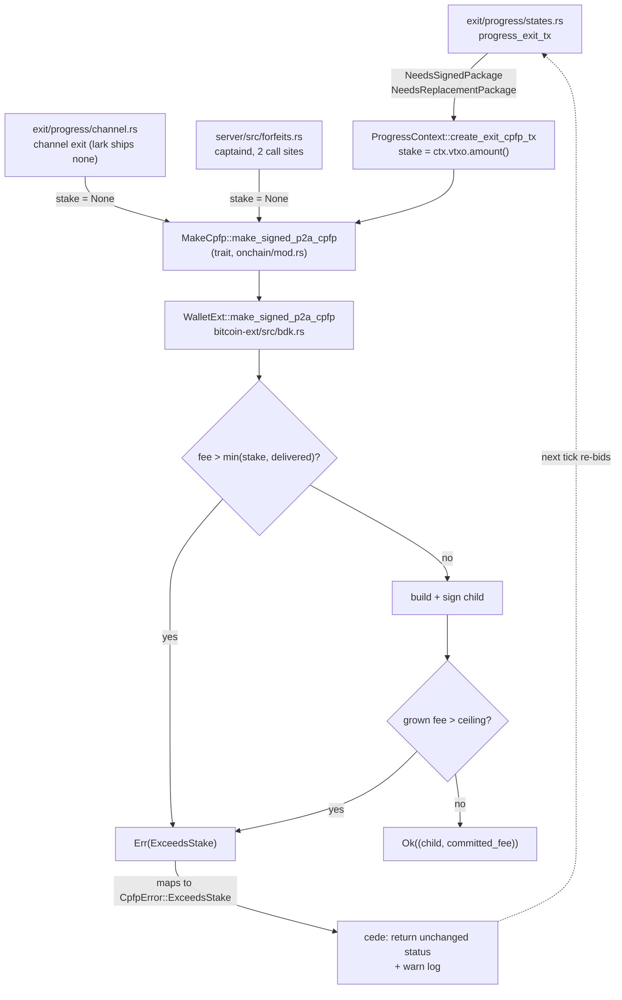

# fix: bound unilateral-exit CPFP bids by the stake they recover

**Target repos:** this plan spans two. Paths under `bark/`, `bitcoin-ext/`, and `server/` are
relative to the **sibling bark fork checkout** (`../bark`, remote `conor` =
`gitlab.com/ConorOkus/bark`, currently at the pinned `5cd1f226`). Every other path is relative to
**lark-app**. Each implementation unit names which repo it lands in.

---

## Summary

lark's unilateral exit pays a CPFP child to drag each exit-tree transaction into a block. The
builder that constructs that child has **no economic ceiling**: it will bid whatever the requested
fee rate implies, even when the fee exceeds everything the wallet stands to recover from the
package. Upstream fixed this in `f1333628` (MR !2444, open, unmerged), explicitly flagged
`FOR UPSTREAM: independent of channels`. This plan ports the channels-independent core of that fix
onto our fork and bumps lark's pin to it.

Three behaviours land, in order: an **intrinsic ceiling** in the shared builder that no caller can
bid past; the **real per-exit stake** passed at lark's exit call site instead of the package's face
value; and **cede-the-race** handling so a refused bid declines gracefully instead of erroring the
exit — while staying visible, because a bid we decline forever and an exit that is stuck look
identical from outside.

**The bound this buys is per-level, not per-recovery.** Each individual bid is capped at what that
transaction recovers for us, which closes the unbounded and face-value exposures. An N-level exit
chain can still commit up to N × stake in total, because the durable per-recovery budget that fixes
that is deliberately out of scope (KTD-4). Describe the result that way — this plan reduces the
exposure, it does not close it.

---

## Problem Frame

`WalletExt::make_signed_p2a_cpfp` (`bitcoin-ext/src/bdk.rs:135`) computes
`extra_fee_needed = parent_weight * fee_rate`, then grows that fee in a loop until the child's own
weight and any RBF minimum are satisfied. Nothing anywhere compares the resulting fee to what
confirming the package is worth to us.

Two things make that dangerous rather than theoretical:

1. **An exit-tree transaction is mostly other people's money.** A shared tree tx delivers value to
   strangers' branches; our stake is one leaf. Bidding against its face value — let alone against
   an unbounded rate — burns our on-chain funds to confirm their outputs.
2. **P2A anchors are anyone-can-bump.** The RBF branch prices our replacement off
   `current_package_fee`, which is whatever child is standing on the anchor. A third party can put
   a bulky, high-absolute-fee child there. Our wallet then computes a minimum that clears *their*
   fee and pays it, with no ceiling to refuse.

Beyond the stake, losing the race is strictly cheaper than winning it. Today the wallet cannot
express that.

lark runs this code. The exit was proven live on 2026-08-18 (a 90,000 sat VTXO to `Claimed` in
79m56s with captaind scaled to zero); it is shipped in TestFlight and is the recourse path the whole
keys-on-device design rests on.

**What this is not.** This is not the channels work. It is not a rebase onto upstream 0.6.2. Both
are deliberately out of scope (KTD-1, KTD-2).

---

## Requirements

| ID | Requirement |
| --- | --- |
| R1 | A CPFP child must never commit a fee greater than the caller's stake in the package, and never greater than the package's delivered value. The refusal is enforced in the builder, so no call site can bypass it. |
| R2 | The ceiling holds for the **grown** fee, not just the first estimate — the loop adds the child's own weight and can raise the fee further via the RBF minimum. |
| R3 | lark's exit passes its own claimable value as the stake, rather than defaulting to the package's face value. |
| R4 | A refused bid **cedes the race**: the exit leaves that transaction's status unchanged and continues, so a later tick can retry. It must not error the exit or wedge the state machine, and a single cede must not be reported as a failure. |
| R9 | A cede must be **observable**, not merely logged. The exit records that it declined, with the fee and the ceiling, so a wallet that is ceding repeatedly can be told apart from one that is progressing. |
| R5 | The RBF minimum charges relay bandwidth for the **replacement child alone**; the parent stays in the mempool and must not be charged twice. |
| R6 | Every existing caller keeps compiling and keeps its current behaviour — the channel-exit call site and both captaind forfeit call sites pass `None`. |
| R7 | lark-app pins the ported fork commit, and a lark-side test fails if a future pin bump loses the fix. |
| R8 | The port must not regress `5cd1f226` (the 15s Ark connect bound); `ark_connect_timeout_tests` stays green. |

---

## Key Technical Decisions

**KTD-1. Scope is the CPFP stake ceiling, not a rebase onto upstream 0.6.2.**
*(session-settled: user-directed — chosen over rebasing the fork onto upstream master and dropping
the rust-lightning fork: the upstream series is unmerged with one part still Draft and two parts
unwritten, while the fee-burn exposure is live in shipped code today.)*

**KTD-2. No channels code is ported.**
*(session-settled: user-directed — chosen over taking !2444 wholesale: lark ships no channel
actions, so channel code would be dead weight carrying its own protocol risk.)* The channel-exit
CPFP call site (`bark/src/exit/progress/channel.rs:675`) is updated only enough to compile, passing
`None`.

**KTD-3. Hand-port, do not cherry-pick.** `f1333628` is written against upstream master `9b48c40b`
(bark-wallet 0.6.2, 2026-08-24). Our fork branches from `fbdb0136` (2026-01-27) and is 2685 commits
behind. Upstream restructured exits into `bark/src/exit/bdk.rs` with an `ExitCpfpRequest { exit_tx,
stake }` and made the trait `async`; we still have `exit/progress/{mod,states}.rs` and a sync trait.
A cherry-pick would conflict in every file. The **builder body itself is near-identical** — same
loop, same RBF branch, only local renames (`outpoint`/`txout` vs `fee_anchor_point`/
`fee_anchor_txout`, `p2a_weight` vs `parent_weight`, `reveal_next_address` vs `next_unused_address`)
— so the builder hunks transcribe almost verbatim while the call-site plumbing is written against
our shape.

**KTD-4. Take the intrinsic ceiling and the per-exit stake; leave the durable per-recovery budget.**
Upstream's full commit also carries a durable per-recovery fee budget (new sqlite migration
`m0048_exit_child_fee`, persistence adaptor changes, `bark_persister_test` updates) so that an
N-level exit chain counts as *one* recovery rather than N. Our driver runs `progress_exit_tx` per
transaction with `ctx.vtxo` fixed, so passing `ctx.vtxo.amount()` at every level means an N-level
chain could commit up to N × amount across levels while each individual bid respects the ceiling.
That residual is real and is recorded below — but closing it needs persistence surgery in a
7-month-stale fork whose e2e lane cannot run here (needs bitcoind + postgres). The ceiling plus a
real per-call stake removes the unbounded and the face-value exposures, which are the ones an
adversary can actually drive.

**KTD-5. Take the RBF bandwidth fix; leave the other pricing fixes.** Removing
`p2a_weight * min_tx_relay_fee` from `min_package_fee` (R5) is inside the builder and *entangled*
with the ceiling — an inflated minimum is more likely to trip the refusal, so shipping the ceiling
without it would cede races we should win. Upstream's other two pricing fixes are separable and
deferred: the origin-gated `RbfRequirement` needs tx-manager plumbing we do not have, and the
`mempool_ancestor_info` `ancestorsize` double-count **only affects the Bitcoind branch** — our
esplora branch is byte-identical to upstream's, and lark's chain source is esplora, so that fix
changes nothing lark runs.

**KTD-6. Cede by returning the transaction's current status, not by erroring.** Our
`create_exit_cpfp_tx` maps every builder error into an `ExitError`, and
`ExitProcessingState::progress` turns any error from `progress_exit_tx` into an `ExitProgressError`
that aborts the whole exit's progression for that tick. Mapping `ExceedsStake` down that path would
make a refused bid look like a broken exit — every tick, in the UI, on the one screen whose subject
is recovering the user's money. Ceding instead returns `Ok(<unchanged status>)` with a warning log,
so the state machine holds position and the next tick re-bids at the plain target. This matches
upstream's "ceding abandons the escalation, not the work."

**KTD-7. Ship the fork commit and the pin bump as one reviewable pair, fork first.**
`scripts/build-rust.sh` verifies the sibling checkout's `HEAD` equals `rust/fork-pins.toml`, and
`scripts/clone-forks.sh` fetches the pinned SHA from the remote. A pin pointing at an unpushed
commit fails CI on the runner while passing locally. So: commit on the fork → **push to `conor`** →
bump the pin in lark-app. Non-negotiable ordering.

---

## High-Level Technical Design

Where the ceiling sits relative to the callers, in our fork's shape:

The ceiling is checked twice on purpose: once against the first estimate (`parent_weight * rate`)
and once per loop pass against the grown fee, because each pass adds the child's own weight and the
RBF branch can raise the figure further.

---

## Implementation Units

### U1. The intrinsic ceiling in the shared CPFP builder

**Repo:** bark fork.

**Goal:** `make_signed_p2a_cpfp` refuses to build a child whose fee exceeds the caller's stake, and
returns the fee it actually committed. Every call site compiles by passing `None`, so no stake
semantics arrive yet — the ceiling this unit enforces is the package's *delivered value*.

Two behaviour changes land here, both wallet-wide: bids above the delivered value are now refused
(previously unbounded), **and** every RBF replacement is priced slightly lower because the parent's
relay bandwidth is no longer charged twice (R5). The second one touches every replacement, not only
the ones that would have exceeded the ceiling — do not describe this unit as inert for well-behaved
bids.

**Requirements:** R1, R2, R5, R6.

**Dependencies:** none.

**Files:**
- `bitcoin-ext/src/bdk.rs` — add `CpfpInternalError::ExceedsStake { fee, stake }`; add the `stake:
  Option<Amount>` parameter; compute `delivered` and `ceiling = stake.map_or(delivered, |s|
  s.min(delivered))`; refuse before the loop and again inside it; change the return to
  `Result<(Transaction, Amount), CpfpInternalError>`; drop `p2a_weight * min_tx_relay_fee` from
  `min_package_fee` in the RBF branch (R5).
- `bitcoin-ext/src/cpfp.rs` — add the matching `CpfpError::ExceedsStake { fee, stake }`.
- `bark/src/onchain/mod.rs` — the `MakeCpfp` trait signature and its doc comment.
- `bark/src/onchain/bdk.rs` — both impls (`BdkWallet` at ~187, `OnchainWallet` at ~271); map
  `CpfpInternalError::ExceedsStake` to `CpfpError::ExceedsStake` in the `BdkWallet` match arm.
- `bark/src/exit/progress/mod.rs` — `create_exit_cpfp_tx` threads `None` for now and destructures
  the tuple.
- `bark/src/exit/progress/channel.rs` (~675) — pass `None`, destructure (KTD-2).
- `server/src/forfeits.rs` (~169, ~462) — pass `None`, destructure. captaind's forfeit claims
  recover the whole delivered value, which is what `None` means.

**Approach:** transcribe upstream's builder hunks against our local names (KTD-3). The refusal is a
plain early `return Err`, not a new control path — the loop's existing structure is untouched apart
from the added guard at the top of each pass. Keep upstream's comments explaining *why* the ceiling
is economic rather than a safety limit; they are the reason a future reader will not "fix" it by
raising the cap.

**Extract the economic rule as a pure function.** Upstream inlines `let ceiling =
stake.map_or(delivered, |s| s.min(delivered))` and compares in two places. Do not inline it here.
Our fork's `bitcoin-ext/src/bdk.rs` has **no test module at all** (the crate's only
`#[cfg(test)]` blocks are in `serde.rs`, `bitcoin.rs`, and `fee.rs`), its dev-dependencies are
`rmp-serde` alone, and upstream's `two_utxo_wallet()` fixture — along with
`NonDustDrainCoinSelection` and the rest of that test module — arrived in commits after our fork
point, on bdk_wallet 3.1 where we are on 2.1. Porting the funded-wallet fixture is therefore an
unbounded side quest, and the ceiling would end up untested to avoid it.

A small named function — the ceiling from `(stake, delivered)`, and the guard that turns a fee and
a ceiling into `Ok(())` or `ExceedsStake` — is pure arithmetic, testable with no wallet at all, and
called from both guard points. It also gives the economic rule a name a reader can find. This is a
deliberate divergence from upstream's shape, taken because it is the difference between a tested
ceiling and an untested one.

**Patterns to follow:** the existing `CpfpInternalError` → `CpfpError` mapping in
`bark/src/onchain/bdk.rs` — every new internal variant needs an arm there or the match stops
compiling, which is the compiler doing the R6 check for us.

**Test scenarios** (a new `#[cfg(test)]` module in `bitcoin-ext/src/bdk.rs`, against the extracted
function — no wallet fixture needed):
- `stake = None` yields a ceiling equal to the delivered value — `None` means "the whole delivered
  value is the caller's", never "no ceiling". This is the variant most likely to be misread as
  unbounded, and every existing call site passes it.
- A stake larger than the delivered value is clamped to the delivered value — you cannot claim more
  than the package pays out.
- A stake smaller than the delivered value tightens the ceiling to the stake.
- A fee equal to the ceiling is accepted; one satoshi over is refused. The boundary is where an
  off-by-one silently reintroduces the exposure.
- The refusal carries both the offending fee and the ceiling that rejected it, so the log line in
  U3 can explain itself.
- A zero stake refuses any positive fee rather than dividing by zero or wrapping.

**Optional, only if cheap:** if adding a `bdk_wallet` test-utils dev-dependency turns out to be a
few lines on 2.1, also port upstream's `cpfp_bid_never_exceeds_the_parent_value` end-to-end through
the real builder. Time-box it; the extracted-function tests above are the unit's actual coverage
commitment.

**Verification:** `cargo test -p bark-bitcoin-ext` green; `cargo build -p bark-wallet --features
lightning,onchain_bdk` and `cargo build -p bark-server` both compile, proving R6 across all five
call sites.

---

### U2. lark's exit bids its own claimable value

**Repo:** bark fork.

**Goal:** the generic exit path passes the exiting VTXO's amount as the stake instead of `None`, so
a shared tree transaction is bid against what we recover from it rather than its face value.

**Requirements:** R3.

**Dependencies:** U1.

**Files:**
- `bark/src/exit/progress/mod.rs` — `create_exit_cpfp_tx` takes the stake (or reads it from the
  context) and forwards it.
- `bark/src/exit/progress/states.rs` — both call sites (~200 `NeedsSignedPackage`, ~224
  `NeedsReplacementPackage`).

**Approach:** `ProgressContext` already carries `vtxo: &'a Vtxo`, and `states.rs:55` already reads
`ctx.vtxo.amount()` for the dust check — so the stake is in scope at both call sites with no
plumbing. Pass `Some(ctx.vtxo.amount())`. Prefer reading it inside `create_exit_cpfp_tx` from
`self.vtxo` over threading a parameter through both call sites: one funnel, no chance of a future
call site forgetting.

Do **not** attempt upstream's scoped-recovery arithmetic (claimable value less fees already
committed by the chain's other levels) — that is the deferred budget (KTD-4). Write the comment
that says so at the call site, naming what the residual is, so the next reader knows this is a
deliberate floor and not an oversight.

**Patterns to follow:** `states.rs:55`'s existing `ctx.vtxo.amount()` read.

**Test scenarios:** none at this unit's own level — the behaviour it changes is an argument value
whose effect is proven by U1's ceiling tests and U3's cede test. `Test expectation: none -- this
unit only supplies an argument; U1 proves the ceiling honours it and U3 proves the refusal path.`

**Verification:** the fork builds; a debug log at the call site shows the stake equalling the
exiting VTXO's amount when a real exit progresses.

---

### U3. A refused bid cedes the race instead of failing the exit

**Repo:** bark fork.

**Goal:** `ExceedsStake` leaves the exit transaction's status unchanged and lets progression
continue, so a bid we decline does not read as a broken exit — and the decision is recorded, so a
wallet ceding every tick does not read as a healthy one either.

**Requirements:** R4, R9.

**Dependencies:** U1, U2.

**Files:**
- `bark/src/exit/progress/mod.rs` — `create_exit_cpfp_tx`'s error mapping: `ExceedsStake` must not
  fall into the catch-all `e => ExitError::ExitPackageFinalizeFailure`. Return it distinguishably
  (a dedicated `ExitError` variant the caller matches, or an `Option`/enum outcome from the funnel).
- `bark/src/exit/progress/states.rs` — both call sites: on a cede, log at `warn` and return
  `Ok(exit.status.clone())` so the state machine holds position.

**Approach:** the current funnel collapses every builder failure into an `ExitError`, and
`ExitProcessingState::progress` (`states.rs:90`) turns any `Err` from `progress_exit_tx` into an
`ExitProgressError` that aborts the remaining transactions for this tick. That is correct for a real
failure and wrong for a deliberate refusal (KTD-6). Give the refusal its own shape at the funnel and
handle it at both call sites.

Prefer making the funnel's return type carry the cede explicitly (e.g. an outcome enum) over adding
an `ExitError` variant the caller must remember to intercept — an unmatched variant silently
inherits the abort behaviour, which is the exact defect being fixed. Whichever shape is chosen, the
`NeedsReplacementPackage` arm must cede to its *current* status, not to `NeedsSignedPackage`: the
standing child is still on the anchor and re-deriving a fresh package would abandon it.

**A cede must be observable, not just logged (R9).** This is the part that is easy to get wrong and
expensive to get wrong. The exit is racing a deadline — the VTXO's expiry — and an adversary who
keeps a fat child on our anchor (P2A anchors are anyone-can-bump) can make every one of our bids
exceed the ceiling. The wallet would then correctly decline, tick after tick, until the money
expires. From outside, "correctly declining an uneconomic race" and "silently losing the user's
money" produce exactly the same picture: an exit that never advances. A log line does not close
that gap; lark's UI never shows logs, and the whole point of `CoreMode.FFI` is that no daemon is
watching on the user's behalf.

So the cede must leave a durable mark the wallet can read back — the fee, the ceiling, and which
exit transaction declined — carried on the exit's own state rather than only emitted to the log.
Keep the shape minimal; the requirement is that a caller can distinguish *ceding* from
*progressing*, not that this plan builds a UI for it. Surfacing it through lark's FFI exit status
and rendering it is deliberately follow-up work, but it is unreachable if the fact is never
recorded here.

The log line is still worth writing and should name the fee, the stake, and the exit txid — it is
what explains a stalled-looking exit during a live drill.

**Patterns to follow:** the existing `ExitTxStatus::NeedsReplacementPackage` arm's
`s => { debug!("Status has changed..."); Ok(s) }` — that is already the "return the status
unchanged" shape this unit generalises.

**Test the classification, not the driver.** `ProgressContext` holds `wallet: &Wallet` and
`tx_manager: &mut ExitTransactionManager`; constructing one in a unit test means standing up a real
wallet with a database and a chain source. The only unit tests under `bark/src/exit/` today are in
`progress/channel.rs`, and they work by testing free functions (`progress_channel_bridge`) against
local fakes rather than by building a `ProgressContext` — nobody has paid that cost, and this unit
should not either. So put the decision in a pure classifier — builder error in, cede-or-fail out —
and test that directly. The call sites then have one branch each, visible in review.

**Test scenarios** (against the classifier):
- `ExceedsStake` classifies as cede.
- `InsufficientConfirmedFunds` classifies as a real failure — the cede path must not swallow the
  error that means the user has to add funds.
- `NoFeeAnchor` and the catch-all internal errors classify as real failures, so a genuinely broken
  package is never mistaken for a declined race.
- Every `CpfpError` variant is classified explicitly rather than by a catch-all that would silently
  absorb a future variant into the wrong bucket.
- A cede records the fee, the ceiling, and the exit txid on the exit's state, so a caller reading
  the exit back can tell a ceding wallet from a progressing one (R9).
- A subsequent successful bid clears or supersedes that mark — a wallet that ceded once and then
  won must not keep reporting that it is declining.

**Not provable here:** that a ceded tick leaves the surrounding progression running and re-bids on
the next tick. That needs a driven exit against a chain, which is the `testing/` e2e lane
(bitcoind + postgres, not runnable in this environment) or a live drill (needs funds). Assert the
classifier; state the rest as reviewed-by-inspection rather than tested.

**Verification:** `cargo test -p bark-wallet` green; both call sites reviewed to confirm they cede
to their own current status.

---

### U4. lark-app pins the fix and holds the fork to it

**Repo:** lark-app.

**Goal:** lark builds against the ported fork, and a future pin bump that loses the fix fails lark's
own test lane rather than silently restoring the exposure.

**Requirements:** R7, R8.

**Dependencies:** U1–U3 committed **and pushed** to the `conor` remote (KTD-7).

**Files:**
- `rust/fork-pins.toml` — `[bark]` `branch` and `sha`.
- `rust/lark-ffi/Cargo.toml` — add `bark-bitcoin-ext = { path = "../../../bark/bitcoin-ext" }` as a
  **dev-dependency**, mirroring the existing `bark-server-rpc` dev-dependency and its comment
  explaining why a lark-side test names a fork crate directly.
- `rust/lark-ffi/src/wallet.rs` — a new `cpfp_stake_ceiling_tests` module.
- `docs/solutions/logic-errors/` — a new learning note (see Documentation below).

**Approach:** the pin bump is one line of substance. The test is the durable part: mirror
`ark_connect_timeout_tests` (`rust/lark-ffi/src/wallet.rs:1288`), which exists precisely because a
behaviour lark depends on lives in the fork and a pin bump could quietly drop it. That module's
doc-comment shape — what the failure was, when it was observed, why it is lark's to suffer — is the
template.

At minimum the test must fail to compile or fail to pass if `ExceedsStake` disappears or the stake
parameter is dropped. If constructing a funded bdk fixture proves cheap, assert the refusal
behaviourally as upstream does; if it does not, a compile-level contract that names the variant and
the new arity is an honest guard and is better than no guard. Decide this while implementing — it
is an execution-time question, not a planning one.

**Patterns to follow:** `rust/lark-ffi/src/wallet.rs`'s `ark_connect_timeout_tests` module and the
`bark-server-rpc` dev-dependency comment in `rust/lark-ffi/Cargo.toml`.

**Test scenarios:**
- The ceiling refusal is observable from lark's own crate — a bid past the stake yields
  `ExceedsStake` (behavioural), or the symbol and arity are named such that their removal breaks the
  build (compile-level contract).
- `ark_connect_timeout_tests` still passes against the new pin (R8) — the port touched
  `server/src/forfeits.rs`, not `server-rpc`, but the pin moves and this is the test that proves the
  15s bound survived it.
- The existing 15 Rust tests and the FFI lane stay green against the new pin.

**Verification:** `bash scripts/clone-forks.sh` moves the sibling checkout onto the new SHA from the
remote (proving it was pushed); `bash scripts/build-rust.sh` rebuilds the dylib **before** any test
lane runs (AGENTS.md: `FfiHostLibraryTest` reaches the crate through `jna.library.path`, which
Gradle cannot see, so a stale dylib passes silently); then `bash scripts/ci.sh` green, with the FFI
lane reporting >0 tests and 0 skips.

---

## Scope Boundaries

### In scope
The intrinsic builder ceiling, the per-exit stake at lark's exit call site, cede-the-race handling,
the RBF replacement-bandwidth correction, the pin bump, and a lark-side guard.

### Deferred to Follow-Up Work
- **The durable per-recovery fee budget** (upstream's `m0048_exit_child_fee` migration, persistence
  adaptor and `bark_persister_test` changes). Without it an N-level exit chain can commit up to
  N × stake across its levels while each individual bid respects the ceiling. Recorded as a known
  residual (KTD-4); the honest bound after this plan is per-level, not per-recovery.
- **Merged requests for a parent shared by sibling exits**, with aggregated stakes and a single
  escalation counter. Upstream's `ExitCpfpRequest` architecture does not exist in our fork.
- **Origin-gated RBF pricing** (`RbfRequirement` carrying whether the standing child is ours), which
  needs tx-manager plumbing we do not have. Until it lands, a third party's child on our anchor
  still influences our minimum — but the ceiling now bounds what that influence can cost us, which
  is the part that turns an annoyance into a loss.
- **The `mempool_ancestor_info` `ancestorsize` double-count.** Present in our fork's Bitcoind
  branch; our esplora branch is byte-identical to upstream's, and lark's chain source is esplora, so
  fixing it changes nothing lark runs (KTD-5).
- **The emergency-exit estimator's `uneconomic_txs` reporting** (`bark/src/exit/estimate.rs`).
  Reporting, not safety.
- **Surfacing a persistent cede in lark's UI.** U3 records the fact (R9); reading it across the FFI
  and showing the user "this exit is declining an uneconomic race" is follow-up work. The recording
  is what makes that reachable, which is why it is in scope and the UI is not.
- **Upstreaming our fork commits.** Both `5cd1f226` (the Ark connect bound) and this port are
  contributions we could offer; neither is this plan's job.

### Non-goals
- Channels (KTD-2). The channel-exit call site is touched only to compile.
- A rebase onto upstream 0.6.2 (KTD-1).
- Redeploying captaind. Note that `deploy/fly/captaind.Dockerfile` pins `BARK_SHA=f05e944d`, which
  is already one commit behind `rust/fork-pins.toml` — a **pre-existing** drift this plan does not
  introduce and does not fix. A future captaind rebuild would pick up the port via
  `server/src/forfeits.rs`; that is a deployment decision, not part of this change.

---

## Verification Contract

| Lane | Command | What it proves | Runnable here |
| --- | --- | --- | --- |
| Fork unit — builder | `cargo test -p bark-bitcoin-ext` | R1, R2, R5 | yes |
| Fork unit — exit | `cargo test -p bark-wallet` | R4 | yes |
| Fork compile — client | `cargo build -p bark-wallet --features lightning,onchain_bdk` | R6 | yes |
| Fork compile — server | `cargo build -p bark-server` | R6 (captaind call sites) | yes |
| Fork e2e | `testing/` suites | end-to-end exit economics | **no** — needs bitcoind + postgres |
| lark rebuild | `bash scripts/build-rust.sh` | the dylib under test is the one just built | yes |
| lark full check | `bash scripts/ci.sh` | R7, R8, no regression | yes |
| Live exit drill | on-chain mutinynet funds | real-world economics | **no** — needs funds from Conor (faucet needs a captcha, barkd offboards are disabled server-side) |

**Do not trust a green FFI lane that ran without `build-rust.sh` first.** It loads whatever
`rust/lark-ffi/target/debug/liblark_ffi.dylib` is on disk and will happily verify the previous
build, indefinitely and silently. This has already shipped one broken commit to CI
(`docs/solutions/test-failures/test-lane-verifies-a-stale-native-library.md`).

---

## Risks

| Risk | Mitigation |
| --- | --- |
| The cede path swallows a real failure, and an exit that genuinely cannot pay looks like it is calmly declining. | U3's third test scenario asserts `InsufficientConfirmedFunds` still errors. Keep the cede shape narrow — one variant, matched explicitly. |
| A ceded replacement re-derives a fresh package and abandons the standing child. | U3 cedes to the transaction's *current* status; asserted directly. |
| The per-level stake reads as complete protection when the per-recovery budget is still missing. | Recorded in the Summary, KTD-4, Scope Boundaries, and the `docs/solutions/` note. State the bound as per-level wherever it is described. |
| An adversary keeps a fat child on our anchor, every bid exceeds the ceiling, and the exit cedes quietly until the VTXO expires. Correct behaviour and total loss look the same from outside. | R9: the cede is recorded on the exit's state, not just logged, so a ceding wallet is distinguishable from a progressing one. Surfacing it in lark's UI is named follow-up work — but it is unreachable unless the fact is recorded now. |
| Extracting the ceiling as a named function diverges from upstream's inline shape. | Accepted deliberately (U1) — it is what makes the rule testable without a funded-wallet fixture. It costs a small conflict in a future rebase onto upstream, which is already a large hand-merge (KTD-3). |
| The pin points at an unpushed fork commit — green locally, red on the runner. | KTD-7's ordering; U4's verification runs `clone-forks.sh`, which fetches from the remote and therefore fails if the commit was never pushed. |
| The fork has diverged further than the builder body suggests, and the port grows a fixture tail. | Verified before planning: `bitcoin-ext/src/bdk.rs` has no test module, `NonDustDrainCoinSelection` and `two_utxo_wallet()` do not exist here, and we are on bdk_wallet 2.1 against upstream's 3.1. U1 and U3 therefore test extracted pure functions rather than porting upstream's fixtures. If a call site turns out to need more than a `None` and a destructure, stop and re-scope rather than pulling in adjacent upstream commits. |
| Nothing here is proven against a real exit. | Stated plainly. The unit and compile lanes are what is available; the live drill needs funds that require Conor. Do not describe this change as field-proven. The end-to-end cede behaviour in particular is reviewed, not tested. |

---

## Documentation

Add one note under `docs/solutions/logic-errors/` capturing the durable lesson: **a fee bid with no
relation to the value it recovers is an attack surface, not just a waste** — P2A anchors are
anyone-can-bump, so an adversary's bulky high-fee child on our anchor dragged our RBF minimum up
with no ceiling to refuse it. Record what shipped (per-level ceiling, real stake, cede-the-race),
what did not (the per-recovery budget), and that the bound is per-level. Follow the existing
frontmatter convention (`module`, `tags`, `problem_type`, `root_cause`) used by the notes already in
that directory.

---

## Assumptions

- `ctx.vtxo.amount()` is the right stake for a generic exit — it is the value that VTXO recovers,
  and `states.rs:55` already treats it as the exit's own value for the dust check.
- captaind's forfeit claims recover the whole delivered value, so `None` is correct at those two
  call sites (matching upstream's `server/src/watchman/mod.rs`, which also passes `None`).
- The fork's `cargo test -p bark-bitcoin-ext` and `-p bark-wallet` lanes currently pass at
  `5cd1f226`. If they do not, establish that baseline before attributing any failure to this port.

---

## Definition of Done

- [ ] The builder refuses any bid past `min(stake, delivered)`, at both the initial and grown fee,
      and returns the fee it committed (R1, R2).
- [ ] The RBF minimum charges bandwidth for the replacement child alone (R5).
- [ ] lark's exit passes its own claimable value as the stake (R3).
- [ ] A refusal cedes — status unchanged, progression continues, warning logged — and a genuine
      failure still errors (R4).
- [ ] A cede is recorded on the exit's state with the fee, the ceiling, and the exit txid, and a
      later successful bid supersedes it (R9).
- [ ] All five call sites compile; channel and captaind sites pass `None` (R6).
- [ ] The fork commit is pushed to `conor` **before** the pin moves (KTD-7).
- [ ] `rust/fork-pins.toml` points at the pushed SHA; `clone-forks.sh` and `build-rust.sh` succeed
      against it (R7).
- [ ] A lark-side test fails if the fix is lost from a future pin (R7).
- [ ] `bash scripts/ci.sh` green, FFI lane >0 tests and 0 skips, `ark_connect_timeout_tests`
      passing (R8).
- [ ] The `docs/solutions/` note is written, and states the bound as per-level.
